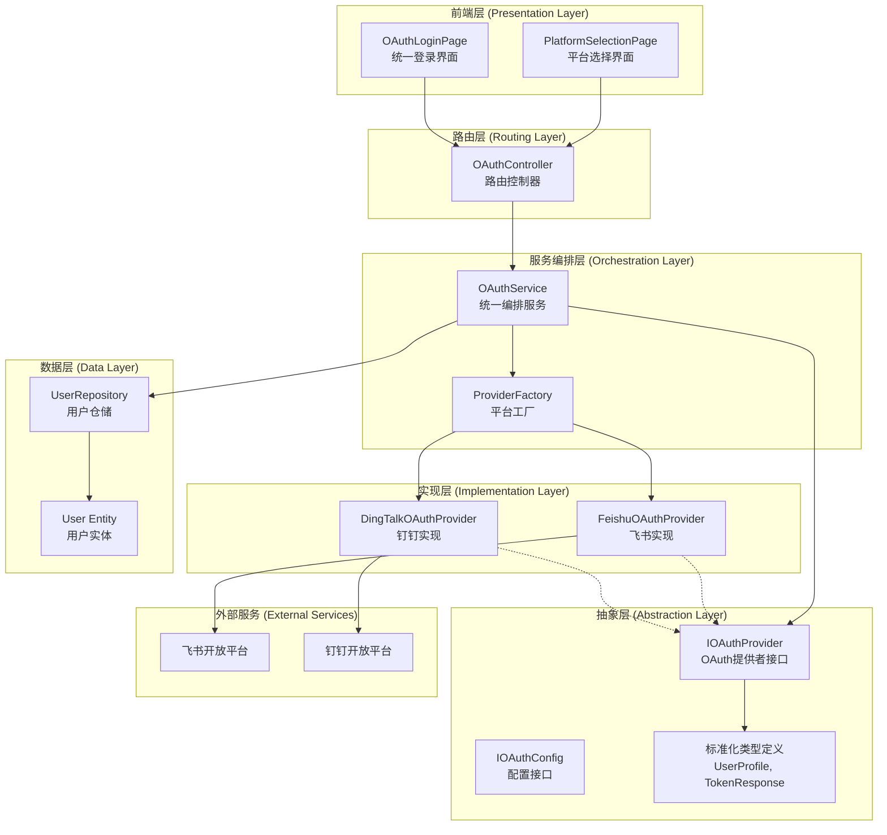
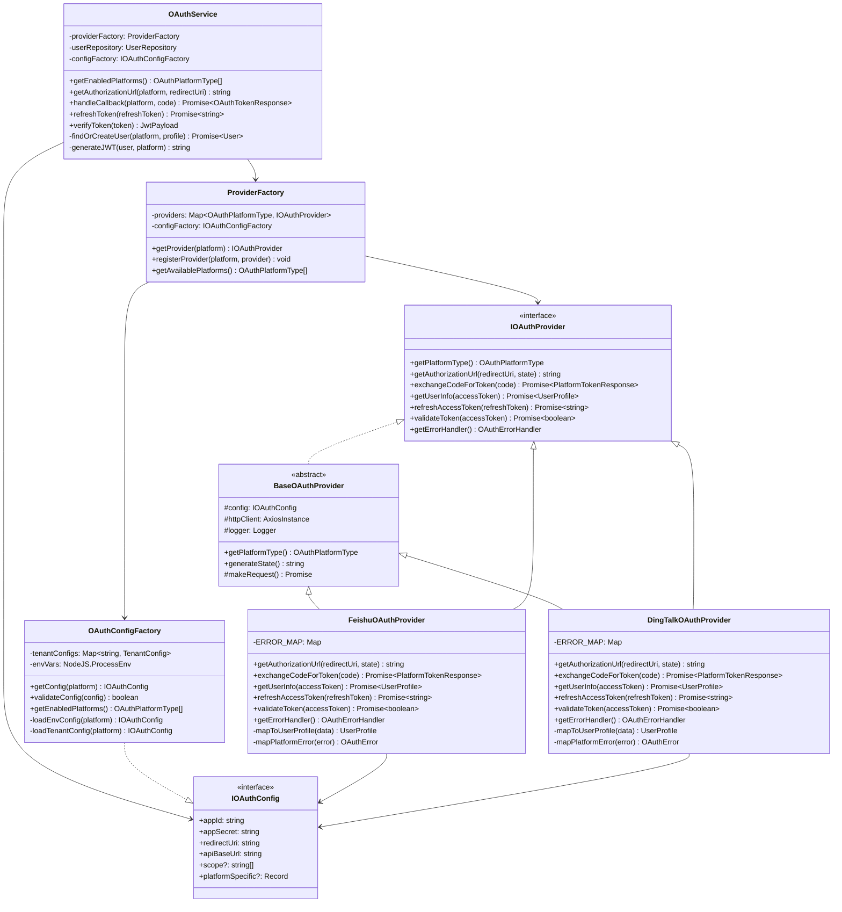
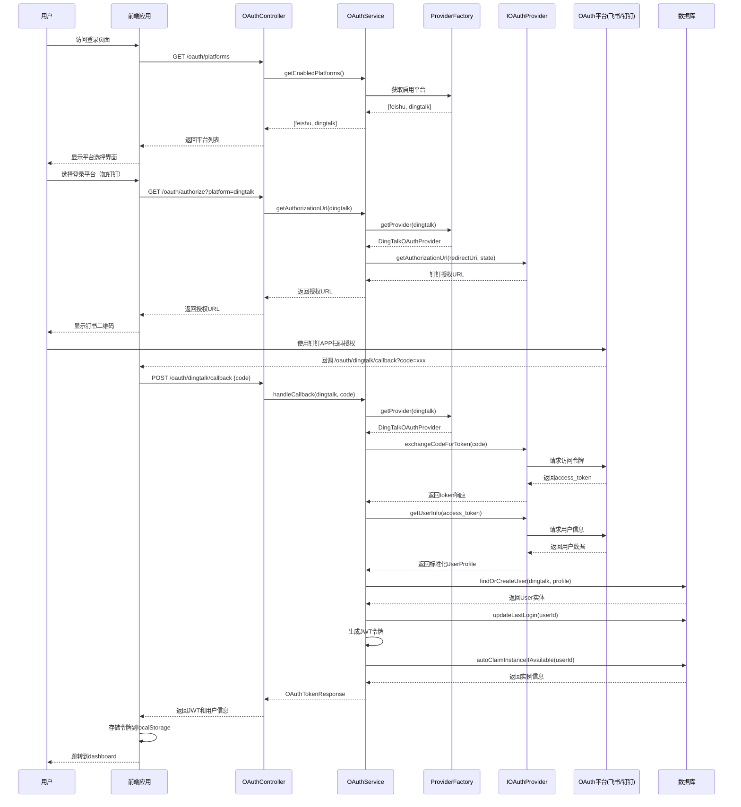
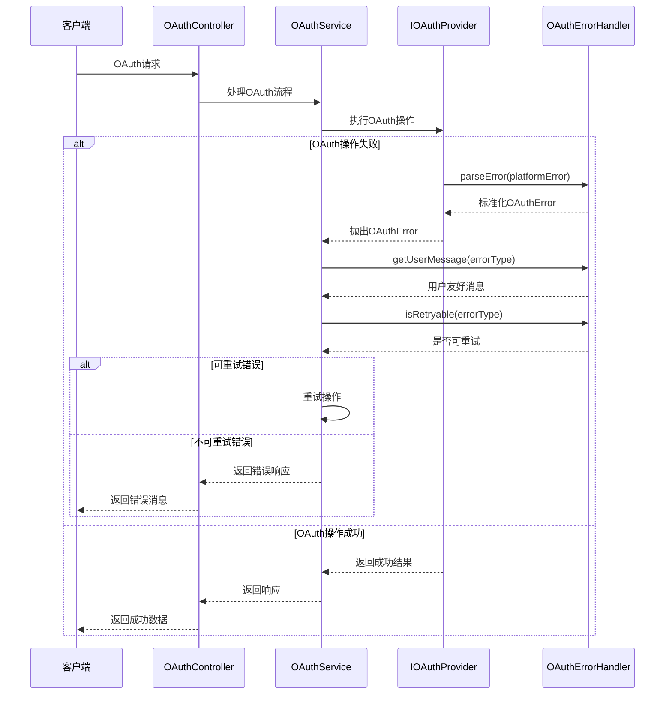

# OAuth 抽象层架构设计

**文档版本**: 1.0
**创建日期**: 2026-03-21
**关联Issue**: #23
**设计目标**: 支持多OAuth平台（飞书+钉钉）的可扩展架构

---

## 📐 架构概览

### 设计原则

本架构遵循以下核心原则：

1. **SOLID原则**
   - **单一职责原则 (SRP)**: 每个Provider只负责特定OAuth平台的适配
   - **开闭原则 (OCP)**: 对扩展开放（新增平台），对修改封闭（核心逻辑不变）
   - **里氏替换原则 (LSP)**: 所有Provider实现可互换使用
   - **接口隔离原则 (ISP)**: 接口精简，只包含必需方法
   - **依赖倒置原则 (DIP)**: 高层模块依赖抽象接口，不依赖具体实现

2. **设计模式应用**
   - **策略模式**: 不同OAuth平台作为不同策略实现
   - **工厂模式**: 平台实例创建和配置管理
   - **适配器模式**: 统一不同平台的API差异
   - **门面模式**: OAuthService提供统一入口

3. **向后兼容性**
   - 保持现有飞书OAuth流程无缝工作
   - 渐进式重构，降低迁移风险
   - 配置驱动，支持灵活切换

### 架构层次图



---

## 🎯 核心接口定义

### 1. IOAuthProvider 接口

所有OAuth平台必须实现的核心契约：

```typescript
/**
 * OAuth提供者接口
 * 定义所有OAuth平台必须实现的标准方法
 */
export interface IOAuthProvider {
  /**
   * 获取平台标识符
   * @returns 平台唯一标识 (e.g., 'feishu', 'dingtalk')
   */
  getPlatformType(): OAuthPlatformType;

  /**
   * 生成授权URL
   * @param redirectUri 授权后回调地址
   * @param state 状态参数，用于防止CSRF攻击
   * @returns 完整的授权URL
   */
  getAuthorizationUrl(redirectUri: string, state?: string): string;

  /**
   * 使用授权码交换访问令牌
   * @param code OAuth授权码
   * @returns 平台原始令牌响应
   * @throws OAuthTokenExchangeError 令牌交换失败
   */
  exchangeCodeForToken(code: string): Promise<PlatformTokenResponse>;

  /**
   * 获取用户信息
   * @param accessToken 访问令牌
   * @returns 标准化的用户信息
   * @throws OAuthUserInfoError 用户信息获取失败
   */
  getUserInfo(accessToken: string): Promise<UserProfile>;

  /**
   * 刷新访问令牌
   * @param refreshToken 刷新令牌
   * @returns 新的访问令牌
   * @throws OAuthRefreshError 刷新令牌失败
   */
  refreshAccessToken(refreshToken: string): Promise<string>;

  /**
   * 验证访问令牌有效性
   * @param accessToken 访问令牌
   * @returns 令牌是否有效
   */
  validateToken(accessToken: string): Promise<boolean>;

  /**
   * 获取平台特定错误处理
   * @returns 平台错误映射表
   */
  getErrorHandler(): OAuthErrorHandler;
}
```

### 2. IOAuthConfig 接口

配置管理的抽象接口：

```typescript
/**
 * OAuth配置接口
 * 定义平台配置的标准化结构
 */
export interface IOAuthConfig {
  /**
   * 应用ID / Client ID
   */
  appId: string;

  /**
   * 应用密钥 / Client Secret
   */
  appSecret: string;

  /**
   * 授权回调地址
   */
  redirectUri: string;

  /**
   * API基础URL
   */
  apiBaseUrl: string;

  /**
   * 授权范围
   */
  scope?: string[];

  /**
   * 平台特定配置
   */
  platformSpecific?: Record<string, any>;
}

/**
 * 平台配置工厂接口
 */
export interface IOAuthConfigFactory {
  /**
   * 根据平台类型获取配置
   * @param platform 平台类型
   * @returns 平台配置
   * @throws ConfigNotFoundError 配置未找到
   */
  getConfig(platform: OAuthPlatformType): IOAuthConfig;

  /**
   * 验证配置完整性
   * @param config 待验证配置
   * @returns 配置是否有效
   */
  validateConfig(config: IOAuthConfig): boolean;

  /**
   * 获取启用的平台列表
   * @returns 启用的平台类型数组
   */
  getEnabledPlatforms(): OAuthPlatformType[];
}
```

### 3. 标准化类型定义

```typescript
/**
 * OAuth平台类型枚举
 */
export enum OAuthPlatformType {
  FEISHU = 'feishu',
  DINGTALK = 'dingtalk',
  // 未来扩展: WEWORK = 'wework', WECHAT = 'wechat'
}

/**
 * 标准化用户信息
 * 统一不同平台的用户数据结构
 */
export interface UserProfile {
  /** 平台标识符 */
  platform: OAuthPlatformType;

  /** 用户在平台中的唯一标识 */
  user_id: string;

  /** 跨应用用户标识（如适用） */
  union_id?: string;

  /** 用户显示名称 */
  name: string;

  /** 英文名称（可选） */
  en_name?: string;

  /** 邮箱地址 */
  email?: string;

  /** 头像URL */
  avatar_url?: string;

  /** 手机号码（可选） */
  mobile?: string;

  /** 平台原始数据（保留用于调试和扩展） */
  raw_data?: Record<string, any>;
}

/**
 * 平台原始令牌响应
 * 不同平台的令牌响应结构可能不同
 */
export interface PlatformTokenResponse {
  /** 访问令牌 */
  access_token: string;

  /** 令牌类型 */
  token_type: string;

  /** 过期时间（秒） */
  expires_in: number;

  /** 刷新令牌（如支持） */
  refresh_token?: string;

  /** 平台原始响应数据 */
  raw_response: Record<string, any>;
}

/**
 * OAuth错误类型
 */
export enum OAuthErrorType {
  CONFIG_MISSING = 'CONFIG_MISSING',
  TOKEN_EXCHANGE_FAILED = 'TOKEN_EXCHANGE_FAILED',
  USER_INFO_FAILED = 'USER_INFO_FAILED',
  INVALID_CODE = 'INVALID_CODE',
  EXPIRED_TOKEN = 'EXPIRED_TOKEN',
  INVALID_STATE = 'INVALID_STATE',
  PLATFORM_ERROR = 'PLATFORM_ERROR'
}

/**
 * OAuth错误处理接口
 */
export interface OAuthErrorHandler {
  /**
   * 解析平台特定错误
   * @param error 原始错误对象
   * @returns 标准化的OAuth错误
   */
  parseError(error: any): OAuthError;

  /**
   * 获取用户友好的错误消息
   * @param errorType 错误类型
   * @returns 用户可读的错误消息
   */
  getUserMessage(errorType: OAuthErrorType): string;

  /**
   * 判断错误是否可重试
   * @param errorType 错误类型
   * @returns 是否可重试
   */
  isRetryable(errorType: OAuthErrorType): boolean;
}

/**
 * 标准化OAuth错误
 */
export class OAuthError extends Error {
  constructor(
    public readonly type: OAuthErrorType,
    public readonly platform: OAuthPlatformType,
    message: string,
    public readonly originalError?: any
  ) {
    super(message);
    this.name = 'OAuthError';
  }
}
```

---

## 🏗️ 类设计和关系

### 1. 核心类图



### 2. 基础抽象类

```typescript
/**
 * OAuth提供者基础抽象类
 * 提供公共功能实现，减少重复代码
 */
export abstract class BaseOAuthProvider implements IOAuthProvider {
  protected httpClient: AxiosInstance;
  protected logger: Logger;

  constructor(protected readonly config: IOAuthConfig) {
    this.httpClient = axios.create({
      baseURL: config.apiBaseUrl,
      timeout: 30000,
      headers: {
        'Content-Type': 'application/json'
      }
    });

    this.logger = Container.get(Logger);
    this.logger.info(`Initialized OAuth provider for platform: ${this.getPlatformType()}`);
  }

  /**
   * 子类必须实现：获取平台类型
   */
  abstract getPlatformType(): OAuthPlatformType;

  /**
   * 子类必须实现：生成授权URL
   */
  abstract getAuthorizationUrl(redirectUri: string, state?: string): string;

  /**
   * 子类必须实现：交换授权码
   */
  abstract exchangeCodeForToken(code: string): Promise<PlatformTokenResponse>;

  /**
   * 子类必须实现：获取用户信息
   */
  abstract getUserInfo(accessToken: string): Promise<UserProfile>;

  /**
   * 子类必须实现：刷新令牌
   */
  abstract refreshAccessToken(refreshToken: string): Promise<string>;

  /**
   * 子类必须实现：验证令牌
   */
  abstract validateToken(accessToken: string): Promise<boolean>;

  /**
   * 子类必须实现：获取错误处理器
   */
  abstract getErrorHandler(): OAuthErrorHandler;

  /**
   * 生成随机状态参数（公共方法）
   */
  protected generateState(): string {
    return Math.random().toString(36).substring(2, 15) +
           Math.random().toString(36).substring(2, 15);
  }

  /**
   * 通用HTTP请求方法（公共方法）
   */
  protected async makeRequest<T>(
    method: 'GET' | 'POST',
    endpoint: string,
    data?: any,
    headers?: Record<string, string>
  ): Promise<T> {
    try {
      const response = await this.httpClient.request<T>({
        method,
        url: endpoint,
        data,
        headers
      });

      return response.data;
    } catch (error) {
      this.logger.error(`HTTP request failed: ${method} ${endpoint}`, {
        error: error instanceof Error ? error.message : String(error)
      });
      throw error;
    }
  }
}
```

### 3. 飞书OAuth提供者实现

```typescript
/**
 * 飞书OAuth提供者实现
 * 重构现有的FeishuOAuthService功能
 */
@Service()
export class FeishuOAuthProvider extends BaseOAuthProvider {
  private static readonly ERROR_MAP = new Map<number, OAuthErrorType>([
    [99991663, OAuthErrorType.INVALID_CODE],
    [99991401, OAuthErrorType.EXPIRED_TOKEN],
    [99991402, OAuthErrorType.CONFIG_MISSING]
  ]);

  constructor(@Inject('FEISHU_CONFIG') config: IOAuthConfig) {
    super(config);
  }

  getPlatformType(): OAuthPlatformType {
    return OAuthPlatformType.FEISHU;
  }

  /**
   * 生成飞书授权URL
   */
  getAuthorizationUrl(redirectUri: string, state?: string): string {
    const validState = state || this.generateState();
    const params = new URLSearchParams({
      app_id: this.config.appId,
      redirect_uri: redirectUri || this.config.redirectUri,
      scope: this.config.scope?.join(' ') || 'contact:user.base:readonly',
      state: validState
    });

    const url = `${this.config.apiBaseUrl}/authen/v1/authorize?${params}`;

    if (url.includes('undefined')) {
      throw new OAuthError(
        OAuthErrorType.CONFIG_MISSING,
        OAuthPlatformType.FEISHU,
        'Generated authorization URL contains undefined values'
      );
    }

    return url;
  }

  /**
   * 使用授权码交换访问令牌
   */
  async exchangeCodeForToken(code: string): Promise<PlatformTokenResponse> {
    try {
      const response = await this.makeRequest<{
        code: number;
        msg: string;
        data: any;
      }>(
        'POST',
        '/open-apis/authen/v1/access_token',
        {
          grant_type: 'authorization_code',
          app_id: this.config.appId,
          app_secret: this.config.appSecret,
          code
        }
      );

      if (response.code !== 0) {
        throw this.mapPlatformError(response);
      }

      return {
        access_token: response.data.access_token,
        token_type: response.data.token_type,
        expires_in: response.data.expires_in,
        refresh_token: response.data.refresh_token,
        raw_response: response.data
      };
    } catch (error) {
      this.logger.error('Feishu token exchange failed', { error });
      if (error instanceof OAuthError) throw error;
      throw new OAuthError(
        OAuthErrorType.TOKEN_EXCHANGE_FAILED,
        OAuthPlatformType.FEISHU,
        'Failed to exchange authorization code',
        error
      );
    }
  }

  /**
   * 获取飞书用户信息
   */
  async getUserInfo(accessToken: string): Promise<UserProfile> {
    try {
      // 飞书在token响应中已包含用户信息，直接从token解析
      // 如果需要单独的用户信息API调用，可以实现如下逻辑
      const response = await this.makeRequest<{
        code: number;
        data: any;
      }>(
        'GET',
        '/open-apis/authen/v1/user_info',
        undefined,
        {
          'Authorization': `Bearer ${accessToken}`
        }
      );

      if (response.code !== 0) {
        throw this.mapPlatformError(response);
      }

      return this.mapToUserProfile(response.data);
    } catch (error) {
      this.logger.error('Feishu user info fetch failed', { error });
      if (error instanceof OAuthError) throw error;
      throw new OAuthError(
        OAuthErrorType.USER_INFO_FAILED,
        OAuthPlatformType.FEISHU,
        'Failed to fetch user information',
        error
      );
    }
  }

  /**
   * 刷新访问令牌
   */
  async refreshAccessToken(refreshToken: string): Promise<string> {
    try {
      const response = await this.makeRequest<{
        code: number;
        data: any;
      }>(
        'POST',
        '/open-apis/authen/v1/refresh_access_token',
        {
          app_id: this.config.appId,
          app_secret: this.config.appSecret,
          grant_type: 'refresh_token',
          refresh_token: refreshToken
        }
      );

      if (response.code !== 0) {
        throw this.mapPlatformError(response);
      }

      return response.data.access_token;
    } catch (error) {
      this.logger.error('Feishu token refresh failed', { error });
      throw new OAuthError(
        OAuthErrorType.PLATFORM_ERROR,
        OAuthPlatformType.FEISHU,
        'Failed to refresh access token',
        error
      );
    }
  }

  /**
   * 验证令牌有效性
   */
  async validateToken(accessToken: string): Promise<boolean> {
    try {
      await this.getUserInfo(accessToken);
      return true;
    } catch (error) {
      return false;
    }
  }

  /**
   * 获取错误处理器
   */
  getErrorHandler(): OAuthErrorHandler {
    return new FeishuOAuthErrorHandler();
  }

  /**
   * 映射飞书用户数据到标准化格式
   */
  private mapToUserProfile(data: any): UserProfile {
    return {
      platform: OAuthPlatformType.FEISHU,
      user_id: data.open_id,
      union_id: data.union_id,
      name: data.name,
      en_name: data.en_name,
      email: data.email,
      avatar_url: data.avatar_url,
      raw_data: data
    };
  }

  /**
   * 映射飞书错误到标准错误
   */
  private mapPlatformError(response: any): OAuthError {
    const errorType = FeishuOAuthProvider.ERROR_MAP.get(response.code) ||
                     OAuthErrorType.PLATFORM_ERROR;

    return new OAuthError(
      errorType,
      OAuthPlatformType.FEISHU,
      `Feishu API error: ${response.msg}`,
      { code: response.code, msg: response.msg }
    );
  }
}
```

### 4. 钉钉OAuth提供者实现

```typescript
/**
 * 钉钉OAuth提供者实现
 * 实现钉钉开放平台OAuth 2.0流程
 */
@Service()
export class DingTalkOAuthProvider extends BaseOAuthProvider {
  private static readonly ERROR_MAP = new Map<string, OAuthErrorType>([
    ['invalid_request', OAuthErrorType.CONFIG_MISSING],
    ['invalid_client', OAuthErrorType.CONFIG_MISSING],
    ['invalid_grant', OAuthErrorType.INVALID_CODE],
    ['unauthorized_client', OAuthErrorType.CONFIG_MISSING],
    ['unsupported_grant_type', OAuthErrorType.PLATFORM_ERROR]
  ]);

  constructor(@Inject('DINGTALK_CONFIG') config: IOAuthConfig) {
    super(config);
  }

  getPlatformType(): OAuthPlatformType {
    return OAuthPlatformType.DINGTALK;
  }

  /**
   * 生成钉钉授权URL
   * 注意：钉钉使用不同的授权端点
   */
  getAuthorizationUrl(redirectUri: string, state?: string): string {
    const validState = state || this.generateState();
    const params = new URLSearchParams({
      redirect_uri: redirectUri || this.config.redirectUri,
      response_type: 'code',
      client_id: this.config.appId,
      scope: this.config.scope?.join(' ') || 'openid corpid',
      state: validState,
      prompt: 'consent'
    });

    // 钉钉使用独立的授权域名
    return `https://login.dingtalk.com/oauth2/auth?${params}`;
  }

  /**
   * 使用授权码交换访问令牌
   * 钉钉使用不同的token端点和请求格式
   */
  async exchangeCodeForToken(code: string): Promise<PlatformTokenResponse> {
    try {
      const response = await this.makeRequest<{
        accessToken: string;
        tokenType: string;
        expiresIn: number;
        refreshToken: string;
      }>(
        'POST',
        '/v1.0/oauth2/userAccessToken',
        {
          clientId: this.config.appId,
          code: code,
          grantType: 'authorization_code'
        }
      );

      return {
        access_token: response.accessToken,
        token_type: response.tokenType,
        expires_in: response.expiresIn,
        refresh_token: response.refreshToken,
        raw_response: response
      };
    } catch (error) {
      this.logger.error('DingTalk token exchange failed', { error });
      if (error instanceof OAuthError) throw error;

      // 解析钉钉错误格式
      const errorMessage = error.response?.data?.errorMessage ||
                          'Failed to exchange authorization code';
      const errorCode = error.response?.data?.errorCode;

      throw new OAuthError(
        OAuthErrorType.TOKEN_EXCHANGE_FAILED,
        OAuthPlatformType.DINGTALK,
        `DingTalk API error: ${errorMessage}`,
        error
      );
    }
  }

  /**
   * 获取钉钉用户信息
   * 钉钉使用特定的用户信息端点和header格式
   */
  async getUserInfo(accessToken: string): Promise<UserProfile> {
    try {
      const response = await this.makeRequest<{
        unionId: string;
        userId: string;
        name: string;
        avatarUrl: string;
        stateCode: string;
        email: string;
        mobile: string;
      }>(
        'GET',
        '/v1.0/contact/users/me',
        undefined,
        {
          'x-acs-dingtalk-access-token': accessToken
        }
      );

      return this.mapToUserProfile(response);
    } catch (error) {
      this.logger.error('DingTalk user info fetch failed', { error });
      if (error instanceof OAuthError) throw error;
      throw new OAuthError(
        OAuthErrorType.USER_INFO_FAILED,
        OAuthPlatformType.DINGTALK,
        'Failed to fetch user information',
        error
      );
    }
  }

  /**
   * 刷新访问令牌
   */
  async refreshAccessToken(refreshToken: string): Promise<string> {
    try {
      const response = await this.makeRequest<{
        accessToken: string;
      }>(
        'POST',
        '/v1.0/oauth2/userAccessToken',
        {
          clientId: this.config.appId,
          grantType: 'refreshToken',
          refreshToken: refreshToken
        }
      );

      return response.accessToken;
    } catch (error) {
      this.logger.error('DingTalk token refresh failed', { error });
      throw new OAuthError(
        OAuthErrorType.PLATFORM_ERROR,
        OAuthPlatformType.DINGTALK,
        'Failed to refresh access token',
        error
      );
    }
  }

  /**
   * 验证令牌有效性
   */
  async validateToken(accessToken: string): Promise<boolean> {
    try {
      await this.getUserInfo(accessToken);
      return true;
    } catch (error) {
      return false;
    }
  }

  /**
   * 获取错误处理器
   */
  getErrorHandler(): OAuthErrorHandler {
    return new DingTalkOAuthErrorHandler();
  }

  /**
   * 映射钉钉用户数据到标准化格式
   */
  private mapToUserProfile(data: any): UserProfile {
    return {
      platform: OAuthPlatformType.DINGTALK,
      user_id: data.userId,
      union_id: data.unionId,
      name: data.name,
      email: data.email,
      avatar_url: data.avatarUrl,
      mobile: data.mobile,
      raw_data: data
    };
  }
}
```

---

## 🔄 服务编排层

### OAuthService 统一编排服务

```typescript
/**
 * OAuth统一编排服务
 * 协调多平台OAuth流程，处理用户信息标准化和业务逻辑
 */
@Service()
export class OAuthService {
  constructor(
    private readonly providerFactory: ProviderFactory,
    private readonly userRepository: UserRepository,
    private readonly configFactory: IOAuthConfigFactory,
    private readonly instanceRepository: InstanceRepository
  ) {}

  /**
   * 获取启用的OAuth平台列表
   */
  getEnabledPlatforms(): OAuthPlatformType[] {
    return this.configFactory.getEnabledPlatforms();
  }

  /**
   * 生成指定平台的授权URL
   */
  getAuthorizationUrl(platform: OAuthPlatformType, redirectUri?: string): string {
    const provider = this.providerFactory.getProvider(platform);

    const state = this.generateStateWithTimestamp();
    const finalRedirectUri = redirectUri || this.getDefaultRedirectUri(platform);

    return provider.getAuthorizationUrl(finalRedirectUri, state);
  }

  /**
   * 处理OAuth回调（平台无关）
   */
  async handleCallback(
    platform: OAuthPlatformType,
    code: string,
    state?: string
  ): Promise<OAuthTokenResponse> {
    try {
      // 1. 获取对应平台的Provider
      const provider = this.providerFactory.getProvider(platform);

      // 2. 交换授权码获取令牌
      const tokenResponse = await provider.exchangeCodeForToken(code);

      // 3. 获取标准化用户信息
      const userProfile = await provider.getUserInfo(tokenResponse.access_token);

      // 4. 查找或创建用户（带平台标识）
      const user = await this.findOrCreateUser(platform, userProfile);

      // 5. 更新最后登录时间
      await this.userRepository.updateLastLogin(user.id);

      // 6. 自动认领实例（业务逻辑与平台无关）
      const claimedInstance = await this.autoClaimInstanceIfAvailable(user.id);

      // 7. 生成JWT令牌
      const jwtPayload: JwtPayload = {
        userId: user.id,
        oauthPlatform: platform,
        oauthUserId: userProfile.user_id,
        oauthUnionId: userProfile.union_id,
        name: userProfile.name,
        email: userProfile.email
      };

      const accessToken = this.generateJWTToken(jwtPayload);
      const refreshToken = this.generateRefreshToken(jwtPayload);

      logger.info('OAuth callback successful', {
        platform,
        userId: user.id,
        name: user.name
      });

      return {
        access_token: accessToken,
        refresh_token: refreshToken,
        expires_in: parseInt(process.env.JWT_EXPIRES_IN || '604800'),
        token_type: 'Bearer',
        user: {
          id: user.id,
          oauth_platform: platform,
          oauth_user_id: userProfile.user_id,
          name: user.name,
          email: user.email
        },
        has_instance: !!claimedInstance,
        instance_id: claimedInstance?.instance_id || null,
        redirect_to: claimedInstance ? '/chat' : '/no-instance'
      };
    } catch (error) {
      logger.error('OAuth callback failed', {
        platform,
        error: error instanceof Error ? error.message : String(error)
      });
      throw error;
    }
  }

  /**
   * 查找或创建用户（支持多平台）
   */
  private async findOrCreateUser(
    platform: OAuthPlatformType,
    profile: UserProfile
  ): Promise<User> {
    // 根据平台类型使用不同的查询方法
    let user: User | null = null;

    switch (platform) {
      case OAuthPlatformType.FEISHU:
        user = await this.userRepository.findByFeishuUserId(profile.user_id);
        break;
      case OAuthPlatformType.DINGTALK:
        user = await this.userRepository.findByDingtalkUserId(profile.user_id);
        break;
      default:
        throw new OAuthError(
          OAuthErrorType.CONFIG_MISSING,
          platform,
          `Unsupported platform: ${platform}`
        );
    }

    // 如果用户存在，更新信息
    if (user) {
      await this.updateUserData(user, profile);
      const updatedUser = await this.userRepository.findById(user.id);
      return updatedUser!;
    }

    // 创建新用户
    const newUserData = this.createNewUserData(platform, profile);
    const newUser = await this.userRepository.create(newUserData);

    logger.info('New user created', {
      platform,
      userId: newUser.id,
      name: newUser.name
    });

    return newUser;
  }

  /**
   * 创建新用户数据（根据平台类型）
   */
  private createNewUserData(
    platform: OAuthPlatformType,
    profile: UserProfile
  ): Partial<User> {
    const baseData = {
      name: profile.name,
      email: profile.email,
      avatar_url: profile.avatar_url
    };

    switch (platform) {
      case OAuthPlatformType.FEISHU:
        return {
          ...baseData,
          oauth_platform: OAuthPlatformType.FEISHU,
          feishu_user_id: profile.user_id,
          feishu_union_id: profile.union_id
        };

      case OAuthPlatformType.DINGTALK:
        return {
          ...baseData,
          oauth_platform: OAuthPlatformType.DINGTALK,
          dingtalk_user_id: profile.user_id,
          dingtalk_union_id: profile.union_id
        };

      default:
        throw new Error(`Unsupported platform: ${platform}`);
    }
  }

  /**
   * 更新用户数据
   */
  private async updateUserData(user: User, profile: UserProfile): Promise<void> {
    const updateData: Partial<User> = {
      name: profile.name,
      email: profile.email,
      avatar_url: profile.avatar_url
    };

    // 根据平台更新对应的union_id
    if (profile.union_id) {
      switch (profile.platform) {
        case OAuthPlatformType.FEISHU:
          updateData.feishu_union_id = profile.union_id;
          break;
        case OAuthPlatformType.DINGTALK:
          updateData.dingtalk_union_id = profile.union_id;
          break;
      }
    }

    await this.userRepository.update(user.id, updateData);
  }

  /**
   * 生成JWT令牌
   */
  private generateJWTToken(payload: JwtPayload): string {
    const tokenExpiresIn = process.env.JWT_EXPIRES_IN || '7d';
    return jwt.sign(payload, process.env.JWT_SECRET!, {
      expiresIn: tokenExpiresIn
    });
  }

  /**
   * 生成刷新令牌
   */
  private generateRefreshToken(payload: JwtPayload): string {
    const refreshExpiresIn = process.env.JWT_REFRESH_EXPIRES_IN || '30d';
    return jwt.sign(payload, process.env.JWT_SECRET!, {
      expiresIn: refreshExpiresIn
    });
  }

  /**
   * 生成带时间戳的状态参数
   */
  private generateStateWithTimestamp(): string {
    return `${Date.now()}-${Math.random().toString(36).substring(2, 15)}`;
  }

  /**
   * 获取默认回调地址
   */
  private getDefaultRedirectUri(platform: OAuthPlatformType): string {
    const baseUrl = process.env.OAUTH_REDIRECT_URI ||
                   process.env.FEISHU_REDIRECT_URI;
    return `${baseUrl}/${platform}/callback`;
  }

  /**
   * 自动认领实例（复用现有逻辑）
   */
  private async autoClaimInstanceIfAvailable(
    userId: number
  ): Promise<{ instance_id: string } | null> {
    try {
      const unclaimedInstance = await this.instanceRepository.findUnclaimed();

      if (unclaimedInstance) {
        await this.instanceRepository.claimInstance(
          unclaimedInstance.instance_id,
          userId
        );

        logger.info('Auto-claimed instance for user', {
          userId: userId,
          instanceId: unclaimedInstance.instance_id
        });

        return { instance_id: unclaimedInstance.instance_id };
      }

      return null;
    } catch (error) {
      logger.error('Failed to auto-claim instance for user', {
        userId: userId,
        error: error instanceof Error ? error.message : 'Unknown error'
      });
      return null;
    }
  }

  /**
   * 刷新JWT令牌（平台无关）
   */
  async refreshToken(refreshToken: string): Promise<{ access_token: string }> {
    try {
      const payload = jwt.verify(
        refreshToken,
        process.env.JWT_SECRET!
      ) as JwtPayload;

      const newAccessToken = this.generateJWTToken(payload);

      logger.info('Token refresh successful', { userId: payload.userId });

      return { access_token: newAccessToken };
    } catch (error) {
      logger.error('Token refresh failed', error);
      throw new Error('Invalid refresh token');
    }
  }

  /**
   * 验证JWT令牌（平台无关）
   */
  verifyToken(token: string): JwtPayload {
    try {
      const payload = jwt.verify(token, process.env.JWT_SECRET!) as JwtPayload;
      return payload;
    } catch (error) {
      logger.error('Token verification failed', error);
      throw new Error('Invalid token');
    }
  }
}
```

### ProviderFactory 工厂类

```typescript
/**
 * OAuth提供者工厂
 * 负责创建和管理平台实例
 */
@Service()
export class ProviderFactory {
  private providers: Map<OAuthPlatformType, IOAuthProvider> = new Map();

  constructor(
    private readonly configFactory: IOAuthConfigFactory,
    private readonly feishuProvider: FeishuOAuthProvider,
    private readonly dingtalkProvider: DingTalkOAuthProvider
  ) {
    this.registerProviders();
  }

  /**
   * 注册所有可用的Provider
   */
  private registerProviders(): void {
    this.providers.set(OAuthPlatformType.FEISHU, this.feishuProvider);
    this.providers.set(OAuthPlatformType.DINGTALK, this.dingtalkProvider);

    logger.info('Registered OAuth providers', {
      platforms: Array.from(this.providers.keys())
    });
  }

  /**
   * 获取指定平台的Provider
   */
  getProvider(platform: OAuthPlatformType): IOAuthProvider {
    const provider = this.providers.get(platform);

    if (!provider) {
      throw new OAuthError(
        OAuthErrorType.CONFIG_MISSING,
        platform,
        `No provider registered for platform: ${platform}`
      );
    }

    return provider;
  }

  /**
   * 获取所有可用平台
   */
  getAvailablePlatforms(): OAuthPlatformType[] {
    return Array.from(this.providers.keys());
  }

  /**
   * 动态注册Provider（用于扩展）
   */
  registerProvider(platform: OAuthPlatformType, provider: IOAuthProvider): void {
    this.providers.set(platform, provider);
    logger.info(`Registered new OAuth provider: ${platform}`);
  }
}
```

---

## 💾 数据模型扩展

### User实体扩展

```typescript
import { Entity, PrimaryGeneratedColumn, Column, CreateDateColumn, Index } from 'typeorm';

@Entity('users')
export class User {
  @PrimaryGeneratedColumn()
  id: number;

  /**
   * OAuth平台标识符
   * 标识用户来自哪个OAuth平台
   */
  @Column({
    type: 'enum',
    enum: OAuthPlatformType,
    nullable: true,
    comment: 'OAuth platform type (feishu/dingtalk)'
  })
  @Index()
  oauth_platform: OAuthPlatformType;

  /**
   * 飞书用户ID（改为nullable以支持多平台）
   */
  @Column({ unique: true, nullable: true })
  @Index()
  feishu_user_id: string;

  /**
   * 飞书Union ID
   */
  @Column({ nullable: true })
  feishu_union_id: string;

  /**
   * 钉钉用户ID（新增）
   */
  @Column({ unique: true, nullable: true })
  @Index('idx_dingtalk_user_id')
  dingtalk_user_id: string;

  /**
   * 钉钉Union ID（新增）
   */
  @Column({ nullable: true, name: 'dingtalk_union_id' })
  dingtalk_union_id: string;

  @Column()
  name: string;

  @Column({ nullable: true })
  email: string;

  @Column({ nullable: true })
  avatar_url: string;

  @CreateDateColumn({ name: 'created_at' })
  created_at: Date;

  @Column({ type: 'timestamp', nullable: true })
  last_login_at: Date;
}
```

### 数据库迁移脚本

```typescript
import { MigrationInterface, QueryRunner, TableIndex } from 'typeorm';

export class AddDingtalkOAuthSupport1679391200000
  implements MigrationInterface {
  public async up(queryRunner: QueryRunner): Promise<void> {
    // 1. 添加oauth_platform列
    await queryRunner.query(`
      ALTER TABLE users
      ADD COLUMN oauth_platform VARCHAR(20) NULL
      COMMENT 'OAuth platform type (feishu/dingtalk)'
    `);

    // 2. 添加钉钉用户ID列
    await queryRunner.query(`
      ALTER TABLE users
      ADD COLUMN dingtalk_user_id VARCHAR(100) NULL UNIQUE
    `);

    // 3. 添加钉钉union_id列
    await queryRunner.query(`
      ALTER TABLE users
      ADD COLUMN dingtalk_union_id VARCHAR(100) NULL
    `);

    // 4. 修改feishu_user_id为nullable（当前已有值的不受影响）
    await queryRunner.query(`
      ALTER TABLE users
      MODIFY COLUMN feishu_user_id VARCHAR(100) NULL
    `);

    // 5. 创建索引
    await queryRunner.createIndex('users', new TableIndex({
      name: 'idx_oauth_platform',
      columnNames: ['oauth_platform']
    }));

    await queryRunner.createIndex('users', new TableIndex({
      name: 'idx_dingtalk_user_id',
      columnNames: ['dingtalk_user_id'],
      isUnique: true
    }));

    // 6. 为现有飞书用户设置oauth_platform
    await queryRunner.query(`
      UPDATE users
      SET oauth_platform = 'feishu'
      WHERE feishu_user_id IS NOT NULL
    `);
  }

  public async down(queryRunner: QueryRunner): Promise<void> {
    // 回滚操作
    await queryRunner.dropIndex('users', 'idx_dingtalk_user_id');
    await queryRunner.dropIndex('users', 'idx_oauth_platform');

    await queryRunner.query(`
      ALTER TABLE users
      DROP COLUMN dingtalk_union_id
    `);

    await queryRunner.query(`
      ALTER TABLE users
      DROP COLUMN dingtalk_user_id
    `);

    await queryRunner.query(`
      ALTER TABLE users
      DROP COLUMN oauth_platform
    `);

    await queryRunner.query(`
      ALTER TABLE users
      MODIFY COLUMN feishu_user_id VARCHAR(100) NOT NULL
    `);
  }
}
```

### UserRepository扩展

```typescript
/**
 * 用户仓储类（扩展）
 * 添加多平台用户查询支持
 */
@Service()
export class UserRepository extends BaseRepository<User> {
  // ... 现有方法 ...

  /**
   * 根据钉钉用户ID查找用户（新增）
   */
  async findByDingtalkUserId(dingtalkUserId: string): Promise<User | null> {
    const result = await this.repository.findOne({
      where: { dingtalk_user_id: dingtalkUserId }
    });
    return result || null;
  }

  /**
   * 根据钉钉Union ID查找用户（新增）
   */
  async findByDingtalkUnionId(dingtalkUnionId: string): Promise<User | null> {
    const result = await this.repository.findOne({
      where: { dingtalk_union_id: dingtalkUnionId }
    });
    return result || null;
  }

  /**
   * 根据平台和用户ID查找用户（通用方法）
   */
  async findByPlatformAndUserId(
    platform: OAuthPlatformType,
    userId: string
  ): Promise<User | null> {
    switch (platform) {
      case OAuthPlatformType.FEISHU:
        return this.findByFeishuUserId(userId);
      case OAuthPlatformType.DINGTALK:
        return this.findByDingtalkUserId(userId);
      default:
        throw new Error(`Unsupported platform: ${platform}`);
    }
  }

  /**
   * 跨平台用户查询（通过邮箱）
   * 用于检测同一用户在不同平台的账号
   */
  async findByEmailAcrossPlatforms(email: string): Promise<User[]> {
    return this.repository.find({
      where: { email }
    });
  }
}
```

---

## 🌊 时序图

### 多平台OAuth完整流程



### 错误处理流程



---

## 🎯 关键设计决策和Trade-off分析

### 1. 抽象层位置选择

**决策**: 在Service层之下引入Provider抽象层，而非在Controller层

**理由**:
- ✅ **关注点分离**: Controller专注路由，Service编排业务逻辑，Provider处理平台差异
- ✅ **代码复用**: JWT生成、用户管理、实例认领等逻辑在Service层统一处理
- ✅ **测试友好**: 可以独立测试每个Provider和Service
- ✅ **扩展性**: 新增平台只需实现Provider接口

**Trade-off**:
- ❌ **增加一层抽象**: 轻微增加代码复杂度
- ❌ **调用链稍长**: Controller → Service → Provider，但可接受

### 2. 继承 vs 组合

**决策**: 使用继承（BaseOAuthProvider）+ 接口（IOAuthProvider）

**理由**:
- ✅ **代码复用**: 通用方法（generateState、makeRequest）在基类实现
- ✅ **类型安全**: 接口确保所有Provider实现一致
- ✅ **灵活性**: 子类可重写基类方法处理特殊情况

**Trade-off**:
- ❌ **继承耦合**: 子类依赖基类实现，但基类稳定可接受
- ❌ **多重继承限制**: TypeScript不支持多继承，但接口组合可弥补

### 3. 错误处理策略

**决策**: 统一错误类型 + 平台特定错误映射

**理由**:
- ✅ **一致性**: 上层调用者只需处理OAuthError
- ✅ **可调试性**: 保留原始错误信息
- ✅ **用户友好**: 平台特定错误转换为用户可读消息

**Trade-off**:
- ❌ **错误映射维护**: 每个平台需要维护错误码映射表
- ❌ **信息丢失**: 某些平台特定细节可能丢失，但raw_data保留

### 4. 数据模型设计

**决策**: User表添加oauth_platform字段，平台ID列改为nullable

**理由**:
- ✅ **向后兼容**: 现有飞书用户无需数据迁移
- ✅ **查询效率**: 通过oauth_platform + platform_user_id快速定位
- ✅ **数据完整性**: 每个用户记录关联到单一OAuth平台

**Trade-off**:
- ❌ **表宽度增加**: 多个平台ID列增加表复杂度
- ❌ **未来扩展**: 新增平台需要添加列，但迁移成本可控

**替代方案对比**:
| 方案 | 优点 | 缺点 | 选择 |
|------|------|------|------|
| **方案A**: 多ID列 | 查询简单，性能好 | 表宽度增加 | ✅ 采用 |
| **方案B**: JSON存储 | 灵活扩展 | 查询复杂，无约束 | ❌ 放弃 |
| **方案C**: 关联表 | 规范化设计 | JOIN查询性能差 | ❌ 放弃 |

### 5. 配置管理策略

**决策**: 优先环境变量 + 租户配置覆盖

**理由**:
- ✅ **安全性**: 敏感信息（app_secret）不进入代码仓库
- ✅ **灵活性**: 不同租户可配置不同OAuth平台
- ✅ **环境隔离**: 开发/测试/生产环境独立配置

**Trade-off**:
- ❌ **配置分散**: 环境变量和租户配置两处管理
- ❌ **验证复杂**: 需要配置完整性检查

### 6. 向后兼容性策略

**决策**: 保持现有飞书OAuth路由和逻辑不变

**理由**:
- ✅ **零风险**: 现有飞书用户不受影响
- ✅ **渐进迁移**: 可先迁移飞书到新架构，再添加钉钉
- ✅ **回滚简单**: 出问题可快速回退

**兼容性保证**:
```typescript
// 路由兼容：保留旧路由，重定向到新逻辑
router.post('/oauth/callback', (req, res) => {
  // 默认按飞书处理（向后兼容）
  res.redirect(307, '/oauth/feishu/callback');
});

// 数据兼容：feishu_user_id保持非空约束，现有数据不变
// 新架构下设置为nullable，但已有数据不受影响
```

---

## 🔌 扩展性说明

### 添加第三个OAuth平台（如企业微信）

#### 步骤1: 定义平台类型

```typescript
// 在OAuthPlatformType枚举中添加
export enum OAuthPlatformType {
  FEISHU = 'feishu',
  DINGTALK = 'dingtalk',
  WEWORK = 'wework'  // 新增
}
```

#### 步骤2: 实现Provider

```typescript
/**
 * 企业微信OAuth提供者
 */
@Service()
export class WeworkOAuthProvider extends BaseOAuthProvider {
  constructor(@Inject('WEWORK_CONFIG') config: IOAuthConfig) {
    super(config);
  }

  getPlatformType(): OAuthPlatformType {
    return OAuthPlatformType.WEWORK;
  }

  // 实现企业微信特定的OAuth流程
  getAuthorizationUrl(redirectUri: string, state?: string): string {
    // 企业微信授权URL逻辑
  }

  exchangeCodeForToken(code: string): Promise<PlatformTokenResponse> {
    // 企业微信token交换逻辑
  }

  getUserInfo(accessToken: string): Promise<UserProfile> {
    // 企业微信用户信息获取
  }

  // ... 其他方法实现
}
```

#### 步骤3: 配置管理

```yaml
# config/tenants/CIIBER.yml
oauth:
  enabled_platforms:
    - feishu
    - dingtalk
    - wework  # 新增

wework:  # 新增配置块
  app_id: "wwxxxxxxxxxxxxxxxx"
  app_secret: "wework_app_secret_32_chars"
  redirect_uri: "https://ciiber.example.com/oauth/callback"
  api_base_url: "https://qyapi.weixin.qq.com"
  corp_id: "wwxxxxxxxxxxxxxxxx"
  agent_id: "1000001"
```

#### 步骤4: 注册Provider

```typescript
// 在ProviderFactory中注册
constructor(
  private readonly configFactory: IOAuthConfigFactory,
  private readonly feishuProvider: FeishuOAuthProvider,
  private readonly dingtalkProvider: DingTalkOAuthProvider,
  private readonly weworkProvider: WeworkOAuthProvider  // 新增
) {
  this.registerProviders();
}

private registerProviders(): void {
  this.providers.set(OAuthPlatformType.FEISHU, this.feishuProvider);
  this.providers.set(OAuthPlatformType.DINGTALK, this.dingtalkProvider);
  this.providers.set(OAuthPlatformType.WEWORK, this.weworkProvider);  // 新增
}
```

#### 步骤5: 数据库扩展（可选）

如需持久化企业微信用户：

```typescript
// 数据库迁移
await queryRunner.query(`
  ALTER TABLE users
  ADD COLUMN wework_user_id VARCHAR(100) NULL UNIQUE
`);

await queryRunner.query(`
  ALTER TABLE users
  ADD COLUMN wework_union_id VARCHAR(100) NULL
`);
```

#### 步骤6: 前端支持

```typescript
// 前端平台选择界面自动显示新平台
const platforms = await oauthService.getEnabledPlatforms();
// 返回: [feishu, dingtalk, wework]
```

### 扩展成本评估

| 扩展项 | 工作量 | 复杂度 | 风险 |
|--------|--------|--------|------|
| **新增Provider** | 1-2天 | 中 | 低 |
| **配置管理** | 0.5天 | 低 | 低 |
| **数据库扩展** | 0.5天 | 低 | 低 |
| **测试验证** | 1天 | 中 | 中 |
| **文档更新** | 0.5天 | 低 | 低 |
| **总计** | **3.5-4.5天** | **中** | **低** |

---

## 📋 实施计划

### 阶段1: 抽象层基础（P0 - Week 1-2）

**目标**: 建立抽象层，迁移飞书OAuth

1. **创建核心接口和类型**
   - IOAuthProvider接口
   - IOAuthConfig接口
   - 标准化类型定义（UserProfile, OAuthError等）

2. **实现基础抽象类**
   - BaseOAuthProvider
   - OAuthErrorHandler基类

3. **重构飞书OAuth**
   - FeishuOAuthProvider实现
   - 保持现有功能向后兼容

4. **实现服务编排层**
   - OAuthService重构
   - ProviderFactory实现

5. **配置管理**
   - OAuthConfigFactory实现
   - 多平台配置支持

### 阶段2: 钉钉OAuth实现（P0 - Week 3-4）

**目标**: 实现钉钉OAuth完整流程

1. **DingTalkOAuthProvider实现**
   - 授权URL生成
   - 令牌交换
   - 用户信息获取
   - 错误处理

2. **数据模型扩展**
   - User实体添加钉钉字段
   - 数据库迁移脚本
   - UserRepository扩展

3. **路由和控制器**
   - 多平台callback路由
   - 平台选择接口

4. **集成测试**
   - 钉钉OAuth端到端测试
   - 错误场景测试

### 阶段3: 前端适配（P1 - Week 5）

**目标**: 前端支持多平台选择

1. **平台选择界面**
   - PlatformSelectionPage组件
   - 平台卡片和样式

2. **OAuth流程适配**
   - AuthService支持platform参数
   - 路由参数传递

3. **用户体验优化**
   - 平台特定二维码样式
   - 错误提示优化

### 阶段4: 测试和文档（P2 - Week 6）

**目标**: 完善测试和文档

1. **测试覆盖**
   - 单元测试（Provider、Service）
   - 集成测试（OAuth流程）
   - E2E测试（多平台场景）

2. **文档完善**
   - API文档更新
   - 部署文档
   - 故障排查指南

3. **性能优化**
   - Provider实例池化
   - 配置缓存

---

## 🧪 测试策略

### 单元测试

```typescript
describe('FeishuOAuthProvider', () => {
  let provider: FeishuOAuthProvider;
  let mockConfig: IOAuthConfig;

  beforeEach(() => {
    mockConfig = {
      appId: 'test_app_id',
      appSecret: 'test_secret',
      redirectUri: 'https://test.com/callback',
      apiBaseUrl: 'https://open.feishu.cn',
      scope: ['contact:user.base:readonly']
    };
    provider = new FeishuOAuthProvider(mockConfig);
  });

  describe('getAuthorizationUrl', () => {
    it('should generate valid authorization URL', () => {
      const url = provider.getAuthorizationUrl('https://test.com/callback', 'test_state');

      expect(url).toContain('open.feishu.cn');
      expect(url).toContain('app_id=test_app_id');
      expect(url).toContain('state=test_state');
    });

    it('should throw error if config is invalid', () => {
      const invalidProvider = new FeishuOAuthProvider({
        ...mockConfig,
        appId: undefined
      });

      expect(() => {
        invalidProvider.getAuthorizationUrl('https://test.com/callback');
      }).toThrow(OAuthError);
    });
  });

  describe('exchangeCodeForToken', () => {
    it('should exchange code for token successfully', async () => {
      // Mock HTTP client response
      jest.spyOn(provider['httpClient'], 'post').mockResolvedValue({
        data: {
          code: 0,
          data: {
            access_token: 'test_access_token',
            expires_in: 7200
          }
        }
      });

      const tokenResponse = await provider.exchangeCodeForToken('test_code');

      expect(tokenResponse.access_token).toBe('test_access_token');
      expect(tokenResponse.expires_in).toBe(7200);
    });

    it('should handle platform errors', async () => {
      jest.spyOn(provider['httpClient'], 'post').mockResolvedValue({
        data: {
          code: 99991663,
          msg: 'invalid code'
        }
      });

      await expect(
        provider.exchangeCodeForToken('invalid_code')
      ).rejects.toThrow(OAuthError);
    });
  });
});
```

### 集成测试

```typescript
describe('OAuthService Integration', () => {
  let oauthService: OAuthService;
  let mockProviderFactory: jest.Mocked<ProviderFactory>;

  beforeEach(() => {
    mockProviderFactory = {
      getProvider: jest.fn()
    } as any;

    oauthService = new OAuthService(
      mockProviderFactory,
      mockUserRepository,
      mockConfigFactory
    );
  });

  describe('handleCallback', () => {
    it('should handle feishu callback successfully', async () => {
      const mockProvider = {
        exchangeCodeForToken: jest.fn().mockResolvedValue({
          access_token: 'test_token',
          expires_in: 7200
        }),
        getUserInfo: jest.fn().mockResolvedValue({
          platform: OAuthPlatformType.FEISHU,
          user_id: 'test_user_id',
          name: 'Test User'
        })
      };

      mockProviderFactory.getProvider.mockReturnValue(mockProvider);

      const result = await oauthService.handleCallback(
        OAuthPlatformType.FEISHU,
        'test_code'
      );

      expect(result.access_token).toBeDefined();
      expect(result.user.oauth_platform).toBe(OAuthPlatformType.FEISHU);
    });

    it('should handle callback with platform errors', async () => {
      const mockProvider = {
        exchangeCodeForToken: jest.fn().mockRejectedValue(
          new OAuthError(
            OAuthErrorType.TOKEN_EXCHANGE_FAILED,
            OAuthPlatformType.DINGTALK,
            'Token exchange failed'
          )
        )
      };

      mockProviderFactory.getProvider.mockReturnValue(mockProvider);

      await expect(
        oauthService.handleCallback(OAuthPlatformType.DINGTALK, 'invalid_code')
      ).rejects.toThrow(OAuthError);
    });
  });
});
```

---

## 📊 性能考虑

### Provider实例化策略

**决策**: 使用TypeDI依赖注入，单例模式管理Provider实例

```typescript
// Provider在应用启动时实例化，复用整个请求生命周期
@Service()
export class FeishuOAuthProvider extends BaseOAuthProvider {
  // 单例实例，避免重复创建
}
```

**性能优势**:
- ✅ 避免重复实例化开销
- ✅ HTTP连接池复用
- ✅ 配置一次性加载

### 配置缓存策略

```typescript
@Service()
export class OAuthConfigFactory implements IOAuthConfigFactory {
  private configCache: Map<OAuthPlatformType, IOAuthConfig> = new Map();

  getConfig(platform: OAuthPlatformType): IOAuthConfig {
    // 缓存配置，避免重复读取环境变量
    if (this.configCache.has(platform)) {
      return this.configCache.get(platform)!;
    }

    const config = this.loadConfig(platform);
    this.configCache.set(platform, config);
    return config;
  }
}
```

### 数据库查询优化

```typescript
// 使用索引优化用户查询
@Entity('users')
export class User {
  @Index('idx_oauth_platform_user')  // 复合索引
  @Column()
  oauth_platform: OAuthPlatformType;

  @Index('idx_oauth_platform_user')
  @Column()
  feishu_user_id: string;

  @Column()
  dingtalk_user_id: string;
}

// 查询优化
const user = await userRepository
  .createQueryBuilder('user')
  .where('user.oauth_platform = :platform', { platform })
  .andWhere('user.feishu_user_id = :userId', { userId })
  .cache(60000)  // 1分钟缓存
  .getOne();
```

---

## 🔐 安全考虑

### 敏感信息保护

```typescript
/**
 * 配置敏感信息脱敏
 */
export function sanitizeConfig(config: IOAuthConfig): IOAuthConfig {
  return {
    ...config,
    appSecret: maskSecret(config.appSecret),
    platformSpecific: config.platformSpecific ?
      { ...config.platformSpecific, encrypt_key: maskSecret(config.platformSpecific.encrypt_key) } :
      undefined
  };
}

function maskSecret(secret: string): string {
  return `${secret.substring(0, 8)}...${secret.substring(secret.length - 4)}`;
}

// 日志中使用
logger.info('OAuth provider initialized', {
  platform: this.getPlatformType(),
  config: sanitizeConfig(this.config)
});
```

### CSRF防护

```typescript
/**
 * 生成和验证state参数
 */
export class StateManager {
  private static readonly STATE_EXPIRY = 10 * 60 * 1000; // 10分钟
  private static states = new Map<string, { timestamp: number; platform: OAuthPlatformType }>();

  static generate(platform: OAuthPlatformType): string {
    const state = `${Date.now()}-${Math.random().toString(36).substring(2)}`;
    this.states.set(state, { timestamp: Date.now(), platform });
    return state;
  }

  static validate(state: string): OAuthPlatformType | null {
    const record = this.states.get(state);
    if (!record) return null;

    if (Date.now() - record.timestamp > this.STATE_EXPIRY) {
      this.states.delete(state);
      return null;
    }

    this.states.delete(state);
    return record.platform;
  }
}
```

### Token安全传输

```typescript
/**
 * JWT令牌安全配置
 */
const jwtConfig = {
  secret: process.env.JWT_SECRET!,
  options: {
    expiresIn: '7d',
    algorithm: 'HS256',
    issuer: 'opclaw-platform',
    audience: 'opclaw-users'
  }
};

// HTTPS only
app.set('trust proxy', 1);
app.use((req, res, next) => {
  if (!req.secure && process.env.NODE_ENV === 'production') {
    return res.redirect(301, `https://${req.headers.host}${req.url}`);
  }
  next();
});
```

---

## 📚 附录

### A. 配置文件示例

#### 完整租户配置

```yaml
# config/tenants/CIIBER.yml
oauth:
  enabled_platforms:
    - feishu
    - dingtalk
  default_platform: feishu

feishu:
  app_id: "${FEISHU_APP_ID}"
  app_secret: "${FEISHU_APP_SECRET}"
  encrypt_key: "${FEISHU_ENCRYPT_KEY}"
  oauth_redirect_uri: "https://ciiber.example.com/oauth/callback"
  event_callback_url: "${FEISHU_EVENT_CALLBACK_URL}"
  api_base_url: "${FEISHU_API_BASE_URL:-https://open.feishu.cn}"

dingtalk:
  app_id: "${DINGTALK_APP_ID}"
  app_secret: "${DINGTALK_APP_SECRET}"
  encrypt_key: "${DINGTALK_ENCRYPT_KEY}"
  oauth_redirect_uri: "https://ciiber.example.com/oauth/callback"
  event_callback_url: "${DINGTALK_EVENT_CALLBACK_URL}"
  api_base_url: "${DINGTALK_API_BASE_URL:-https://api.dingtalk.com}"
  corp_id: "${DINGTALK_CORP_ID}"
  sso_enabled: "${DINGTALK_SSO_ENABLED:-false}"
```

### B. 错误码映射

#### 飞书错误码

```typescript
const FEISHU_ERROR_CODES = {
  0: 'Success',
  99991663: 'Invalid authorization code',
  99991401: 'Access token expired',
  99991402: 'Invalid app credentials',
  99991400: 'Invalid request format'
};
```

#### 钉钉错误码

```typescript
const DINGTALK_ERROR_CODES = {
  'invalid_request': 'Invalid request parameters',
  'invalid_client': 'Invalid client credentials',
  'invalid_grant': 'Invalid authorization code',
  'unauthorized_client': 'Client not authorized',
  'unsupported_grant_type': 'Grant type not supported'
};
```

### C. API路由定义

```typescript
/**
 * OAuth路由定义
 */
const oauthRoutes = {
  // 获取启用的平台列表
  'GET /oauth/platforms': '获取可用的OAuth平台',

  // 生成授权URL（平台特定）
  'GET /oauth/authorize?platform={platform}': '生成指定平台的授权URL',

  // 平台特定回调路由
  'POST /oauth/feishu/callback': '飞书OAuth回调',
  'POST /oauth/dingtalk/callback': '钉钉OAuth回调',

  // 向后兼容路由（重定向到feishu）
  'POST /oauth/callback': '默认飞书回调（向后兼容）',

  // 通用令牌管理（平台无关）
  'POST /oauth/refresh': '刷新JWT令牌',
  'POST /oauth/verify': '验证JWT令牌',
  'POST /oauth/logout': '登出并清除令牌'
};
```

---

**文档结束**

*本文档为Issue #23的OAuth抽象层架构设计，将作为后续实现的技术蓝图。*
