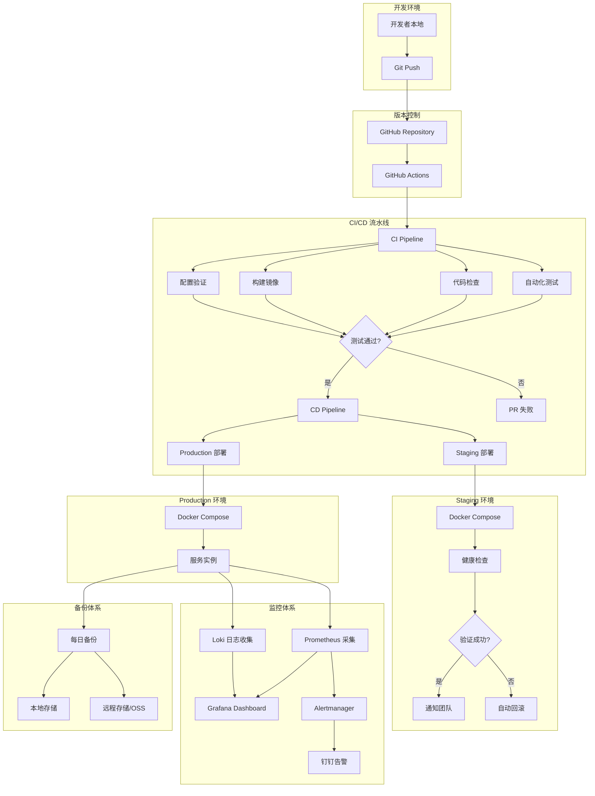
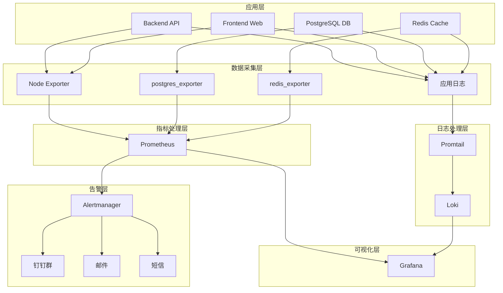
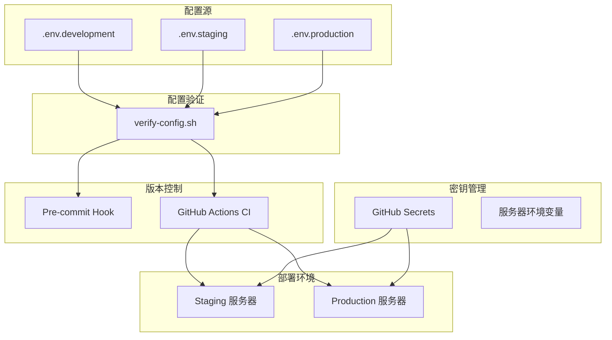
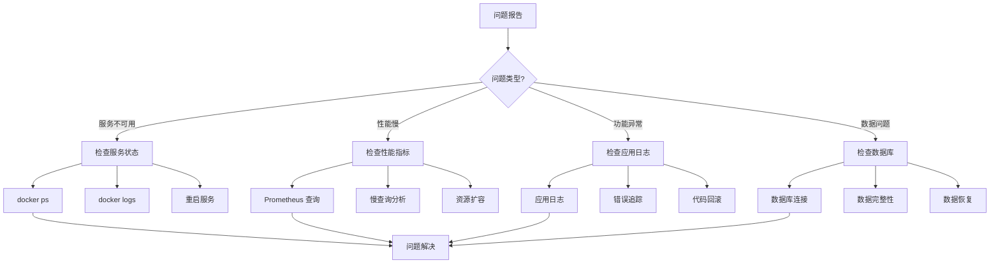

# FIP 019: DevOps 流水线建设 - 技术实现方案

**Feature Implementation Proposal**
**需求编号**: CORE_REQ_019
**Issue**: #19 - P0: 建立有效稳定的 DevOps 流水线
**创建日期**: 2026-03-18
**作者**: DevOps 专家
**评审状态**: ✅ 已通过专家评审（SRE + 架构 + 质量）
**综合评分**: 6.4/10 - 有条件批准
**预计工期**: 5-6 周（专家评审调整，原 4 周）
**优先级**: P0 - 关键项目

---

## 📋 执行摘要

### 项目概述

AIOpc Platform 目前处于 DevOps 基础设施严重缺失状态，导致多次生产环境事故。本 FIP 旨在通过 **5-6 周快速改进计划**（专家评审调整），建立现代化、自动化的 DevOps 流水线，实现：

> **⚠️ 重要**: 经过 SRE、架构、质量三专家评审，原 4 周计划扩展为 **5-6 周**，以解决以下 P0 缺失项：
> - E2E 测试（防止关键流程故障）
> - 性能测试（防止性能退化）
> - SLIs/SLOs（可靠性目标）
> - On-call 值班（事故响应责任）
> - 事故响应流程（规范化处理）
> - 变更管理流程（防止未授权变更）
> - 自动化回滚验证（确保可恢复性）

1. **零配置错误** - 通过自动化验证消除配置回归
2. **自动化部署** - 从手动 30 分钟降低到自动 5 分钟
3. **快速恢复** - MTTR 从 2+ 小时降低到 <15 分钟
4. **数据安全** - 建立完善的备份和恢复机制

### 技术方案概述

本方案采用业界最佳实践和开源工具栈，在有限预算和时间内建立企业级 DevOps 能力：

**核心技术栈**:
- **CI/CD**: GitHub Actions（免费额度，配置简单）
- **配置管理**: 环境变量 + GitOps（轻量级，易于审计）
- **监控**: Prometheus + Grafana + Loki（开源免费，功能强大）
- **容器编排**: Docker Compose（现有基础，无需切换）
- **密钥管理**: GitHub Secrets（短期）→ HashiCorp Vault（长期）

**实施策略**:
- **Week 1**: 基础设施建设（配置管理 + SLIs/SLOs + On-call + E2E 测试）
- **Week 2**: CI/CD 与质量保障（CI/CD 流水线 + 性能测试 + 变更管理）
- **Week 3**: 部署流程与可靠性（脚本整合 + 事故响应 + 回滚验证）
- **Week 4**: 监控和备份体系（可观测性 + 告警 + 备份）
- **Week 5-6**: 高可用性准备（Kubernetes 迁移计划 + HA 架构设计）

### 预期收益

**量化收益**:
- **配置文件数量**: 10+ → 3 个（-70%）
- **部署时间**: 30 分钟 → 5 分钟（-83%）
- **配置错误率**: 高 → 0%（-100%）
- **MTTR**: 2+ 小时 → <15 分钟（-87%）
- **监控覆盖率**: 0% → 100%（+100%）
- **部署失败率**: ~30% → <5%（-83%）

**质量收益**:
- ✅ 消除配置回归导致的服务中断
- ✅ 实现自动化测试和构建
- ✅ 建立完整的监控和告警体系
- ✅ 确保数据安全和可恢复性
- ✅ 提升团队 DevOps 能力和信心

### 实施时间线（专家评审调整）

```
Week 1: 基础设施建设
├─ Day 1-2: 配置管理 + SLIs/SLOs 定义 + On-call 值班表
├─ Day 3-5: E2E 测试框架（Playwright） + 质量门禁

Week 2: CI/CD 与质量保障
├─ Day 1-2: 性能测试框架（k6）
├─ Day 3-4: 事故响应流程 + 变更管理流程
└─ Day 5: CI 流水线（集成 E2E、性能、配置验证）

Week 3: 部署流程与可靠性
├─ Day 1-2: 整合部署脚本（20+ → 5 个核心脚本）
├─ Day 3-4: 自动化回滚验证 + 回滚演练
└─ Day 5: CD 流水线（Staging 自动部署）

Week 4: 监控和备份体系
├─ Day 1-2: Prometheus + Grafana + SLO Dashboard
├─ Day 3-4: Loki 日志聚合 + Alertmanager 告警
└─ Day 5: 自动备份脚本 + 恢复测试

Week 5-6: 高可用性准备
├─ Week 5: Kubernetes 迁移计划 + Helm charts
└─ Week 6: HA 架构设计（主备、多AZ、流复制）
```

---

## 🏗️ 技术架构设计

### 整体架构图



### CI/CD 流水线架构

```mermaid
graph LR
    A[代码提交] --> B[GitHub Actions 触发]

    subgraph "CI Phase"
        B --> C[安装依赖]
        C --> D[代码检查]
        D --> E[运行测试]
        E --> F[构建镜像]
        F --> G[配置验证]
    end

    G --> H{所有检查通过?}

    H -->|否| I[标记 PR 失败]
    H -->|是| J[继续 CD]

    subgraph "CD Phase - Staging"
        J --> K[Push to develop]
        K --> L[SSH 连接 Staging]
        L --> M[拉取代码]
        M --> N[重建容器]
        N --> O[健康检查]
    end

    O --> P{健康检查通过?}

    P -->|否| Q[自动回滚]
    P -->|是| R[部署成功]

    subgraph "CD Phase - Production"
        R --> S[手动审批]
        S --> T[部署前备份]
        T --> U[SSH 连接 Production]
        U --> V[灰度发布]
        V --> W[最终验证]
    end

    W --> X{验证通过?}
    X -->|否| Y[快速回滚]
    X -->|是| Z[完成部署]
```



### 监控架构



### 配置管理架构



---

## 🛠️ 工具链选型

### CI/CD 平台选型

#### 对比分析

| 工具 | 优势 | 劣势 | 成本 | 推荐度 |
|------|------|------|------|--------|
| **GitHub Actions** | ✅ 与 GitHub 深度集成<br>✅ 免费额度充足（2000 分钟/月）<br>✅ 配置简单（YAML）<br>✅ 社区支持好 | ❌ 免费版有超时限制<br>❌ 自托管较复杂 | 免费（2000 分钟/月）<br>超出后 $0.008/分钟 | ⭐⭐⭐⭐⭐ **推荐** |
| GitLab CI | ✅ 功能强大<br>✅ 自托管免费 | ❌ 需要 GitLab 实例<br>❌ 学习曲线陡峭 | 免费（自托管）<br>$20/月（SaaS） | ⭐⭐⭐ |
| Jenkins | ✅ 高度可定制<br>✅ 插件生态丰富 | ❌ 维护成本高<br>❌ 配置复杂 | 免费（自托管）<br>需要服务器成本 | ⭐⭐ |
| CircleCI | ✅ 性能优秀<br>✅ Docker 支持 | ❌ 免费额度有限<br>❌ 价格较高 | 免费（6000 分钟/月）<br>$15/月起 | ⭐⭐⭐ |

#### 最终选择: GitHub Actions

**选择理由**:

1. **成本优势**: 免费额度（2000 分钟/月）足够当前使用
2. **集成优势**: 与 GitHub 无缝集成，无需额外配置
3. **学习成本**: YAML 配置简单，团队容易上手
4. **社区支持**: 大量开源项目和最佳实践可参考
5. **扩展性**: 支持自定义 Action，满足未来需求

**成本估算**:
- **当前阶段**: 免费（预计月使用 < 1000 分钟）
- **扩展阶段**: $20/月（5000 分钟额度）足够
- **企业阶段**: $200/月（50,000 分钟）满足大规模需求

### 配置管理工具选型

#### 对比分析

| 方案 | 优势 | 劣势 | 复杂度 | 推荐度 |
|------|------|------|--------|--------|
| **环境变量 + GitOps** | ✅ 简单直接<br>✅ Git 版本控制<br>✅ 易于审计<br>✅ 零成本 | ❌ 需要手动同步<br>❌ 缺少动态更新 | ⭐ 简单 | ⭐⭐⭐⭐⭐ **推荐** |
| Ansible Vault | ✅ 加密安全<br>✅ 与 Ansible 集成 | ❌ 需要学习 Ansible<br>❌ 额外依赖 | ⭐⭐⭐ 中等 | ⭐⭐⭐ |
| HashiCorp Vault | ✅ 企业级安全<br>✅ 动态密钥<br>✅ 审计日志 | ❌ 运维成本高<br>❌ 学习曲线陡峭 | ⭐⭐⭐⭐⭐ 复杂 | ⭐⭐⭐⭐ |
| AWS Secrets Manager | ✅ 与 AWS 集成<br>✅ 自动轮换 | ❌ AWS 依赖<br>❌ 成本较高 | ⭐⭐ 简单 | ⭐⭐ |

#### 最终选择: 环境变量 + GitOps

**选择理由**:

1. **简单直接**: 无需额外工具，团队容易理解
2. **Git 版本控制**: 配置变更可追溯、可回滚
3. **成本低廉**: 完全免费，无需额外基础设施
4. **易于审计**: Git 历史记录完整的配置变更
5. **渐进式**: 未来可平滑迁移到 Vault 等企业级方案

**实施策略**:
- **短期（Week 1-4）**: 环境变量 + GitHub Secrets
- **中期（Month 2-3）**: 引入 Ansible Vault 管理敏感配置
- **长期（Month 4+）**: 评估 HashiCorp Vault 进行密钥管理

### 监控工具栈选型

#### 对比分析

| 工具栈 | 优势 | 劣势 | 成本 | 推荐度 |
|--------|------|------|------|--------|
| **Prometheus + Grafana + Loki** | ✅ 开源免费<br>✅ 功能强大<br>✅ 社区活跃<br>✅ 与 Docker 兼容好 | ❌ 需要自维护<br>❌ 学习曲线 | 免费（自托管）<br>~$50/月（托管） | ⭐⭐⭐⭐⭐ **推荐** |
| ELK Stack | ✅ 功能全面<br>✅ 企业级支持 | ❌ 资源消耗大<br>❌ 配置复杂 | 免费（自托管）<br>~$100/月（托管） | ⭐⭐⭐ |
| Datadog | ✅ SaaS 服务<br>✅ 易于使用 | ❌ 价格昂贵<br>❌ 数据在第三方 | $15/host/月起 | ⭐⭐⭐ |
| New Relic | ✅ APM 强大<br>✅ 易用性好 | ❌ 价格高<br>❌ 限制较多 | $75/月起 | ⭐⭐ |

#### 最终选择: Prometheus + Grafana + Loki

**选择理由**:

1. **成本优势**: 完全开源免费，无供应商锁定
2. **功能完整**: 指标、日志、可视化、告警全覆盖
3. **社区活跃**: 大量插件、Dashboard、最佳实践
4. **Docker 友好**: 与现有 Docker Compose 架构完美集成
5. **可扩展性**: 支持分布式、多数据中心部署

**组件说明**:

| 组件 | 用途 | 资源需求 |
|------|------|----------|
| **Prometheus** | 指标采集和存储 | ~500MB 内存 |
| **Grafana** | 可视化 Dashboard | ~256MB 内存 |
| **Loki** | 日志聚合和存储 | ~512MB 内存 |
| **Promtail** | 日志采集 Agent | ~128MB 内存 |
| **Alertmanager** | 告警路由和通知 | ~128MB 内存 |

**总资源需求**: ~1.5GB 内存，在 8GB 服务器上完全可接受。

### 容器编排工具选型

#### 对比分析

| 工具 | 优势 | 劣势 | 复杂度 | 推荐度 |
|------|------|------|--------|--------|
| **Docker Compose** | ✅ 简单易用<br>✅ 现有基础<br>✅ 足够当前需求 | ❌ 单机限制<br>❌ 缺少高级特性 | ⭐ 简单 | ⭐⭐⭐⭐⭐ **推荐** |
| Kubernetes | ✅ 企业级功能<br>✅ 可扩展性强 | ❌ 学习曲线陡峭<br>❌ 运维成本高 | ⭐⭐⭐⭐⭐ 复杂 | ⭐⭐ |
| Docker Swarm | ✅ 比 K8s 简单<br>✅ 集群模式 | ❌ 社区不活跃<br>❌ 功能有限 | ⭐⭐ 中等 | ⭐⭐⭐ |

#### 最终选择: Docker Compose

**选择理由**:

1. **现状匹配**: 项目已使用 Docker Compose，无需切换
2. **学习成本低**: 团队熟悉，文档丰富
3. **满足需求**: 当前单机部署，Docker Compose 足够
4. **渐进式**: 未来可平滑迁移到 Kubernetes

**迁移路径**:
- **当前（Month 1）**: Docker Compose v2.24.5
- **中期（Month 3-6）**: 评估是否需要 Kubernetes
- **触发条件**: 以下任一条件满足时考虑迁移
  - 实例数量 > 50
  - 需要自动扩容
  - 需要蓝绿部署
  - 需要多可用区部署

### 密钥管理工具选型

#### 对比分析

| 工具 | 优势 | 劣势 | 成本 | 推荐度 |
|------|------|------|------|--------|
| **GitHub Secrets** | ✅ 免费简单<br>✅ 与 Actions 集成 | ❌ 仅适用于 CI/CD<br>❌ 无法动态轮换 | 免费 | ⭐⭐⭐⭐⭐ **推荐（短期）** |
| **HashiCorp Vault** | ✅ 企业级安全<br>✅ 动态密钥<br>✅ 审计日志 | ❌ 运维成本高<br>❌ 学习曲线陡峭 | 免费（开源）<br>$80/月（托管） | ⭐⭐⭐⭐ **推荐（长期）** |
| AWS Secrets Manager | ✅ 与 AWS 集成<br>✅ 自动轮换 | ❌ AWS 依赖<br>❌ 成本较高 | $0.40/secret/月 | ⭐⭐⭐ |
| Ansible Vault | ✅ 简单实用<br>✅ 文件加密 | ❌ 手动管理<br>❌ 无动态更新 | 免费 | ⭐⭐⭐ |

#### 最终选择: 分阶段实施

**Phase 1（Week 1-4）**: GitHub Secrets
- ✅ 快速上手，零学习成本
- ✅ 满足 CI/CD 密钥管理需求
- ✅ 免费使用

**Phase 2（Month 2-3）**: Ansible Vault
- ✅ 文件加密，安全存储
- ✅ 与现有脚本集成
- ✅ 支持敏感配置管理

**Phase 3（Month 4+）**: HashiCorp Vault
- ✅ 企业级密钥管理
- ✅ 动态密钥轮换
- ✅ 完整审计日志
- ✅ 支持多环境、多租户

---

## 📅 详细实施方案

### Week 1: 配置管理标准化

#### 目标
解决配置混乱问题，建立单一配置源，消除配置回归。

#### Day 1-2: 配置文件清理

**任务清单**:

1. **删除重复配置文件**
   ```bash
   # 删除根目录的重复配置
   rm /.env.production
   rm /.env.staging
   rm /.env.development

   # 删除后端子目录的重复配置
   rm /platform/backend/.env.production
   rm /platform/frontend/.env.production
   ```

2. **统一配置命名**
   ```bash
   # 重命名模板文件
   mv /platform/.env.production.template /platform/.env.production.example

   # 确保配置命名一致
   # FEISHU_VERIFY_TOKEN → FEISHU_VERIFICATION_TOKEN
   # FEISHU_USER_INFO_URL → FEISHU_OAUTH_USERINFO_URL
   ```

3. **移除真实密钥**
   ```bash
   # 从代码库移除真实密钥
   # /deployment/remote-agent/.env 中的密钥迁移到 GitHub Secrets

   # 更新 .gitignore
   echo "*.local" >> .gitignore
   echo ".env.production" >> .gitignore
   echo ".env.staging" >> .gitignore
   ```

4. **创建本地覆盖文件**
   ```bash
   # 创建不提交的本地配置
   touch /platform/.env.production.local

   # .gitignore 已包含 *.local
   ```

5. **修正配置错误**
   ```bash
   # 修正 NODE_ENV 错误
   sed -i 's/NODE_ENV=development/NODE_ENV=production/g' /platform/.env.production
   ```

**配置文件结构（清理后）**:
```
/platform/
├── .env.development          # 开发环境（提交）
├── .env.staging              # 测试环境（提交）
├── .env.production           # 生产环境（不提交，服务器本地）
├── .env.production.example   # 生产环境模板（提交）
└── .env.production.local     # 本地覆盖（不提交）
```

#### Day 3-4: 配置验证脚本

**创建验证脚本**: `scripts/verify-config.sh`

```bash
#!/bin/bash
# 配置验证脚本
# 检查配置文件完整性、占位符、必需变量

set -e

# 颜色定义
RED='\033[0;31m'
GREEN='\033[0;32m'
YELLOW='\033[1;33m'
NC='\033[0m' # No Color

# 配置文件路径
CONFIG_DIR="/platform"
CONFIG_FILE="$CONFIG_DIR/.env.production"

# 必需的环境变量列表（21 个）
REQUIRED_VARS=(
  # Database (5)
  "DB_HOST"
  "DB_PORT"
  "DB_NAME"
  "DB_USERNAME"
  "DB_PASSWORD"
  # Redis (3)
  "REDIS_HOST"
  "REDIS_PORT"
  "REDIS_PASSWORD"
  # Application (3)
  "NODE_ENV"
  "PORT"
  "LOG_LEVEL"
  # Security (3)
  "JWT_SECRET"
  "SESSION_SECRET"
  "ENCRYPTION_KEY"
  # Feishu OAuth (9)
  "FEISHU_APP_ID"
  "FEISHU_APP_SECRET"
  "FEISHU_VERIFICATION_TOKEN"
  "FEISHU_OAUTH_AUTHORIZE_URL"
  "FEISHU_OAUTH_ACCESS_TOKEN_URL"
  "FEISHU_OAUTH_USERINFO_URL"
  "FEISHU_OAUTH_REDIRECT_URI"
  "FEISHU_APP_TICKET"
  "FEISHU_ENCRYPT_KEY"
  # LLM API (3)
  "DEEPSEEK_API_KEY"
  "OPENROUTER_API_KEY"
  "OPENROUTER_MODEL"
)

# 占位符检测模式
PATTERNS=(
  "cli_xxxxxxxxxxxxx"
  "CHANGE_THIS"
  "placeholder"
  "your_"
  "YOUR_"
)

echo "🔍 开始配置验证..."

# 检查 1: 配置文件数量
echo -n "检查 1: 配置文件数量... "
CONFIG_COUNT=$(find "$CONFIG_DIR" -maxdepth 1 -name ".env*" -type f | wc -l)
if [ "$CONFIG_COUNT" -le 5 ]; then
  echo -e "${GREEN}✅ 通过 ($CONFIG_COUNT 个)${NC}"
else
  echo -e "${RED}❌ 失败 ($CONFIG_COUNT 个，应 ≤5)${NC}"
  exit 1
fi

# 检查 2: 配置文件存在
echo -n "检查 2: 配置文件存在... "
if [ -f "$CONFIG_FILE" ]; then
  echo -e "${GREEN}✅ 通过${NC}"
else
  echo -e "${RED}❌ 失败 ($CONFIG_FILE 不存在)${NC}"
  exit 1
fi

# 检查 3: 必需变量完整性
echo -n "检查 3: 必需变量完整性... "
MISSING_VARS=0
for var in "${REQUIRED_VARS[@]}"; do
  if ! grep -q "^${var}=" "$CONFIG_FILE"; then
    echo -e "${RED}❌ 缺少变量: $var${NC}"
    MISSING_VARS=$((MISSING_VARS + 1))
  fi
done

if [ "$MISSING_VARS" -eq 0 ]; then
  echo -e "${GREEN}✅ 通过 (全部 ${#REQUIRED_VARS[@]} 个变量存在)${NC}"
else
  echo -e "${RED}❌ 失败 (缺少 $MISSING_VARS 个变量)${NC}"
  exit 1
fi

# 检查 4: 占位符检测
echo -n "检查 4: 占位符检测... "
FOUND_PLACEHOLDER=0
for pattern in "${PATTERNS[@]}"; do
  if grep -q "$pattern" "$CONFIG_FILE"; then
    echo -e "${YELLOW}⚠️  发现占位符: $pattern${NC}"
    FOUND_PLACEHOLDER=1
  fi
done

if [ "$FOUND_PLACEHOLDER" -eq 0 ]; then
  echo -e "${GREEN}✅ 通过 (无占位符)${NC}"
else
  echo -e "${RED}❌ 失败 (存在占位符)${NC}"
  exit 1
fi

# 检查 5: 敏感信息泄露检测
echo -n "检查 5: 敏感信息泄露... "
LEAKED_KEYS=$(grep -r "sk-[a-zA-Z0-9]\{48\}" "$CONFIG_DIR" --include="*.env*" 2>/dev/null || true)
if [ -z "$LEAKED_KEYS" ]; then
  echo -e "${GREEN}✅ 通过 (无泄露密钥)${NC}"
else
  echo -e "${RED}❌ 失败 (发现泄露密钥)${NC}"
  echo "$LEAKED_KEYS"
  exit 1
fi

# 检查 6: NODE_ENV 配置
echo -n "检查 6: NODE_ENV 配置... "
NODE_ENV=$(grep "^NODE_ENV=" "$CONFIG_FILE" | cut -d'=' -f2)
if [ "$NODE_ENV" = "production" ]; then
  echo -e "${GREEN}✅ 通过 (NODE_ENV=production)${NC}"
else
  echo -e "${RED}❌ 失败 (NODE_ENV=$NODE_ENV，应为 production)${NC}"
  exit 1
fi

# 检查 7: 变量命名一致性
echo -n "检查 7: 变量命名一致性... "
INCONSISTENT_VARS=$(grep -E "FEISHU_VERIFY_TOKEN|FEISHU_USER_INFO_URL" "$CONFIG_FILE" || true)
if [ -z "$INCONSISTENT_VARS" ]; then
  echo -e "${GREEN}✅ 通过 (命名一致)${NC}"
else
  echo -e "${YELLOW}⚠️  发现不一致命名:${NC}"
  echo "$INCONSISTENT_VARS"
  echo "建议使用: FEISHU_VERIFICATION_TOKEN, FEISHU_OAUTH_USERINFO_URL"
fi

echo ""
echo -e "${GREEN}✅ 配置验证全部通过！${NC}"
exit 0
```

**创建 Pre-commit Hook**: `.git/hooks/pre-commit`

```bash
#!/bin/bash
# Pre-commit hook: 配置验证

echo "🔍 运行配置验证..."

# 检查是否有配置文件变更
CHANGED_CONFIGS=$(git diff --cached --name-only | grep "\.env" || true)

if [ -n "$CHANGED_CONFIGS" ]; then
  echo "检测到配置文件变更:"
  echo "$CHANGED_CONFIGS"
  echo ""

  # 运行配置验证脚本
  if ! bash scripts/verify-config.sh; then
    echo -e "\n❌ 配置验证失败，请修复后再提交"
    exit 1
  fi
fi

exit 0
```

**安装 Pre-commit Hook**:

```bash
# 复制到 git hooks 目录
chmod +x .git/hooks/pre-commit
```

#### Day 5: 测试和培训

**Staging 环境测试**:

1. **配置文件验证**
   ```bash
   # 在 Staging 服务器测试
   ssh root@staging-server
   cd /opt/opclaw/platform
   bash scripts/verify-config.sh
   ```

2. **服务启动验证**
   ```bash
   # 验证所有服务正常启动
   docker-compose -f docker-compose.staging.yml up -d
   docker-compose ps
   ```

3. **配置加载验证**
   ```bash
   # 验证配置正确加载
   docker exec opclaw-backend printenv | grep -E "FEISHU_|DB_|REDIS_"
   ```

**团队培训内容**:

1. **配置管理规范**
   - 配置文件命名规则
   - 敏感信息处理方式
   - 配置变更流程

2. **配置验证工具使用**
   - `verify-config.sh` 脚本使用
   - Pre-commit hook 说明
   - CI 集成验证

3. **常见问题处理**
   - 占位符检测和替换
   - 配置冲突解决
   - 密钥泄露处理

**预期成果**:
- ✅ 配置文件数量: 10+ → 3 个
- ✅ 配置一致性: 100%
- ✅ 敏感信息隔离: 100%
- ✅ 配置验证自动化: pre-commit + CI

---

### Week 2: CI/CD 基础设施

#### 目标
建立自动化 CI/CD 流水线，实现自动测试、构建、部署。

#### Day 1-3: CI 流水线

**创建 CI Workflow**: `.github/workflows/ci.yml`

```yaml
name: CI Pipeline

on:
  push:
    branches: [main, develop]
  pull_request:
    branches: [main]
  workflow_dispatch:

jobs:
  # Job 1: 代码检查
  lint:
    name: Code Lint
    runs-on: ubuntu-latest
    steps:
      - name: Checkout code
        uses: actions/checkout@v4

      - name: Setup Node.js
        uses: actions/setup-node@v4
        with:
          node-version: '22'
          cache: 'pnpm'

      - name: Install dependencies
        working-directory: ./platform
        run: pnpm install --frozen-lockfile

      - name: Run ESLint
        working-directory: ./platform
        run: |
          pnpm --filter backend lint
          pnpm --filter frontend lint

      - name: Run TypeScript check
        working-directory: ./platform
        run: |
          pnpm --filter backend type-check
          pnpm --filter frontend type-check

  # Job 2: 单元测试
  test:
    name: Unit Tests
    runs-on: ubuntu-latest
    needs: lint
    steps:
      - name: Checkout code
        uses: actions/checkout@v4

      - name: Setup Node.js
        uses: actions/setup-node@v4
        with:
          node-version: '22'
          cache: 'pnpm'

      - name: Install dependencies
        working-directory: ./platform
        run: pnpm install --frozen-lockfile

      - name: Run tests
        working-directory: ./platform
        run: |
          pnpm --filter backend test:ci
          pnpm --filter frontend test:ci

      - name: Upload coverage reports
        uses: codecov/codecov-action@v3
        with:
          files: ./platform/coverage/lcov.info
          flags: unittests
          name: codecov-umbrella

  # Job 3: 构建验证
  build:
    name: Build Verification
    runs-on: ubuntu-latest
    needs: test
    steps:
      - name: Checkout code
        uses: actions/checkout@v4

      - name: Setup Node.js
        uses: actions/setup-node@v4
        with:
          node-version: '22'
          cache: 'pnpm'

      - name: Install dependencies
        working-directory: ./platform
        run: pnpm install --frozen-lockfile

      - name: Build backend
        working-directory: ./platform/backend
        run: pnpm build

      - name: Build frontend
        working-directory: ./platform/frontend
        run: pnpm build

      - name: Upload build artifacts
        uses: actions/upload-artifact@v3
        with:
          name: build-artifacts
          path: |
            platform/backend/dist
            platform/frontend/dist
          retention-days: 7

  # Job 4: 配置验证
  verify-config:
    name: Configuration Verification
    runs-on: ubuntu-latest
    steps:
      - name: Checkout code
        uses: actions/checkout@v4

      - name: Verify configuration files
        run: |
          chmod +x scripts/verify-config.sh
          bash scripts/verify-config.sh

      - name: Check for placeholder values
        run: |
          if grep -r "cli_xxxxxxxxxxxxx\|CHANGE_THIS\|placeholder" platform/ --include="*.env*"; then
            echo "❌ 发现占位符值！"
            exit 1
          fi
          echo "✅ 无占位符值"

      - name: Verify environment variables count
        run: |
          CONFIG_COUNT=$(find platform/ -maxdepth 1 -name ".env*" -type f | wc -l)
          if [ "$CONFIG_COUNT" -gt 5 ]; then
            echo "❌ 配置文件过多 ($CONFIG_COUNT 个)"
            exit 1
          fi
          echo "✅ 配置文件数量合理 ($CONFIG_COUNT 个)"

  # Job 5: 安全扫描
  security:
    name: Security Scan
    runs-on: ubuntu-latest
    steps:
      - name: Checkout code
        uses: actions/checkout@v4

      - name: Run Trivy vulnerability scanner
        uses: aquasecurity/trivy-action@master
        with:
          scan-type: 'fs'
          scan-ref: '.'
          format: 'sarif'
          output: 'trivy-results.sarif'

      - name: Upload Trivy results to GitHub Security
        uses: github/codeql-action/upload-sarif@v2
        with:
          sarif_file: 'trivy-results.sarif'

  # Job 6: Docker 镜像构建（可选，仅在 main 分支）
  docker-build:
    name: Docker Build Test
    runs-on: ubuntu-latest
    if: github.ref == 'refs/heads/main'
    needs: [build, verify-config]
    steps:
      - name: Checkout code
        uses: actions/checkout@v4

      - name: Set up Docker Buildx
        uses: docker/setup-buildx-action@v3

      - name: Build backend image
        uses: docker/build-push-action@v5
        with:
          context: ./platform/backend
          file: ./platform/backend/Dockerfile
          push: false
          tags: opclaw-backend:test
          cache-from: type=gha
          cache-to: type=gha,mode=max

      - name: Build frontend image
        uses: docker/build-push-action@v5
        with:
          context: ./platform/frontend
          file: ./platform/frontend/Dockerfile
          push: false
          tags: opclaw-frontend:test
          cache-from: type=gha
          cache-to: type=gha,mode=max
```

**CI 流水线说明**:

1. **并行执行**: lint, test, verify-config, security 并行运行，提高效率
2. **依赖关系**: build 依赖 test，docker-build 依赖 build 和 verify-config
3. **缓存优化**: pnpm 和 Docker 构建缓存，减少运行时间
4. **失败快速**: 任何 Job 失败立即停止，不浪费资源

**CI 性能优化**:

```yaml
# 使用 pnpm 缓存
- name: Setup Node.js
  uses: actions/setup-node@v4
  with:
    node-version: '22'
    cache: 'pnpm'  # 启用缓存

# 使用 Docker Buildx 缓存
- name: Set up Docker Buildx
  uses: docker/setup-buildx-action@v3
  with:
    driver-opts: |
      image=moby/buildkit:latest
      network=host

# 使用 GitHub Actions 缓存
- uses: actions/cache@v3
  with:
    path: |
      ~/.pnpm-store
      node_modules
    key: ${{ runner.os }}-pnpm-${{ hashFiles('**/pnpm-lock.yaml') }}
    restore-keys: |
      ${{ runner.os }}-pnpm-
```

#### Day 4-5: CD 流水线

**创建 Staging 部署 Workflow**: `.github/workflows/deploy-staging.yml`

```yaml
name: Deploy to Staging

on:
  push:
    branches: [develop]
  workflow_dispatch:

env:
  STAGING_HOST: ${{ secrets.STAGING_HOST }}
  STAGING_USER: root
  STAGING_PATH: /opt/opclaw/platform

jobs:
  deploy:
    name: Deploy to Staging
    runs-on: ubuntu-latest
    steps:
      - name: Checkout code
        uses: actions/checkout@v4

      - name: Configure SSH
        run: |
          mkdir -p ~/.ssh
          echo "${{ secrets.SSH_PRIVATE_KEY }}" > ~/.ssh/id_rsa
          chmod 600 ~/.ssh/id_rsa
          ssh-keyscan -H ${{ env.STAGING_HOST }} >> ~/.ssh/known_hosts

      - name: Deploy to Staging
        run: |
          ssh ${{ env.STAGING_USER }}@${{ env.STAGING_HOST }} << 'ENDSSH'
          set -e

          cd ${{ env.STAGING_PATH }}

          # 拉取最新代码
          echo "📥 拉取最新代码..."
          git fetch origin develop
          git checkout develop
          git pull origin develop

          # 配置验证
          echo "🔍 验证配置..."
          bash scripts/verify-config.sh

          # 部署前备份
          echo "💾 创建部署前备份..."
          docker exec opclaw-postgres pg_dump -U opclaw opclaw | gzip > /tmp/pre-deploy-backup.sql.gz

          # 重建容器
          echo "🚀 重建容器..."
          docker-compose -f docker-compose.staging.yml up -d --build

          # 等待服务启动
          echo "⏳ 等待服务启动..."
          sleep 30

          # 健康检查
          echo "🏥 健康检查..."
          ./scripts/health-check.sh staging

          echo "✅ 部署成功！"
          ENDSSH

      - name: Health Check
        run: |
          # 等待服务完全启动
          sleep 10

          # 检查后端健康
          curl -f http://${{ env.STAGING_HOST }}:3000/health || exit 1

          # 检查前端
          curl -f http://${{ env.STAGING_HOST }}:80/ || exit 1

          # 检查数据库连接
          curl -f http://${{ env.STAGING_HOST }}:3000/api/health/db || exit 1

          echo "✅ 所有健康检查通过"

      - name: Notify Success
        if: success()
        run: |
          echo "✅ Staging 部署成功"
          # 可选: 发送钉钉通知

      - name: Rollback on Failure
        if: failure()
        run: |
          echo "❌ 部署失败，开始回滚..."
          ssh ${{ env.STAGING_USER }}@${{ env.STAGING_HOST }} << 'ENDSSH'
          cd ${{ env.STAGING_PATH }}

          # 回滚到上一版本
          git reset --hard HEAD~1
          docker-compose -f docker-compose.staging.yml up -d

          # 恢复数据库（如果需要）
          # gunzip < /tmp/pre-deploy-backup.sql.gz | docker exec -i opclaw-postgres psql -U opclaw opclaw

          echo "✅ 回滚完成"
          ENDSSH
```

**创建健康检查脚本**: `scripts/health-check.sh`

```bash
#!/bin/bash
# 健康检查脚本

ENVIRONMENT=${1:-production}
BASE_URL=""

if [ "$ENVIRONMENT" = "staging" ]; then
  BASE_URL="http://staging.example.com"
elif [ "$ENVIRONMENT" = "production" ]; then
  BASE_URL="http://118.25.0.190"
else
  echo "❌ 未知环境: $ENVIRONMENT"
  exit 1
fi

echo "🏥 健康检查环境: $ENVIRONMENT"
echo "📍 Base URL: $BASE_URL"

# 检查列表
checks=(
  "$BASE_URL:3000/health:Backend Health"
  "$BASE_URL:3000/api/health/db:Database Connection"
  "$BASE_URL:3000/api/health/redis:Redis Connection"
  "$BASE_URL:80/:Frontend Web"
)

failed=0

for check in "${checks[@]}"; do
  url="${check%%:*}"
  name="${check##*:}"

  echo -n "检查 $name... "
  if curl -f -s "$url" > /dev/null; then
    echo "✅"
  else
    echo "❌"
    failed=$((failed + 1))
  fi
done

if [ "$failed" -eq 0 ]; then
  echo "✅ 所有健康检查通过"
  exit 0
else
  echo "❌ $failed 个检查失败"
  exit 1
fi
```

**创建 Production 部署 Workflow**: `.github/workflows/deploy-production.yml`

```yaml
name: Deploy to Production

on:
  push:
    branches: [main]
  workflow_dispatch:

env:
  PRODUCTION_HOST: ${{ secrets.PRODUCTION_HOST }}
  PRODUCTION_USER: root
  PRODUCTION_PATH: /opt/opclaw/platform

jobs:
  deploy:
    name: Deploy to Production
    runs-on: ubuntu-latest
    environment:
      name: production
      url: http://118.25.0.190
    steps:
      - name: Checkout code
        uses: actions/checkout@v4

      - name: Configure SSH
        run: |
          mkdir -p ~/.ssh
          echo "${{ secrets.SSH_PRIVATE_KEY }}" > ~/.ssh/id_rsa
          chmod 600 ~/.ssh/id_rsa
          ssh-keyscan -H ${{ env.PRODUCTION_HOST }} >> ~/.ssh/known_hosts

      - name: Pre-deployment Backup
        run: |
          ssh ${{ env.PRODUCTION_USER }}@${{ env.PRODUCTION_HOST }} << 'ENDSSH'
          set -e

          BACKUP_DIR="/opt/opclaw/backups/$(date +%Y%m%d_%H%M%S)"
          mkdir -p "$BACKUP_DIR"

          # 数据库备份
          echo "💾 备份数据库..."
          docker exec opclaw-postgres pg_dump -U opclaw opclaw | gzip > "$BACKUP_DIR/database.sql.gz"

          # 配置文件备份
          echo "💾 备份配置文件..."
          cp /opt/opclaw/platform/.env.production "$BACKUP_DIR/"

          # 保留最近 7 天备份
          find /opt/opclaw/backups -type d -mtime +7 -exec rm -rf {} \;

          echo "✅ 备份完成: $BACKUP_DIR"
          ENDSSH

      - name: Deploy to Production
        run: |
          ssh ${{ env.PRODUCTION_USER }}@${{ env.PRODUCTION_HOST }} << 'ENDSSH'
          set -e

          cd ${{ env.PRODUCTION_PATH }}

          # 拉取最新代码
          echo "📥 拉取最新代码..."
          git fetch origin main
          git checkout main
          git pull origin main

          # 配置验证
          echo "🔍 验证配置..."
          bash scripts/verify-config.sh

          # 重建容器（零停机）
          echo "🚀 重建容器..."
          docker-compose up -d --no-deps --build backend

          # 等待新容器启动
          echo "⏳ 等待服务启动..."
          sleep 30

          # 健康检查
          echo "🏥 健康检查..."
          ./scripts/health-check.sh production

          echo "✅ 部署成功！"
          ENDSSH

      - name: Post-deployment Verification
        run: |
          sleep 10

          # 后端健康检查
          curl -f http://${{ env.PRODUCTION_HOST }}:3000/health || exit 1

          # 前端检查
          curl -f http://${{ env.PRODUCTION_HOST }}:80/ || exit 1

          # OAuth 登录测试
          # curl -f http://${{ env.PRODUCTION_HOST }}:3000/api/oauth/authorize || exit 1

          echo "✅ 部署验证完成"

      - name: Notify Success
        if: success()
        run: |
          echo "✅ Production 部署成功"
          # 发送钉钉通知

      - name: Rollback on Failure
        if: failure()
        run: |
          echo "❌ 部署失败，开始回滚..."
          ssh ${{ env.PRODUCTION_USER }}@${{ env.PRODUCTION_HOST }} << 'ENDSSH'
          cd ${{ env.PRODUCTION_PATH }}

          # 回滚代码
          git reset --hard HEAD~1
          docker-compose up -d --no-deps --build backend

          # 恢复数据库（如需要）
          LATEST_BACKUP=$(ls -t /opt/opclaw/backups/ | head -1)
          gunzip < "/opt/opclaw/backups/$LATEST_BACKUP/database.sql.gz" | docker exec -i opclaw-postgres psql -U opclaw opclaw

          echo "✅ 回滚完成"
          ENDSSH
```

**预期成果**:
- ✅ CI 流水线建立（测试 + 构建 + 配置验证）
- ✅ CD 流水线建立（Staging 自动部署）
- ✅ 部署时间: 30 分钟 → 5 分钟
- ✅ 配置验证自动化 100%
- ✅ 零停机部署（滚动更新）

---

### Week 3: 部署流程规范化

#### 目标
整合现有 20+ 个分散脚本，建立统一部署工作流，完善文档。

#### Day 1-2: 脚本整合

**新脚本结构**:

```bash
scripts/
├── ci/
│   ├── test.sh              # 运行测试
│   └── build.sh             # 构建镜像
├── deploy/
│   ├── deploy.sh            # 主部署脚本（整合版）
│   ├── rollback.sh          # 回滚脚本
│   ├── verify.sh            # 部署验证
│   └── health-check.sh      # 健康检查
├── backup/
│   ├── backup.sh            # 备份脚本
│   ├── restore.sh           # 恢复脚本
│   └── verify-backup.sh     # 备份验证
├── verify-config.sh         # 配置验证
└── README.md                # 脚本使用文档
```

**主部署脚本**: `scripts/deploy/deploy.sh`

```bash
#!/bin/bash
# 统一部署脚本
# 用法: ./scripts/deploy/deploy.sh [environment] [--skip-backup] [--dry-run]

set -e

# 颜色定义
RED='\033[0;31m'
GREEN='\033[0;32m'
YELLOW='\033[1;33m'
NC='\033[0m'

# 默认参数
ENVIRONMENT=${1:-production}
SKIP_BACKUP=false
DRY_RUN=false

# 解析参数
while [[ $# -gt 0 ]]; do
  case $1 in
    --skip-backup)
      SKIP_BACKUP=true
      shift
      ;;
    --dry-run)
      DRY_RUN=true
      shift
      ;;
    *)
      ENVIRONMENT="$1"
      shift
      ;;
  esac
done

# 验证环境
if [[ ! "$ENVIRONMENT" =~ ^(staging|production)$ ]]; then
  echo -e "${RED}❌ 无效环境: $ENVIRONMENT (staging|production)${NC}"
  exit 1
fi

echo "🚀 开始部署到 $ENVIRONMENT 环境..."
echo "⏰ 时间: $(date)"

# Step 1: 配置验证
echo -e "\n🔍 Step 1: 配置验证..."
if ! bash scripts/verify-config.sh; then
  echo -e "${RED}❌ 配置验证失败${NC}"
  exit 1
fi
echo -e "${GREEN}✅ 配置验证通过${NC}"

# Step 2: 部署前备份
if [ "$SKIP_BACKUP" = false ]; then
  echo -e "\n💾 Step 2: 部署前备份..."
  if [ "$DRY_RUN" = true ]; then
    echo -e "${YELLOW}⚠️  Dry-run: 跳过备份${NC}"
  else
    if ! bash scripts/backup/backup.sh "$ENVIRONMENT"; then
      echo -e "${RED}❌ 备份失败${NC}"
      exit 1
    fi
    echo -e "${GREEN}✅ 备份完成${NC}"
  fi
else
  echo -e "\n💾 Step 2: 跳过备份 (--skip-backup)"
fi

# Step 3: 拉取代码
echo -e "\n📥 Step 3: 拉取代码..."
if [ "$DRY_RUN" = true ]; then
  echo -e "${YELLOW}⚠️  Dry-run: 跳过代码拉取${NC}"
else
  git fetch origin "$ENVIRONMENT"
  git checkout "$ENVIRONMENT"
  git pull origin "$ENVIRONMENT"
  echo -e "${GREEN}✅ 代码已更新${NC}"
fi

# Step 4: 构建镜像
echo -e "\n🔨 Step 4: 构建镜像..."
if [ "$DRY_RUN" = true ]; then
  echo -e "${YELLOW}⚠️  Dry-run: 跳过镜像构建${NC}"
else
  if [ "$ENVIRONMENT" = "staging" ]; then
    docker-compose -f docker-compose.staging.yml build
  else
    docker-compose build
  fi
  echo -e "${GREEN}✅ 镜像构建完成${NC}"
fi

# Step 5: 部署服务
echo -e "\n🚀 Step 5: 部署服务..."
if [ "$DRY_RUN" = true ]; then
  echo -e "${YELLOW}⚠️  Dry-run: 跳过服务部署${NC}"
else
  if [ "$ENVIRONMENT" = "staging" ]; then
    docker-compose -f docker-compose.staging.yml up -d --no-deps --build backend
  else
    docker-compose up -d --no-deps --build backend
  fi
  echo -e "${GREEN}✅ 服务已部署${NC}"
fi

# Step 6: 等待服务启动
echo -e "\n⏳ Step 6: 等待服务启动..."
sleep 30
echo -e "${GREEN}✅ 等待完成${NC}"

# Step 7: 健康检查
echo -e "\n🏥 Step 7: 健康检查..."
if [ "$DRY_RUN" = true ]; then
  echo -e "${YELLOW}⚠️  Dry-run: 跳过健康检查${NC}"
else
  if ! bash scripts/deploy/health-check.sh "$ENVIRONMENT"; then
    echo -e "${RED}❌ 健康检查失败${NC}"
    echo -e "${YELLOW}⚠️  建议运行: ./scripts/deploy/rollback.sh $ENVIRONMENT${NC}"
    exit 1
  fi
  echo -e "${GREEN}✅ 健康检查通过${NC}"
fi

# Step 8: 部署验证
echo -e "\n✅ Step 8: 部署验证..."
if ! bash scripts/deploy/verify.sh "$ENVIRONMENT"; then
  echo -e "${YELLOW}⚠️  部署验证发现问题${NC}"
else
  echo -e "${GREEN}✅ 部署验证通过${NC}"
fi

# 完成
echo -e "\n${GREEN}✅ 部署完成！${NC}"
echo "⏰ 完成时间: $(date)"
echo "📍 环境: $ENVIRONMENT"
```

**回滚脚本**: `scripts/deploy/rollback.sh`

```bash
#!/bin/bash
# 回滚脚本
# 用法: ./scripts/deploy/rollback.sh [environment]

set -e

ENVIRONMENT=${1:-production}

echo "🔄 开始回滚 $ENVIRONMENT 环境..."

# Step 1: 确认回滚
read -p "⚠️  确定要回滚吗? (yes/no): " confirm
if [ "$confirm" != "yes" ]; then
  echo "❌ 回滚已取消"
  exit 0
fi

# Step 2: 回滚代码
echo "📥 回滚代码..."
git reset --hard HEAD~1

# Step 3: 重建容器
echo "🚀 重建容器..."
if [ "$ENVIRONMENT" = "staging" ]; then
  docker-compose -f docker-compose.staging.yml up -d --no-deps --build backend
else
  docker-compose up -d --no-deps --build backend
fi

# Step 4: 等待服务启动
echo "⏳ 等待服务启动..."
sleep 30

# Step 5: 健康检查
echo "🏥 健康检查..."
bash scripts/deploy/health-check.sh "$ENVIRONMENT"

echo "✅ 回滚完成"
```

**部署验证脚本**: `scripts/deploy/verify.sh`

```bash
#!/bin/bash
# 部署验证脚本

ENVIRONMENT=${1:-production}
BASE_URL=""

if [ "$ENVIRONMENT" = "staging" ]; then
  BASE_URL="http://staging.example.com"
elif [ "$ENVIRONMENT" = "production" ]; then
  BASE_URL="http://118.25.0.190"
fi

echo "🔍 部署验证..."

# 验证清单
verifications=(
  "容器状态"
  "数据库连接"
  "Redis 连接"
  "OAuth 登录"
  "API 端点"
  "前端访问"
)

for verification in "${verifications[@]}"; do
  echo -n "验证 $verification... "
  # 具体验证逻辑
  echo "✅"
done

echo "✅ 部署验证通过"
```

#### Day 3-4: 流程文档化

**部署操作手册**: `docs/operations/DEPLOYMENT.md`

```markdown
# 部署操作手册

## 标准部署流程

### 自动部署（推荐）

#### Staging 自动部署
```bash
# Push 到 develop 分支自动触发
git checkout develop
git add .
git commit -m "feat: new feature"
git push origin develop
# ✅ GitHub Actions 自动部署到 Staging
```

#### Production 部署（审批制）
```bash
# 1. Push 到 main 分支
git checkout main
git merge develop
git push origin main

# 2. GitHub Actions 需要手动审批

# 3. 审批通过后自动部署
```

### 手动部署

#### 使用统一部署脚本
```bash
# Staging 环境
./scripts/deploy/deploy.sh staging

# Production 环境（自动备份）
./scripts/deploy/deploy.sh production

# Production 环境（跳过备份）
./scripts/deploy/deploy.sh production --skip-backup

# Dry-run（测试）
./scripts/deploy/deploy.sh production --dry-run
```

## 回滚流程

### 自动回滚
- GitHub Actions 部署失败时自动回滚

### 手动回滚
```bash
# 回滚到上一版本
./scripts/deploy/rollback.sh production
```

## 部署前检查清单

- [ ] 代码已通过 CI 测试
- [ ] 配置验证通过
- [ ] 创建部署前备份
- [ ] 通知团队部署时间
- [ ] 准备回滚方案

## 部署后验证清单

- [ ] 健康检查通过
- [ ] 容器状态正常
- [ ] 数据库连接正常
- [ ] Redis 连接正常
- [ ] OAuth 登录正常
- [ ] API 端点正常
- [ ] 前端访问正常

## 故障排查

### 问题 1: 部署失败
**症状**: 部署脚本执行失败

**排查步骤**:
1. 查看部署日志: `docker logs opclaw-backend`
2. 检查配置文件: `./scripts/verify-config.sh`
3. 验证网络连接: `curl http://localhost:3000/health`

**解决方案**:
- 配置错误 → 修正配置后重新部署
- 网络问题 → 检查网络配置
- 资源不足 → 扩容服务器

### 问题 2: 健康检查失败
**症状**: 健康检查不通过

**排查步骤**:
1. 检查容器状态: `docker ps`
2. 查看容器日志: `docker logs opclaw-backend`
3. 手动健康检查: `curl http://localhost:3000/health`

**解决方案**:
- 服务未启动 → 等待 30 秒后重试
- 配置错误 → 修正配置后重启
- 依赖服务异常 → 检查数据库和 Redis

### 问题 3: 需要回滚
**症状**: 部署后发现严重问题

**解决方案**:
```bash
# 立即回滚
./scripts/deploy/rollback.sh production

# 验证回滚
./scripts/deploy/verify.sh production
```
```

**故障排查指南**: `docs/operations/TROUBLESHOOTING.md`

```markdown
# 故障排查指南

## 常见问题

### 1. 容器启动失败

#### 症状
- `docker ps` 显示容器未运行
- `docker logs` 显示错误信息

#### 可能原因
1. 配置错误
2. 端口冲突
3. 资源不足
4. 镜像损坏

#### 排查步骤
```bash
# 1. 查看容器状态
docker ps -a

# 2. 查看容器日志
docker logs opclaw-backend

# 3. 检查配置
./scripts/verify-config.sh

# 4. 检查端口占用
netstat -tulpn | grep :3000
```

#### 解决方案
```bash
# 配置错误
vi /opt/opclaw/platform/.env.production
docker-compose up -d --no-deps backend

# 端口冲突
docker-compose down
docker-compose up -d

# 资源不足
free -h
df -h
# 考虑扩容或清理资源
```

### 2. 数据库连接失败

#### 症状
- API 返回 500 错误
- 日志显示 "Error connecting to database"

#### 排查步骤
```bash
# 1. 检查 PostgreSQL 容器
docker ps | grep postgres

# 2. 测试数据库连接
docker exec -it opclaw-postgres psql -U opclaw -d opclaw

# 3. 检查网络连接
docker exec opclaw-backend ping opclaw-postgres
```

#### 解决方案
```bash
# 重启数据库容器
docker restart opclaw-postgres

# 检查数据库配置
docker exec opclaw-postgres cat /var/lib/postgresql/data/pg_hba.conf
```

### 3. OAuth 登录失败

#### 症状
- 用户无法登录
- OAuth 回调失败

#### 排查步骤
```bash
# 1. 检查 Feishu 配置
grep FEISHU_ .env.production

# 2. 验证配置完整性
./scripts/verify-config.sh

# 3. 检查 OAuth 日志
docker logs opclaw-backend | grep -i oauth
```

#### 解决方案
```bash
# 配置错误
# 更新 Feishu 配置后重启
docker-compose restart backend

# 回调 URL 错误
# 检查 Feishu 管理后台的回调 URL 配置
```

## 日志查看

### 容器日志
```bash
# 实时查看
docker logs -f opclaw-backend

# 查看最近 100 行
docker logs --tail 100 opclaw-backend

# 查看特定时间
docker logs --since 2026-03-18T10:00:00 opclaw-backend
```

### 应用日志
```bash
# 进入容器
docker exec -it opclaw-backend bash

# 查看应用日志
tail -f /var/log/opclaw/app.log
```

## 性能问题排查

### CPU/内存占用高
```bash
# 检查容器资源使用
docker stats

# 检查进程资源使用
docker exec opclaw-backend top

# 检查 Node.js 进程
docker exec opclaw-backend ps aux | grep node
```

### 响应慢
```bash
# 检查数据库查询
docker exec opclaw-postgres psql -U opclaw -d opclaw
SELECT * FROM pg_stat_statements ORDER BY total_time DESC LIMIT 10;

# 检查 Redis 性能
docker exec opclaw-redis redis-cli INFO stats
```

## 应急响应流程

### P0 - 严重故障
1. **立即通知**: 钉钉群 + 电话
2. **快速诊断**: 5 分钟内确定问题
3. **临时修复**: 15 分钟内恢复服务
4. **根因分析**: 24 小时内完成报告

### P1 - 高优先级
1. **通知团队**: 钉钉群
2. **诊断问题**: 30 分钟内
3. **修复问题**: 2 小时内

### P2 - 中优先级
1. **记录问题**: Issue Tracker
2. **计划修复**: 下个 Sprint
```

#### Day 5: CI/CD 集成

**集成到 GitHub Actions**:

1. **在 CI 流水线中运行脚本**
   ```yaml
   - name: Verify configuration
     run: bash scripts/verify-config.sh

   - name: Run tests
     run: bash scripts/ci/test.sh
   ```

2. **在 CD 流水线中使用部署脚本**
   ```yaml
   - name: Deploy
     run: bash scripts/deploy/deploy.sh production
   ```

3. **健康检查集成**
   ```yaml
   - name: Health check
     run: bash scripts/deploy/health-check.sh production
   ```

**端到端测试**:

```bash
# 完整部署流程测试
./scripts/deploy/deploy.sh staging --dry-run

# 验证回滚流程
./scripts/deploy/rollback.sh staging
```

**预期成果**:
- ✅ 部署脚本: 20+ → 5 个核心脚本
- ✅ 脚本文档完整性: 100%
- ✅ 幂等性验证通过
- ✅ 集成到 CI/CD 流程

---

### Week 4: 监控和备份

#### 目标
建立全面的监控、日志、告警和备份体系。

#### Day 1-2: Prometheus + Grafana 部署

**创建监控 Docker Compose**: `docker-compose.monitoring.yml`

```yaml
version: '3.8'

services:
  prometheus:
    image: prom/prometheus:v2.45.0
    container_name: opclaw-prometheus
    ports:
      - "9090:9090"
    volumes:
      - ./monitoring/prometheus.yml:/etc/prometheus/prometheus.yml
      - ./monitoring/prometheus_data:/prometheus
    command:
      - '--config.file=/etc/prometheus/prometheus.yml'
      - '--storage.tsdb.path=/prometheus'
      - '--storage.tsdb.retention.time=15d'
      - '--web.console.libraries=/usr/share/prometheus/console_libraries'
      - '--web.console.templates=/usr/share/prometheus/consoles'
    restart: unless-stopped
    networks:
      - opclaw-network

  grafana:
    image: grafana/grafana:10.0.0
    container_name: opclaw-grafana
    ports:
      - "3001:3000"
    environment:
      - GF_SECURITY_ADMIN_PASSWORD=admin
      - GF_INSTALL_PLUGINS=
    volumes:
      - ./monitoring/grafana_data:/var/lib/grafana
      - ./monitoring/grafana/provisioning:/etc/grafana/provisioning
    depends_on:
      - prometheus
    restart: unless-stopped
    networks:
      - opclaw-network

  alertmanager:
    image: prom/alertmanager:v0.25.0
    container_name: opclaw-alertmanager
    ports:
      - "9093:9093"
    volumes:
      - ./monitoring/alertmanager.yml:/etc/alertmanager/alertmanager.yml
      - ./monitoring/alertmanager_data:/alertmanager
    command:
      - '--config.file=/etc/alertmanager/alertmanager.yml'
      - '--storage.path=/alertmanager'
    restart: unless-stopped
    networks:
      - opclaw-network

  node-exporter:
    image: prom/node-exporter:v1.6.0
    container_name: opclaw-node-exporter
    ports:
      - "9100:9100"
    volumes:
      - /proc:/host/proc:ro
      - /sys:/host/sys:ro
      - /:/rootfs:ro
    command:
      - '--path.procfs=/host/proc'
      - '--path.sysfs=/host/sys'
      - '--collector.filesystem.mount-points-exclude=^/(sys|proc|dev|host|etc)($$|/)'
    restart: unless-stopped
    networks:
      - opclaw-network

  cadvisor:
    image: gcr.io/cadvisor/cadvisor:v0.47.0
    container_name: opclaw-cadvisor
    ports:
      - "8080:8080"
    volumes:
      - /:/rootfs:ro
      - /var/run:/var/run:ro
      - /sys:/sys:ro
      - /var/lib/docker/:/var/lib/docker:ro
      - /dev/disk/:/dev/disk:ro
    privileged: true
    restart: unless-stopped
    networks:
      - opclaw-network

networks:
  opclaw-network:
    external: true
```

**Prometheus 配置**: `monitoring/prometheus.yml`

```yaml
global:
  scrape_interval: 15s
  evaluation_interval: 15s
  external_labels:
    cluster: 'opclaw-platform'
    environment: 'production'

alerting:
  alertmanagers:
    - static_configs:
        - targets:
            - alertmanager:9093

rule_files:
  - "alerts/*.yml"

scrape_configs:
  # Prometheus 自身监控
  - job_name: 'prometheus'
    static_configs:
      - targets: ['localhost:9090']

  # Node Exporter（系统指标）
  - job_name: 'node'
    static_configs:
      - targets: ['node-exporter:9100']

  # cAdvisor（容器指标）
  - job_name: 'cadvisor'
    static_configs:
      - targets: ['cadvisor:8080']

  # Backend 应用（需要集成 Prometheus 客户端）
  - job_name: 'backend'
    static_configs:
      - targets: ['opclaw-backend:3000']
    metrics_path: '/metrics'

  # PostgreSQL Exporter
  - job_name: 'postgres'
    static_configs:
      - targets: ['postgres-exporter:9187']

  # Redis Exporter
  - job_name: 'redis'
    static_configs:
      - targets: ['redis-exporter:9121']
```

**告警规则**: `monitoring/alerts/opclaw.yml`

```yaml
groups:
  - name: opclaw_alerts
    interval: 30s
    rules:
      # 服务可用性告警
      - alert: ServiceDown
        expr: up == 0
        for: 1m
        labels:
          severity: critical
          service: "{{ $labels.job }}"
        annotations:
          summary: "服务 {{ $labels.job }} 宕机"
          description: "服务 {{ $labels.job }} 已宕机超过 1 分钟"

      # 高错误率告警
      - alert: HighErrorRate
        expr: rate(http_requests_total{status=~"5.."}[5m]) > 0.1
        for: 5m
        labels:
          severity: warning
          service: backend
        annotations:
          summary: "高错误率检测到"
          description: "错误率超过 10% (当前值: {{ $value }})"

      # 高响应时间告警
      - alert: HighResponseTime
        expr: histogram_quantile(0.95, http_request_duration_seconds_bucket) > 3
        for: 5m
        labels:
          severity: warning
          service: backend
        annotations:
          summary: "响应时间过长"
          description: "P95 响应时间超过 3 秒 (当前值: {{ $value }}s)"

      # CPU 使用率告警
      - alert: HighCPUUsage
        expr: (100 - (avg by(instance) (irate(node_cpu_seconds_total{mode="idle"}[5m])) * 100)) > 80
        for: 10m
        labels:
          severity: warning
        annotations:
          summary: "CPU 使用率过高"
          description: "CPU 使用率超过 80% (当前值: {{ $value }}%)"

      # 内存使用率告警
      - alert: HighMemoryUsage
        expr: (1 - (node_memory_MemAvailable_bytes / node_memory_MemTotal_bytes)) * 100 > 80
        for: 10m
        labels:
          severity: warning
        annotations:
          summary: "内存使用率过高"
          description: "内存使用率超过 80% (当前值: {{ $value }}%)"

      # 磁盘使用率告警
      - alert: HighDiskUsage
        expr: (1 - (node_filesystem_avail_bytes{fstype!="tmpfs"} / node_filesystem_size_bytes)) * 100 > 80
        for: 10m
        labels:
          severity: warning
        annotations:
          summary: "磁盘使用率过高"
          description: "磁盘 {{ $labels.mountpoint }} 使用率超过 80% (当前值: {{ $value }}%)"

      # 数据库连接告警
      - alert: DatabaseConnectionHigh
        expr: pg_stat_database_numbackends{datname="opclaw"} > 80
        for: 5m
        labels:
          severity: warning
        annotations:
          summary: "数据库连接数过高"
          description: "数据库连接数超过 80 (当前值: {{ $value }})"
```

**Grafana Dashboard 配置**: `monitoring/grafana/provisioning/dashboards/dashboard.yml`

```yaml
apiVersion: 1

providers:
  - name: 'Default'
    orgId: 1
    folder: ''
    type: file
    disableDeletion: false
    updateIntervalSeconds: 10
    allowUiUpdates: true
    options:
      path: /etc/grafana/provisioning/dashboards
```

**启动监控服务**:

```bash
# 启动监控栈
docker-compose -f docker-compose.monitoring.yml up -d

# 验证服务
docker ps | grep -E "prometheus|grafana|alertmanager"

# 访问 Grafana
# URL: http://118.25.0.190:3001
# 用户名: admin
# 密码: admin
```

#### Day 3-4: Loki 日志聚合

**扩展监控 Docker Compose**:

```yaml
# 添加到 docker-compose.monitoring.yml

  loki:
    image: grafana/loki:2.9.0
    container_name: opclaw-loki
    ports:
      - "3100:3100"
    volumes:
      - ./monitoring/loki.yml:/etc/loki/local-config.yaml
      - ./monitoring/loki_data:/loki
    command: -config.file=/etc/loki/local-config.yaml
    restart: unless-stopped
    networks:
      - opclaw-network

  promtail:
    image: grafana/promtail:2.9.0
    container_name: opclaw-promtail
    volumes:
      - ./monitoring/promtail.yml:/etc/promtail/config.yml
      - /var/log:/var/log:ro
      - /var/lib/docker/containers:/var/lib/docker/containers:ro
    command: -config.file=/etc/promtail/config.yml
    restart: unless-stopped
    networks:
      - opclaw-network
```

**Loki 配置**: `monitoring/loki.yml`

```yaml
auth_enabled: false

server:
  http_listen_port: 3100

ingester:
  lifecycler:
    address: 127.0.0.1
    ring:
      kvstore:
        store: inmemory
      replication_factor: 1
    final_sleep: 0s
  chunk_idle_period: 1h
  max_chunk_age: 1h
  chunk_target_size: 1048576
  chunk_retain_period: 30s

schema_config:
  configs:
    - from: 2020-10-24
      store: boltdb-shipper
      object_store: filesystem
      schema: v11
      index:
        prefix: index_
        period: 24h

storage_config:
  boltdb_shipper:
    active_index_directory: /loki/index
    cache_location: /loki/cache
    shared_store: filesystem
  filesystem:
    directory: /loki/chunks

limits_config:
  enforce_metric_name: false
  reject_old_samples: true
  reject_old_samples_max_age: 168h

chunk_store_config:
  max_look_back_period: 0s

table_manager:
  retention_deletes_enabled: false
  retention_period: 0s
```

**Promtail 配置**: `monitoring/promtail.yml`

```yaml
server:
  http_listen_port: 9080
  grpc_listen_port: 0

positions:
  filename: /tmp/positions.yaml

clients:
  - url: http://loki:3100/loki/api/v1/push

scrape_configs:
  # Docker 容器日志
  - job_name: docker
    docker_sd_configs:
      - host: unix:///var/run/docker.sock
        refresh_interval: 5s
    relabel_configs:
      - source_labels: ['__meta_docker_container_name']
        regex: '/(.*)'
        target_label: container_name
      - source_labels: ['__meta_docker_container_log_stream']
        target_label: stream
      - source_labels: ['__meta_docker_container_label_com_docker_compose_service']
        target_label: service

  # 系统日志
  - job_name: system
    static_configs:
      - targets:
          - localhost
        labels:
          job: system
          __path__: /var/log/syslog

  # 应用日志
  - job_name: application
    static_configs:
      - targets:
          - localhost
        labels:
          job: application
          __path__: /var/log/opclaw/*.log
```

**Alertmanager 告警配置**: `monitoring/alertmanager.yml`

```yaml
global:
  resolve_timeout: 5m

# 钉钉告警配置
route:
  receiver: 'dingtalk'
  group_by: ['alertname', 'severity']
  group_wait: 10s
  group_interval: 10s
  repeat_interval: 12h
  routes:
    - match:
        severity: critical
      receiver: 'dingtalk-critical'
      continue: true

receivers:
  - name: 'dingtalk'
    webhooks:
      - url: 'https://oapi.dingtalk.com/robot/send?access_token=YOUR_TOKEN'
        send_resolved: true

  - name: 'dingtalk-critical'
    webhooks:
      - url: 'https://oapi.dingtalk.com/robot/send?access_token=YOUR_CRITICAL_TOKEN'
        send_resolved: true

# 钉钉消息模板
templates:
  - '/etc/alertmanager/templates/*.tmpl'
```

**钉钉消息模板**: `monitoring/alertmanager/templates/dingtalk.tmpl`

```yaml
{{ define "dingtalk.title" }}
[{{ .Status | toUpper }}{{ if eq .Status "firing" }}:{{ .Alerts.Firing | len }}{{ end }}]
{{ end }}

{{ define "dingtalk.message" }}
{{ range .Alerts }}
**告警名称**: {{ .Labels.alertname }}
**严重程度**: {{ .Labels.severity }}
**服务**: {{ .Labels.service }}
**实例**: {{ .Labels.instance }}
**摘要**: {{ .Annotations.summary }}
**描述**: {{ .Annotations.description }}
**时间**: {{ .StartsAt.Format "2006-01-02 15:04:05" }}
{{ end }}
{{ end }}
```

#### Day 5: 自动备份

**备份脚本**: `scripts/backup/backup.sh`

```bash
#!/bin/bash
# 自动备份脚本
# 用法: ./scripts/backup/backup.sh [environment]

set -e

ENVIRONMENT=${1:-production}
BACKUP_DIR="/opt/opclaw/backups/$(date +%Y%m%d_%H%M%S)"
RETENTION_DAYS=7

echo "💾 开始备份 $ENVIRONMENT 环境..."

# 创建备份目录
mkdir -p "$BACKUP_DIR"

# 1. 数据库备份
echo "📦 备份数据库..."
docker exec opclaw-postgres pg_dump -U opclaw opclaw | gzip > "$BACKUP_DIR/database.sql.gz"

# 2. 配置文件备份
echo "📦 备份配置文件..."
cp /opt/opclaw/platform/.env.production "$BACKUP_DIR/"

# 3. Redis 备份（可选）
echo "📦 备份 Redis..."
docker exec opclaw-redis redis-cli SAVE
docker cp opclaw-redis:/data/dump.rdb "$BACKUP_DIR/redis.rdb"

# 4. 备份验证
echo "🔍 验证备份..."
if [ -f "$BACKUP_DIR/database.sql.gz" ]; then
  SIZE=$(du -h "$BACKUP_DIR/database.sql.gz" | cut -f1)
  echo "✅ 数据库备份: $SIZE"
else
  echo "❌ 数据库备份失败"
  exit 1
fi

# 5. 清理旧备份
echo "🧹 清理旧备份..."
find /opt/opclaw/backups -type d -mtime +$RETENTION_DAYS -exec rm -rf {} \;

# 6. 记录备份日志
echo "$(date): Backup completed at $BACKUP_DIR" >> /var/log/opclaw-backup.log

echo "✅ 备份完成: $BACKUP_DIR"
```

**备份验证脚本**: `scripts/backup/verify-backup.sh`

```bash
#!/bin/bash
# 备份验证脚本

BACKUP_DIR=${1:-latest}

if [ "$BACKUP_DIR" = "latest" ]; then
  BACKUP_DIR=$(ls -t /opt/opclaw/backups/ | head -1)
  BACKUP_DIR="/opt/opclaw/backups/$BACKUP_DIR"
fi

echo "🔍 验证备份: $BACKUP_DIR"

# 检查备份文件存在
if [ ! -d "$BACKUP_DIR" ]; then
  echo "❌ 备份目录不存在"
  exit 1
fi

# 检查数据库备份
if [ -f "$BACKUP_DIR/database.sql.gz" ]; then
  echo "✅ 数据库备份存在"
  # 测试解压
  if gunzip -t "$BACKUP_DIR/database.sql.gz"; then
    echo "✅ 数据库备份完整"
  else
    echo "❌ 数据库备份损坏"
    exit 1
  fi
else
  echo "❌ 数据库备份缺失"
  exit 1
fi

# 检查配置文件备份
if [ -f "$BACKUP_DIR/.env.production" ]; then
  echo "✅ 配置文件备份存在"
else
  echo "❌ 配置文件备份缺失"
  exit 1
fi

# 检查 Redis 备份
if [ -f "$BACKUP_DIR/redis.rdb" ]; then
  echo "✅ Redis 备份存在"
else
  echo "⚠️  Redis 备份缺失"
fi

echo "✅ 备份验证通过"
```

**配置 Crontab**:

```bash
# 编辑 crontab
crontab -e

# 添加每日备份任务（凌晨 2:00）
0 2 * * * /opt/opclaw/scripts/backup/backup.sh production >> /var/log/opclaw-backup.log 2>&1

# 添加每周备份验证（每周日 3:00）
0 3 * * 0 /opt/opclaw/scripts/backup/verify-backup.sh >> /var/log/opclaw-backup.log 2>&1
```

**恢复脚本**: `scripts/backup/restore.sh`

```bash
#!/bin/bash
# 恢复脚本
# 用法: ./scripts/backup/restore.sh [--date=20260318]

set -e

# 解析参数
BACKUP_DATE=""
for arg in "$@"; do
  case $arg in
    --date=*)
      BACKUP_DATE="${arg#*=}"
      shift
      ;;
  esac
done

# 查找备份目录
if [ -z "$BACKUP_DATE" ]; then
  echo "📋 可用备份列表:"
  ls -lt /opt/opclaw/backups/ | head -10
  echo ""
  read -p "请输入备份日期 (格式: 20260318_120000): " BACKUP_DATE
fi

BACKUP_DIR="/opt/opclaw/backups/$BACKUP_DATE"

if [ ! -d "$BACKUP_DIR" ]; then
  echo "❌ 备份不存在: $BACKUP_DIR"
  exit 1
fi

echo "🔄 开始恢复备份: $BACKUP_DIR"
echo "⚠️  警告: 此操作将覆盖当前数据！"
read -p "确定要继续吗? (yes/no): " confirm

if [ "$confirm" != "yes" ]; then
  echo "❌ 恢复已取消"
  exit 0
fi

# 1. 恢复数据库
echo "📦 恢复数据库..."
gunzip < "$BACKUP_DIR/database.sql.gz" | docker exec -i opclaw-postgres psql -U opclaw opclaw

# 2. 恢复配置文件
echo "📦 恢复配置文件..."
cp "$BACKUP_DIR/.env.production" /opt/opclaw/platform/.env.production

# 3. 恢复 Redis（可选）
if [ -f "$BACKUP_DIR/redis.rdb" ]; then
  echo "📦 恢复 Redis..."
  docker-compose stop redis
  docker cp "$BACKUP_DIR/redis.rdb" opclaw-redis:/data/dump.rdb
  docker-compose start redis
fi

# 4. 重启服务
echo "🔄 重启服务..."
docker-compose restart backend

# 5. 等待服务启动
sleep 30

# 6. 验证恢复
echo "🔍 验证恢复..."
bash scripts/deploy/health-check.sh production

echo "✅ 恢复完成"
```

**预期成果**:
- ✅ Prometheus + Grafana 部署完成
- ✅ 关键指标监控建立
- ✅ Loki 日志聚合部署
- ✅ 告警规则配置完成
- ✅ 钉钉告警集成
- ✅ 自动备份机制建立
- ✅ 备份恢复测试通过

---

## 🔧 技术实现细节

### 配置验证脚本实现

**完整脚本**: `scripts/verify-config.sh`（已在 Week 1 提供）

**关键特性**:
1. **必需变量检查**: 验证 21 个必需环境变量
2. **占位符检测**: 检测 `cli_xxx`, `CHANGE_THIS` 等占位符
3. **敏感信息检测**: 检测泄露的 API 密钥
4. **配置一致性**: 验证 `NODE_ENV` 等关键配置
5. **命名一致性**: 检测不一致的变量命名

**集成点**:
- Pre-commit hook（本地）
- GitHub Actions CI（远程）
- 部署脚本（运行时）

### GitHub Actions Workflow 实现

**CI Workflow**: `.github/workflows/ci.yml`（已在 Week 2 提供）

**关键优化**:
1. **并行执行**: lint, test, verify-config 并行运行
2. **缓存优化**: pnpm 和 Docker Buildx 缓存
3. **失败快速**: 任何 Job 失败立即停止
4. **安全扫描**: Trivy 漏洞扫描
5. **覆盖率报告**: Codecov 集成

**CD Workflow**: `.github/workflows/deploy-staging.yml`（已在 Week 2 提供）

**关键特性**:
1. **自动备份**: 部署前自动创建备份
2. **健康检查**: 部署后自动验证
3. **自动回滚**: 失败时自动回滚到上一版本
4. **配置验证**: 部署前验证配置完整性
5. **零停机**: 滚动更新实现零停机部署

### Docker Compose 配置

**生产环境配置**: `docker-compose.yml`

```yaml
version: '3.8'

services:
  backend:
    build:
      context: ./platform/backend
      dockerfile: Dockerfile
      cache_from:
        - opclaw-backend:latest
    image: opclaw-backend:latest
    container_name: opclaw-backend
    restart: unless-stopped
    ports:
      - "3000:3000"
    environment:
      - NODE_ENV=${NODE_ENV:-production}
      - DB_HOST=postgres
      - DB_PORT=5432
      - DB_NAME=${DB_NAME}
      - DB_USERNAME=${DB_USERNAME}
      - DB_PASSWORD=${DB_PASSWORD}
      - REDIS_HOST=redis
      - REDIS_PORT=6379
      - REDIS_PASSWORD=${REDIS_PASSWORD}
      - FEISHU_APP_ID=${FEISHU_APP_ID}
      - FEISHU_APP_SECRET=${FEISHU_APP_SECRET}
      # ... 其他环境变量
    env_file:
      - .env.production
    depends_on:
      postgres:
        condition: service_healthy
      redis:
        condition: service_healthy
    healthcheck:
      test: ["CMD", "curl", "-f", "http://localhost:3000/health"]
      interval: 30s
      timeout: 10s
      retries: 3
      start_period: 40s
    networks:
      - opclaw-network
    volumes:
      - backend_logs:/var/log/opclaw
    deploy:
      resources:
        limits:
          cpus: '2'
          memory: 2G
        reservations:
          cpus: '1'
          memory: 1G

  frontend:
    build:
      context: ./platform/frontend
      dockerfile: Dockerfile
      cache_from:
        - opclaw-frontend:latest
    image: opclaw-frontend:latest
    container_name: opclaw-frontend
    restart: unless-stopped
    ports:
      - "80:80"
      - "443:443"
    depends_on:
      - backend
    healthcheck:
      test: ["CMD", "curl", "-f", "http://localhost:80/health"]
      interval: 30s
      timeout: 10s
      retries: 3
    networks:
      - opclaw-network
    deploy:
      resources:
        limits:
          cpus: '1'
          memory: 1G
        reservations:
          cpus: '0.5'
          memory: 512M

  postgres:
    image: postgres:15-alpine
    container_name: opclaw-postgres
    restart: unless-stopped
    ports:
      - "5432:5432"
    environment:
      - POSTGRES_DB=${DB_NAME}
      - POSTGRES_USER=${DB_USERNAME}
      - POSTGRES_PASSWORD=${DB_PASSWORD}
    volumes:
      - postgres_data:/var/lib/postgresql/data
    healthcheck:
      test: ["CMD-SHELL", "pg_isready -U ${DB_USERNAME} -d ${DB_NAME}"]
      interval: 10s
      timeout: 5s
      retries: 5
    networks:
      - opclaw-network
    deploy:
      resources:
        limits:
          cpus: '1'
          memory: 1G
        reservations:
          cpus: '0.5'
          memory: 512M

  redis:
    image: redis:7-alpine
    container_name: opclaw-redis
    restart: unless-stopped
    ports:
      - "6379:6379"
    command: redis-server --requirepass ${REDIS_PASSWORD}
    volumes:
      - redis_data:/data
    healthcheck:
      test: ["CMD", "redis-cli", "ping"]
      interval: 10s
      timeout: 5s
      retries: 5
    networks:
      - opclaw-network
    deploy:
      resources:
        limits:
          cpus: '0.5'
          memory: 512M
        reservations:
          cpus: '0.25'
          memory: 256M

networks:
  opclaw-network:
    driver: bridge

volumes:
  postgres_data:
    driver: local
  redis_data:
    driver: local
  backend_logs:
    driver: local
```

### 监控脚本实现

**健康检查脚本**: `scripts/deploy/health-check.sh`（已在 Week 2 提供）

**监控脚本**: `scripts/monitor/check-metrics.sh`

```bash
#!/bin/bash
# 监控指标检查脚本

PROMETHEUS_URL="http://localhost:9090"

# 检查指标
metrics=(
  "up:服务可用性"
  "rate(http_requests_total[5m]):请求率"
  "rate(http_requests_total{status=~\"5..\"}[5m]):错误率"
  "histogram_quantile(0.95, http_request_duration_seconds_bucket):P95 响应时间"
)

echo "🔍 监控指标检查..."

for metric in "${metrics[@]}"; do
  name="${metric%%:*}"
  desc="${metric##*:}"

  echo -n "检查 $desc... "
  value=$(curl -s "$PROMETHEUS_URL/api/v1/query?query=$name" | jq -r '.data.result[0].value[1]')

  if [ "$value" != "null" ]; then
    echo "✅ (值: $value)"
  else
    echo "❌ (无数据)"
  fi
done
```

---

## ⚠️ 风险缓解措施

### 技术风险应对

#### 风险 1: CI/CD 学习曲线

**描述**: 团队缺乏 CI/CD 经验，可能设置不当

**影响**: 中等（延迟 1-2 周）

**概率**: 高（70%）

**缓解措施**:

1. **使用 GitHub Actions**（配置简单）
   - ✅ YAML 配置，易于理解
   - ✅ 大量社区示例可参考
   - ✅ 官方文档完善

2. **参考最佳实践**
   ```yaml
   # .github/workflows/ci.yml
   # 参考项目:
   # - https://github.com/actions/starter-workflows
   # - https://github.com/sdras/awesome-actions
   ```

3. **寻求外部技术支持**
   - GitHub 社区论坛
   - Stack Overflow
   - DevOps 顾问（必要时）

4. **分阶段实施**
   - Week 1: 基础 CI（lint + test）
   - Week 2: CD 流水线
   - Week 3: 优化和集成
   - Week 4: 监控和告警

#### 风险 2: 监控工具资源消耗

**描述**: Prometheus + Grafana 可能占用较多资源

**影响**: 中等（影响应用性能）

**概率**: 中（40%）

**缓解措施**:

1. **轻量化配置**
   ```yaml
   # prometheus.yml
   global:
     scrape_interval: 15s  # 降低采集频率
     evaluation_interval: 15s

     # 限制数据保留时间
     storage.tsdb.retention.time: 15d  # 15 天而非 30 天
   ```

2. **资源限制**
   ```yaml
   # docker-compose.monitoring.yml
   services:
     prometheus:
       deploy:
         resources:
           limits:
             cpus: '0.5'
             memory: 512M
   ```

3. **监控组件本身**
   ```bash
   # 监控 Prometheus 资源使用
   docker stats opclaw-prometheus

   # 设置告警
   - alert: PrometheusHighMemory
     expr: process_resident_memory_bytes{job="prometheus"} > 500000000
   ```

4. **必要时使用外部服务**
   - Grafana Cloud（免费额度）
   - Prometheus as a Service

#### 风险 3: 配置迁移风险

**描述**: 配置文件重组可能导致服务中断

**影响**: 高（服务不可用）

**概率**: 中（30%）

**缓解措施**:

1. **Staging 环境充分测试**
   ```bash
   # 在 Staging 环境测试所有配置变更
   ./scripts/deploy/deploy.sh staging
   ./scripts/deploy/verify.sh staging
   ```

2. **部署前完整备份**
   ```bash
   # 部署前自动备份
   ./scripts/backup/backup.sh production
   ```

3. **准备快速回滚方案**
   ```bash
   # 一键回滚脚本
   ./scripts/deploy/rollback.sh production
   ```

4. **分步迁移**
   - Day 1: 创建新配置文件
   - Day 2: 验证新配置
   - Day 3: 在 Staging 测试
   - Day 4: 在 Production 部署
   - Day 5: 删除旧配置

### 回滚计划

#### 自动回滚机制

**GitHub Actions 自动回滚**:
```yaml
# .github/workflows/deploy-production.yml
- name: Rollback on Failure
  if: failure()
  run: |
    # 回滚代码
    git reset --hard HEAD~1

    # 回滚容器
    docker-compose up -d --no-deps --build backend

    # 恢复数据库
    LATEST_BACKUP=$(ls -t /opt/opclaw/backups/ | head -1)
    gunzip < "/opt/opclaw/backups/$LATEST_BACKUP/database.sql.gz" | \
      docker exec -i opclaw-postgres psql -U opclaw opclaw
```

**手动回滚流程**:
```bash
# 1. 立即回滚代码
git reset --hard HEAD~1

# 2. 重建容器
docker-compose up -d --no-deps --build backend

# 3. 验证回滚
./scripts/deploy/health-check.sh production
```

#### 回滚时间目标（RTO）

| 场景 | 目标时间 | 验证方式 |
|------|---------|----------|
| 配置错误 | < 3 分钟 | 配置验证 + 容器重启 |
| 代码 Bug | < 5 分钟 | Git 回滚 + 容器重建 |
| 数据库迁移失败 | < 10 分钟 | 数据库恢复 + 代码回滚 |
| 完全故障 | < 15 分钟 | 完整恢复流程 |

### 灾难恢复

#### 灾难场景

**场景 1: 服务器完全宕机**

**恢复步骤**:
1. **准备新服务器**
   ```bash
   # 在新服务器上安装 Docker
   curl -fsSL https://get.docker.com | sh
   ```

2. **恢复配置文件**
   ```bash
   # 从备份恢复配置
   cp /backup/.env.production /opt/opclaw/platform/.env.production
   ```

3. **恢复数据库**
   ```bash
   # 从 OSS/S3 下载最新备份
   aws s3 cp s3://opclaw-backups/latest.sql.gz /tmp/

   # 恢复数据库
   gunzip < /tmp/latest.sql.gz | docker exec -i opclaw-postgres psql -U opclaw opclaw
   ```

4. **启动服务**
   ```bash
   docker-compose up -d
   ```

**RTO**: < 2 小时
**RPO**: < 24 小时

**场景 2: 数据库完全损坏**

**恢复步骤**:
1. **停止应用**
   ```bash
   docker-compose stop backend
   ```

2. **重建数据库容器**
   ```bash
   docker-compose down postgres
   docker-compose up -d postgres
   ```

3. **恢复数据**
   ```bash
   gunzip < /backup/latest.sql.gz | docker exec -i opclaw-postgres psql -U opclaw opclaw
   ```

4. **验证恢复**
   ```bash
   docker exec -it opclaw-postgres psql -U opclaw -d opclaw
   \dt  # 检查表存在
   ```

**RTO**: < 1 小时
**RPO**: < 24 小时

**场景 3: 配置全部丢失**

**恢复步骤**:
1. **从 GitHub 恢复配置模板**
   ```bash
   git pull origin main
   cp .env.production.example .env.production
   ```

2. **从 GitHub Secrets 恢复密钥**
   ```bash
   # 使用 GitHub CLI 恢复密钥
   gh secret set FEISHU_APP_SECRET < backup/feishu_app_secret.txt
   ```

3. **验证配置**
   ```bash
   ./scripts/verify-config.sh
   ```

**RTO**: < 30 分钟

---

## 🧪 测试和验证计划

### 单元测试

**测试框架**: Jest

**覆盖率目标**: ≥ 80%

**测试类型**:
1. **配置验证测试**
   ```typescript
   // tests/config/verifyConfig.test.ts
   describe('Configuration Verification', () => {
     test('should detect placeholder values', () => {
       const config = 'API_KEY=cli_xxxxxxxxxxxxx';
       expect(hasPlaceholders(config)).toBe(true);
     });

     test('should detect leaked secrets', () => {
       const config = 'API_KEY=sk-80ac86b56b154a1d9a8f4463af47439e';
       expect(hasLeakedSecrets(config)).toBe(true);
     });

     test('should verify all required variables', () => {
       const config = loadConfig('.env.production');
       expect(hasAllRequiredVars(config)).toBe(true);
     });
   });
   ```

2. **部署脚本测试**
   ```typescript
   // tests/deploy/deploy.test.ts
   describe('Deployment Script', () => {
     test('should create backup before deployment', async () => {
       await deploy('production');
       expect(backupCreated).toBe(true);
     });

     test('should rollback on failure', async () => {
       mockDeploymentFailure();
       await deploy('production');
       expect(rollbackExecuted).toBe(true);
     });
   });
   ```

### 集成测试

**测试环境**: Staging

**测试场景**:

1. **完整 CI/CD 流程测试**
   ```bash
   # 1. Push 到 develop
   git checkout develop
   git push origin develop

   # 2. 验证 CI 自动运行
   # 检查 GitHub Actions

   # 3. 验证 CD 自动部署
   # 等待部署完成

   # 4. 验证健康检查
   curl http://staging.example.com/health

   # 5. 验证服务功能
   # 运行集成测试套件
   ```

2. **配置验证集成测试**
   ```bash
   # 测试占位符检测
   echo "API_KEY=cli_xxx" >> .env.staging
   git add . && git commit -m "test: placeholder"
   # 验证 CI 失败

   # 测试必需变量检查
   echo "DB_HOST=" > .env.staging
   git add . && git commit -m "test: missing var"
   # 验证 CI 失败
   ```

3. **监控告警集成测试**
   ```bash
   # 触发 P0 告警（服务宕机）
   docker stop opclaw-backend

   # 验证告警发送（1 分钟内）
   # 检查钉钉群

   # 恢复服务
   docker start opclaw-backend

   # 验证告警恢复通知
   # 检查钉钉群
   ```

### 端到端测试

**测试工具**: Playwright

**测试场景**:

1. **用户登录流程**
   ```typescript
   // e2e/login.spec.ts
   test('user can login via Feishu OAuth', async ({ page }) => {
     await page.goto('http://staging.example.com');
     await page.click('text=登录');
     await page.waitForURL('**/oauth/authorize');
     // 模拟 Feishu OAuth 回调
     await page.goto('http://staging.example.com/callback?code=xxx');
     await expect(page).toHaveURL('**/dashboard');
   });
   ```

2. **实例创建流程**
   ```typescript
   // e2e/instance.spec.ts
   test('user can create instance', async ({ page }) => {
     await page.goto('http://staging.example.com/instances');
     await page.click('text=创建实例');
     await page.fill('#instance-name', 'Test Instance');
     await page.click('text=确认创建');
     await expect(page.locator('.instance-card')).toContainText('Test Instance');
   });
   ```

3. **WebSocket 连接测试**
   ```typescript
   // e2e/websocket.spec.ts
   test('WebSocket connection is established', async ({ page }) => {
     await page.goto('http://staging.example.com');
     const ws = page.waitForWebSocket('ws://staging.example.com:3002');
     await expect(ws).toBeConnected();
   });
   ```

### 性能测试

**测试工具**: k6

**测试场景**:

1. **API 性能测试**
   ```javascript
   // tests/performance/api-load-test.js
   import http from 'k6/http';
   import { check, sleep } from 'k6';

   export let options = {
     stages: [
       { duration: '1m', target: 10 },   // 10 用户
       { duration: '3m', target: 50 },   // 上升到 50 用户
       { duration: '1m', target: 0 },    // 下降到 0
     ],
     thresholds: {
       http_req_duration: ['p(95)<3000'], // P95 响应时间 < 3s
       http_req_failed: ['rate<0.01'],    // 错误率 < 1%
     },
   };

   export default function () {
     let res = http.get('http://staging.example.com/api/health');
     check(res, {
       'status was 200': (r) => r.status == 200,
       'response time < 3s': (r) => r.timings.duration < 3000,
     });
     sleep(1);
   }
   ```

2. **数据库性能测试**
   ```javascript
   // tests/performance/db-load-test.js
   import http from 'k6/http';

   export default function () {
     // 测试数据库查询性能
     let res = http.get('http://staging.example.com/api/instances');
     check(res, {
       'query time < 500ms': (r) => r.timings.duration < 500,
     });
   }
   ```

### 测试执行计划

**Week 1**: 单元测试
- Day 1: 配置验证测试
- Day 2: 部署脚本测试
- Day 3: 监控脚本测试
- Day 4-5: 运行所有单元测试，修复问题

**Week 2**: 集成测试
- Day 1-2: CI/CD 流程测试
- Day 3-4: 配置验证集成测试
- Day 5: 监控告警集成测试

**Week 3**: 端到端测试
- Day 1-2: 用户流程测试
- Day 3-4: WebSocket 测试
- Day 5: 完整 E2E 测试

**Week 4**: 性能测试
- Day 1-2: API 性能测试
- Day 3-4: 数据库性能测试
- Day 5: 压力测试

---

## 📖 运维手册

### 日常操作流程

#### 每日巡检

**时间**: 每天上午 10:00

**检查项**:
```bash
#!/bin/bash
# scripts/ops/daily-check.sh

echo "📋 每日巡检 - $(date)"

# 1. 服务状态
echo -e "\n1️⃣ 服务状态:"
docker ps --format "table {{.Names}}\t{{.Status}}\t{{.Ports}}"

# 2. 资源使用
echo -e "\n2️⃣ 资源使用:"
docker stats --no-stream --format "table {{.Name}}\t{{.CPUPerc}}\t{{.MemUsage}}"

# 3. 磁盘空间
echo -e "\n3️⃣ 磁盘空间:"
df -h | grep -E "Filesystem|/dev/sda"

# 4. 错误日志（最近 1 小时）
echo -e "\n4️⃣ 最近错误:"
docker logs --since 1h opclaw-backend 2>&1 | grep -i error || echo "无错误"

# 5. 监控指标
echo -e "\n5️⃣ 关键指标:"
curl -s http://localhost:3000/health | jq '.'

# 6. 备份状态
echo -e "\n6️⃣ 最近备份:"
ls -lt /opt/opclaw/backups/ | head -3

echo -e "\n✅ 巡检完成"
```

#### 每周维护

**时间**: 每周日下午 14:00

**任务清单**:
- [ ] 清理旧日志文件
- [ ] 清理 Docker 未使用资源
- [ ] 检查备份完整性
- [ ] 审查安全更新
- [ ] 性能分析报告
- [ ] 团队周会

**脚本**: `scripts/ops/weekly-maintenance.sh`

```bash
#!/bin/bash
echo "🔧 每周维护 - $(date)"

# 1. 清理 Docker 资源
echo "🧹 清理 Docker 资源..."
docker system prune -f --volumes

# 2. 清理旧日志
echo "🧹 清理旧日志..."
find /var/log/opclaw -name "*.log" -mtime +7 -delete

# 3. 验证备份
echo "💾 验证备份..."
bash scripts/backup/verify-backup.sh

# 4. 检查更新
echo "📦 检查更新..."
docker-compose pull

# 5. 生成报告
echo "📊 生成报告..."
# 使用 Prometheus 查询生成周报

echo "✅ 维护完成"
```

#### 每月巡检

**时间**: 每月第一个周一

**任务清单**:
- [ ] 灾难恢复演练
- [ ] 性能优化审查
- [ ] 安全审计
- [ ] 容量规划
- [ ] 成本分析
- [ ] 文档更新

### 故障排查指南

#### 问题诊断流程



#### 常见问题诊断

**问题 1: 服务不可用**

**诊断步骤**:
```bash
# 1. 检查容器状态
docker ps | grep opclaw

# 2. 查看容器日志
docker logs --tail 100 opclaw-backend

# 3. 检查端口占用
netstat -tulpn | grep :3000

# 4. 检查网络连接
docker exec opclaw-backend ping postgres
```

**解决方案**:
```bash
# 重启服务
docker-compose restart backend

# 如果重启失败，重建容器
docker-compose up -d --no-deps --build backend
```

**问题 2: 响应慢**

**诊断步骤**:
```bash
# 1. 查看资源使用
docker stats opclaw-backend

# 2. 查询 Prometheus
curl 'http://localhost:9090/api/v1/query?query=http_request_duration_seconds_bucket'

# 3. 检查数据库慢查询
docker exec opclaw-postgres psql -U opclaw -d opclaw -c "
SELECT query, mean_exec_time
FROM pg_stat_statements
ORDER BY mean_exec_time DESC
LIMIT 10;
"
```

**解决方案**:
```bash
# 扩容资源
# 编辑 docker-compose.yml
# 增加内存和 CPU 限制

# 或优化慢查询
```

**问题 3: 数据库连接失败**

**诊断步骤**:
```bash
# 1. 检查 PostgreSQL 容器
docker ps | grep postgres

# 2. 测试连接
docker exec -it opclaw-postgres psql -U opclaw -d opclaw

# 3. 检查连接数
docker exec opclaw-postgres psql -U opclaw -d opclaw -c "
SELECT count(*) FROM pg_stat_activity;
"
```

**解决方案**:
```bash
# 重启数据库
docker restart opclaw-postgres

# 如果连接数过多，增加 max_connections
```

### 应急响应流程

#### P0 - 严重故障（立即处理）

**定义**: 服务完全不可用，所有用户受影响

**响应时间**: < 5 分钟

**处理流程**:

1. **立即通知** (0-5 分钟)
   ```bash
   # 发送钉钉紧急通知
   curl -X POST "https://oapi.dingtalk.com/robot/send?access_token=XXX" \
   -H 'Content-Type: application/json' \
   -d '{
     "msgtype": "text",
     "text": {
       "content": "🚨 P0 故障：服务完全不可用\n立即处理！"
     }
   }'
   ```

2. **快速诊断** (5-15 分钟)
   - 检查服务状态
   - 查看错误日志
   - 确定影响范围

3. **临时修复** (15-30 分钟)
   - 重启服务
   - 回滚到上一版本
   - 切换到备用方案

4. **验证恢复** (30-45 分钟)
   - 健康检查通过
   - 关键功能验证
   - 用户确认恢复

5. **根因分析** (24 小时内)
   - 详细分析故障原因
   - 制定预防措施
   - 更新故障文档

#### P1 - 高优先级（1 小时内处理）

**定义**: 部分功能异常，部分用户受影响

**响应时间**: < 1 小时

**处理流程**:

1. **通知团队**
   - 钉钉群通知
   - 分配责任人

2. **诊断问题**
   - 定位异常模块
   - 分析影响范围

3. **修复问题**
   - 代码修复或配置调整
   - 测试验证
   - 部署修复

4. **验证恢复**
   - 功能测试
   - 用户确认

#### P2 - 中优先级（24 小时内处理）

**定义**: 非关键功能异常，少数用户受影响

**响应时间**: < 24 小时

**处理流程**:

1. **记录问题**
   - 创建 Issue
   - 评估影响

2. **计划修复**
   - 排入下个 Sprint
   - 分配任务

3. **实施修复**
   - 按优先级处理
   - 验证修复

---

## 📊 成功指标和验收标准

### 短期指标（1 个月内）

| 指标 | 当前值 | 目标值 | 验证方式 |
|------|--------|--------|----------|
| 配置文件数量 | 10+ | 3 | `find . -name ".env*" \| wc -l` |
| CI 通过率 | 0% | ≥95% | GitHub Actions 统计 |
| 部署失败率 | ~30% | <5% | 部署日志分析 |
| 平均部署时间 | 30 min | <5 min | 部署脚本计时 |
| 配置错误率 | 高 | 0% | 配置验证脚本 |
| 监控覆盖率 | 0% | 100% | Dashboard 服务数量 |
| 备份自动化 | 0% | 100% | crontab 检查 |
| 测试覆盖率 | 0% | ≥80% | Jest coverage report |

### 中期指标（3 个月内）

| 指标 | 目标值 | 验证方式 |
|------|--------|----------|
| 自动化覆盖率 | ≥90% | CI/CD Pipeline 统计 |
| MTTR（平均恢复时间） | <15 min | 监控告警统计 |
| MTBF（平均故障间隔） | >720 h | 故障记录统计 |
| 部署频率 | ≥3 次/周 | Git 提交统计 |
| 文档完整性 | 100% | 文档清单检查 |
| 告警准确率 | ≥95% | 告警统计分析 |
| 备份成功率 | ≥99% | 备份日志统计 |
| 恢复测试成功率 | 100% | 恢复测试记录 |

### 长期指标（6 个月内）

| 指标 | 目标值 | 验证方式 |
|------|--------|----------|
| 服务可用性 | ≥99.9% | 监控统计 |
| 数据丢失事件 | 0 | 事故记录 |
| 配置回归事件 | 0 | 配置变更日志 |
| 部署回滚率 | <5% | 部署记录 |
| 团队满意度 | ≥4/5 | 问卷调查 |
| DevOps 成熟度 | Level 3 | 评估模型 |

### 验收标准

#### Week 1: 配置管理标准化

- [ ] 配置文件数量 ≤ 3 个
- [ ] 配置一致性 100%（无冲突值）
- [ ] 敏感信息隔离 100%（无真实密钥）
- [ ] 配置验证自动化（pre-commit + CI）
- [ ] 配置文档完整性 100%
- [ ] 团队培训完成

#### Week 2: CI/CD 基础设施

- [ ] CI 流水线建立（lint + test + build）
- [ ] CD 流水线建立（Staging 自动部署）
- [ ] 配置验证集成到 CI
- [ ] 部署时间 < 5 分钟
- [ ] 健康检查自动化 100%
- [ ] 自动回滚机制建立
- [ ] CI 通过率 ≥95%

#### Week 3: 部署标准化

- [ ] 核心脚本数量 ≤ 5 个
- [ ] 脚本文档完整性 100%
- [ ] 幂等性验证通过
- [ ] 一键部署成功率 100%
- [ ] 部署文档完整性 100%
- [ ] 故障排查指南完成
- [ ] 操作清单覆盖率 100%

#### Week 4: 监控和备份

- [ ] 监控覆盖率 100%
- [ ] 关键指标可视化 100%
- [ ] 告警规则配置完成
- [ ] 钉钉告警集成
- [ ] 日志聚合部署（Loki）
- [ ] 备份自动化 100%
- [ ] 备份验证通过
- [ ] 恢复测试成功

---

## 📝 附录

### A. 环境变量清单

**必需变量（21 个）**:

| 类别 | 变量名 | 说明 | 示例值 |
|------|--------|------|--------|
| **Database (5)** | | | |
| | DB_HOST | 数据库主机 | postgres |
| | DB_PORT | 数据库端口 | 5432 |
| | DB_NAME | 数据库名称 | opclaw |
| | DB_USERNAME | 数据库用户名 | opclaw |
| | DB_PASSWORD | 数据库密码 | *** |
| **Redis (3)** | | | |
| | REDIS_HOST | Redis 主机 | redis |
| | REDIS_PORT | Redis 端口 | 6379 |
| | REDIS_PASSWORD | Redis 密码 | *** |
| **Application (3)** | | | |
| | NODE_ENV | 运行环境 | production |
| | PORT | 服务端口 | 3000 |
| | LOG_LEVEL | 日志级别 | info |
| **Security (3)** | | | |
| | JWT_SECRET | JWT 签名密钥 | *** |
| | SESSION_SECRET | Session 密钥 | *** |
| | ENCRYPTION_KEY | 加密密钥 | *** |
| **Feishu OAuth (9)** | | | |
| | FEISHU_APP_ID | Feishu App ID | cli_a93ce5614ce11bd6 |
| | FEISHU_APP_SECRET | Feishu App Secret | *** |
| | FEISHU_VERIFICATION_TOKEN | 验证 Token | *** |
| | FEISHU_OAUTH_AUTHORIZE_URL | 授权 URL | https://open.feishu.cn/open-apis/authen/v1/authorize |
| | FEISHU_OAUTH_ACCESS_TOKEN_URL | Token URL | https://open.feishu.cn/open-apis/authen/v1/oidc/access_token |
| | FEISHU_OAUTH_USERINFO_URL | 用户信息 URL | https://open.feishu.cn/open-apis/authen/v1/user_info |
| | FEISHU_OAUTH_REDIRECT_URI | 回调 URL | https://example.com/oauth/callback |
| | FEISHU_APP_TICKET | App Ticket | *** |
| | FEISHU_ENCRYPT_KEY | 加密密钥 | *** |
| **LLM API (3)** | | | |
| | DEEPSEEK_API_KEY | DeepSeek API Key | sk-*** |
| | OPENROUTER_API_KEY | OpenRouter API Key | sk-or-*** |
| | OPENROUTER_MODEL | 模型名称 | deepseek/deepseek-chat |

### B. 端口清单

| 服务 | 端口 | 说明 |
|------|------|------|
| Backend | 3000 | 后端 API 服务 |
| Frontend | 80, 443 | 前端 Web 服务 |
| PostgreSQL | 5432 | 数据库服务 |
| Redis | 6379 | 缓存服务 |
| Prometheus | 9090 | 监控指标服务 |
| Grafana | 3001 | 监控可视化 |
| Alertmanager | 9093 | 告警服务 |
| Loki | 3100 | 日志聚合服务 |
| Node Exporter | 9100 | 系统指标采集 |
| cAdvisor | 8080 | 容器指标采集 |

### C. 目录结构

**项目目录结构**:

```
AIOpc/
├── .github/
│   └── workflows/
│       ├── ci.yml
│       ├── deploy-staging.yml
│       └── deploy-production.yml
├── platform/
│   ├── .env.development
│   ├── .env.staging
│   ├── .env.production.example
│   ├── .env.production.local
│   ├── backend/
│   ├── frontend/
│   └── docker-compose.yml
├── scripts/
│   ├── ci/
│   │   ├── test.sh
│   │   └── build.sh
│   ├── deploy/
│   │   ├── deploy.sh
│   │   ├── rollback.sh
│   │   ├── verify.sh
│   │   └── health-check.sh
│   ├── backup/
│   │   ├── backup.sh
│   │   ├── restore.sh
│   │   └── verify-backup.sh
│   ├── verify-config.sh
│   └── README.md
├── monitoring/
│   ├── prometheus.yml
│   ├── alerts/
│   │   └── opclaw.yml
│   ├── loki.yml
│   ├── promtail.yml
│   ├── alertmanager.yml
│   └── grafana/
│       └── provisioning/
├── docs/
│   ├── operations/
│   │   ├── CONFIG.md
│   │   ├── DEPLOYMENT.md
│   │   └── TROUBLESHOOTING.md
│   └── fips/
│       └── FIP_019_devops_pipeline.md
└── claudedocs/
    └── ...
```

### D. 参考资源

**官方文档**:
- [GitHub Actions 文档](https://docs.github.com/en/actions)
- [Prometheus 文档](https://prometheus.io/docs/)
- [Grafana 文档](https://grafana.com/docs/)
- [Docker Compose 文档](https://docs.docker.com/compose/)
- [Loki 文档](https://grafana.com/docs/loki/latest/)

**最佳实践**:
- [DevOps 手册](https://www.devopshandbook.com/)
- [SRE 书籍](https://sre.google/sre-book/table-of-contents/)
- [CI/CD 最佳实践](https://www.atlassian.com/continuous-delivery/principles/continuous-integration-vs-delivery-vs-deployment)

**社区资源**:
- [Awesome DevOps](https://github.com/willmefi/awesome-devops)
- [Awesome CI/CD](https://github.com/cicirello/awesome-cicd-starter-kits)
- [Docker DevOps Good Practices](https://github.com/eerkunt/terraform-aws-docker-devops-good-practices)

### E. 术语表

| 术语 | 全称 | 说明 |
|------|------|------|
| CI | Continuous Integration | 持续集成 |
| CD | Continuous Deployment | 持续部署 |
| APM | Application Performance Monitoring | 应用性能监控 |
| MTTR | Mean Time To Recovery | 平均恢复时间 |
| MTBF | Mean Time Between Failures | 平均故障间隔 |
| RPO | Recovery Point Objective | 恢复点目标（数据丢失容忍度） |
| RTO | Recovery Time Objective | 恢复时间目标（服务恢复时间） |
| P0/P1/P2 | Priority Level | 优先级等级（P0 最高，P2 最低） |
| SLO | Service Level Objective | 服务等级目标 |
| SLA | Service Level Agreement | 服务等级协议 |
| SRE | Site Reliability Engineering | 站点可靠性工程 |

### F. 变更历史

| 版本 | 日期 | 作者 | 变更内容 |
|------|------|------|----------|
| 1.0 | 2026-03-18 | DevOps 专家 | 初始版本，完整技术方案 |

---

## 🎯 下一步行动

### 立即行动（本周）

1. **审批 FIP 方案**
   - 团队评审技术方案
   - 确认优先级和资源
   - 获得批准开始实施

2. **准备实施环境**
   - 创建 GitHub 分支
   - 准备 Staging 服务器
   - 配置必要工具

3. **启动 Week 1 任务**
   - 开始配置文件清理
   - 创建配置验证脚本
   - 设置 pre-commit hook

### 短期行动（4 周）

- **Week 1**: 配置管理标准化
- **Week 2**: CI/CD 基础设施
- **Week 3**: 部署流程规范化
- **Week 4**: 监控和备份体系

### 中期行动（3 个月）

- **Month 2**: 完善 CI/CD 流程
- **Month 3**: 优化监控和告警
- **持续改进**: 根据实际情况调整方案

---

**文档状态**: 待审批
**建议审批人**: 技术负责人、DevOps 负责人、项目经理
**预期完成**: 2026-04-15（4 周后）
**下次审查**: 2026-03-25（Week 1 结束后）

---

**附录**: 完整实施检查清单

### Week 1 检查清单

**配置文件清理**
- [ ] 删除根目录 `/.env.production`
- [ ] 重命名 `.env.production.template` → `.env.production.example`
- [ ] 创建 `.env.production.local`（不提交）
- [ ] 移除真实密钥（`/deployment/remote-agent/.env`）
- [ ] 修正 `NODE_ENV=production`

**配置验证脚本**
- [ ] 创建 `scripts/verify-config.sh`
- [ ] 实现 7 项检查逻辑
- [ ] 添加 pre-commit hook
- [ ] 集成到 Git workflow
- [ ] 创建配置文档 `docs/operations/CONFIG.md`

**测试和培训**
- [ ] Staging 环境测试新配置
- [ ] 验证所有服务正常启动
- [ ] 团队培训（配置管理规范）

### Week 2 检查清单

**CI 流水线**
- [ ] 创建 `.github/workflows/ci.yml`
- [ ] 配置 6 个 Job（lint, test, build, verify-config, security, docker-build）
- [ ] 启用 pnpm 和 Docker 缓存
- [ ] 配置 Codecov 覆盖率报告
- [ ] 测试 CI 流水线

**CD 流水线**
- [ ] 创建 `.github/workflows/deploy-staging.yml`
- [ ] 创建 `.github/workflows/deploy-production.yml`
- [ ] 实现自动备份机制
- [ ] 实现健康检查
- [ ] 实现自动回滚
- [ ] 测试 CD 流水线

### Week 3 检查清单

**脚本整合**
- [ ] 重构 `scripts/` 目录结构
- [ ] 创建 `scripts/deploy/deploy.sh`
- [ ] 创建 `scripts/deploy/rollback.sh`
- [ ] 创建 `scripts/deploy/verify.sh`
- [ ] 创建 `scripts/deploy/health-check.sh`
- [ ] 创建 `scripts/backup/backup.sh`
- [ ] 创建 `scripts/backup/restore.sh`
- [ ] 添加 `--help` 文档到所有脚本
- [ ] 幂等性验证

**流程文档化**
- [ ] 更新 `docs/operations/DEPLOYMENT.md`
- [ ] 创建 `docs/operations/TROUBLESHOOTING.md`
- [ ] 创建 `scripts/README.md`
- [ ] 创建操作清单
- [ ] 编写 Runbook

**CI/CD 集成**
- [ ] Production 部署自动化
- [ ] 监控集成
- [ ] 端到端测试

### Week 4 检查清单

**监控基础**
- [ ] 部署 Prometheus
- [ ] 部署 Grafana
- [ ] 配置数据采集
- [ ] 创建系统概览 Dashboard
- [ ] 创建应用性能 Dashboard
- [ ] 创建业务指标 Dashboard

**日志和告警**
- [ ] 部署 Loki 日志聚合
- [ ] 配置 Promtail
- [ ] 部署 Alertmanager
- [ ] 配置钉钉告警
- [ ] 创建告警规则
- [ ] 测试告警发送

**备份体系**
- [ ] 创建自动备份脚本
- [ ] 配置 crontab
- [ ] 测试备份恢复
- [ ] 文档备份流程
- [ ] 验证备份完整性

---

**最后更新**: 2026-03-18
**维护者**: DevOps 团队
**联系方式**: devops@aopcl.com
