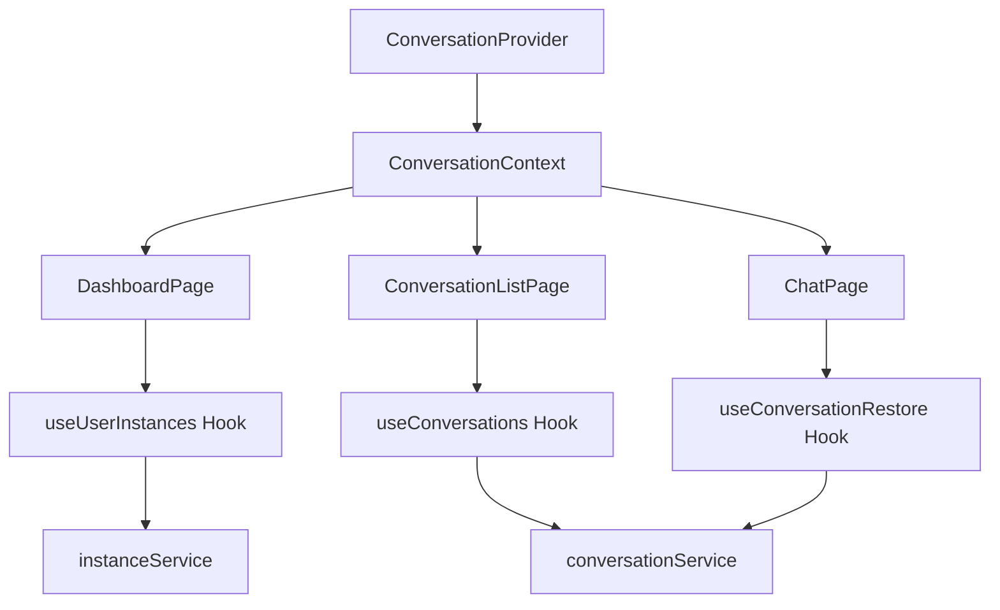

# FIP-022: 飞书应用主页显示用户认领的实例并支持会话恢复
# Feature Implementation Plan: Dashboard Instance Display & Session Recovery

## 文档信息

| 项目 | 内容 |
|------|------|
| **FIP 编号** | FIP-022 |
| **需求编号** | REQ-022-DASHBOARD-SESSION-RECOVERY |
| **Issue** | #22 |
| **标题** | 飞书应用主页显示用户认领的实例并支持会话恢复 |
| **版本** | v1.0 |
| **创建日期** | 2026-03-19 |
| **作者** | Claude Code (Frontend Architect) |
| **状态** | 草案，待评审 |
| **目标上线** | Week 4-6 (2-3周) |

---

## 目录

- [1. 执行摘要](#1-执行摘要)
- [2. 技术架构](#2-技术架构)
- [3. 组件设计](#3-组件设计)
- [4. 状态管理](#4-状态管理)
- [5. API 集成](#5-api-集成)
- [6. 路由设计](#6-路由设计)
- [7. 实现计划](#7-实现计划)
- [8. 风险和挑战](#8-风险和挑战)
- [9. 附录](#9-附录)

---

## 1. 执行摘要

### 1.1 背景

当前 AIOpc 平台已完成飞书 OAuth 认证和实例认领功能，但存在两个关键的用户体验缺口：

1. **主页实例列表缺失**：用户登录 Dashboard 后无法看到已认领的实例，需要手动导航到 `/instances` 页面
2. **会话历史无法恢复**：用户与 Agent 的对话无法保存和恢复，每次都是全新对话

### 1.2 核心目标

本 FIP 要实现的核心功能：

1. **主页实例列表**：在 `/dashboard` 页面展示用户已认领的实例卡片
2. **会话历史列表**：为每个实例提供会话历史查看页面
3. **会话上下文恢复**：支持恢复历史会话的完整对话上下文

### 1.3 技术方案概览

**采用技术栈**（基于现有代码库）：

| 层级 | 技术选型 | 版本 | 说明 |
|------|---------|------|------|
| **前端框架** | React + TypeScript | 19+ | 组件化开发 |
| **构建工具** | Vite | 8.0+ | 快速开发和热更新 |
| **路由** | React Router | 7.13+ | 单页应用路由 |
| **样式** | Tailwind CSS | 4.2+ | 原子化 CSS |
| **状态管理** | React Context + Hooks | 内置 | 轻量级状态管理 |
| **HTTP 客户端** | Fetch API | 内置 | 与现有服务一致 |
| **测试** | Vitest + Playwright | Latest | 单元测试和 E2E 测试 |

**设计原则**：
- 遵循现有代码风格和组件模式
- 最小化依赖，使用现有技术栈
- 保持与后端 API 的一致性
- 确保可访问性和响应式设计

### 1.4 预期成果

**前端组件**：
- 新增 4 个组件（InstanceCard, ConversationCard, 会话相关组件）
- 修改 3 个页面（DashboardPage, 新增 ConversationListPage, ChatPage 增强）
- 新增 3 个自定义 Hooks（useConversations, useConversationRestore, useUserInstances）
- 新增 1 个 Context（ConversationContext）

**用户体验提升**：
- 用户登录后立即看到已认领实例
- 快速访问最近使用的实例
- 查看和恢复历史会话
- 无缝的对话体验

---

## 2. 技术架构

### 2.1 前端架构概览

```
┌─────────────────────────────────────────────────────────────┐
│                         Browser                              │
├─────────────────────────────────────────────────────────────┤
│                                                              │
│  ┌────────────────────────────────────────────────────┐    │
│  │              React Application (Vite)              │    │
│  ├────────────────────────────────────────────────────┤    │
│  │                                                     │    │
│  │  ┌──────────┐  ┌──────────┐  ┌──────────┐         │    │
│  │  │   Pages  │  │Components│  │ Contexts │         │    │
│  │  │          │  │          │  │          │         │    │
│  │  │ •Dashboard│  │•Instance │  │•Auth     │         │    │
│  │  │ •ConvList│  │ •ConvCard│  │•Conversation│      │    │
│  │  │ •Chat    │  │ •Message │  │          │         │    │
│  │  └────┬─────┘  └────┬─────┘  └────┬─────┘         │    │
│  │       │             │             │                │    │
│  │  ┌────▼─────────────▼─────────────▼────┐          │    │
│  │  │         Custom Hooks               │          │    │
│  │  │  • useAuth                         │          │    │
│  │  │  • useWebSocket                    │          │    │
│  │  │  • useConversations (NEW)          │          │    │
│  │  │  • useConversationRestore (NEW)    │          │    │
│  │  │  • useUserInstances (NEW)          │          │    │
│  │  └────────────────┬────────────────────┘          │    │
│  │                   │                                │    │
│  │  ┌────────────────▼────────────────────┐          │    │
│  │  │       API Services (Fetch)          │          │    │
│  │  │  • authService                      │          │    │
│  │  │  • instanceService                  │          │    │
│  │  │  • conversationService (NEW)        │          │    │
│  │  └────────────────┬────────────────────┘          │    │
│  │                   │                                │    │
│  └───────────────────┼────────────────────────────────┘    │
│                      │                                       │
└──────────────────────┼───────────────────────────────────────┘
                       │
                       ▼
┌─────────────────────────────────────────────────────────────┐
│              Backend API (NestJS)                           │
│  /api/user/instances                                        │
│  /api/instances/:id/conversations                           │
│  /api/conversations/:id                                     │
└─────────────────────────────────────────────────────────────┘
```

### 2.2 目录结构设计

基于现有代码库结构，新增以下文件：

```
platform/frontend/src/
├── components/
│   ├── dashboard/
│   │   ├── InstanceList.tsx           # NEW: 实例列表组件
│   │   └── InstanceCard.tsx           # NEW: 实例卡片组件
│   ├── conversations/
│   │   ├── ConversationList.tsx       # NEW: 会话列表组件
│   │   ├── ConversationCard.tsx       # NEW: 会话卡片组件
│   │   └── ConversationActions.tsx    # NEW: 会话操作菜单
│   └── messages/                       # Existing: 消息相关组件
├── pages/
│   ├── DashboardPage.tsx              # MODIFY: 添加实例列表
│   ├── ConversationListPage.tsx       # NEW: 会话列表页面
│   └── ChatPage.tsx                   # MODIFY: 支持会话恢复
├── contexts/
│   ├── AuthContext.tsx                # Existing
│   └── ConversationContext.tsx        # NEW: 会话上下文
├── hooks/
│   ├── useAuth.ts                     # Existing
│   ├── useWebSocket.ts                # Existing
│   ├── useConversations.ts            # NEW: 获取会话列表
│   ├── useConversationRestore.ts      # NEW: 恢复会话
│   └── useUserInstances.ts            # NEW: 获取用户实例
├── services/
│   ├── auth.ts                        # Existing
│   ├── instance.ts                    # Existing
│   └── conversation.ts                # NEW: 会话 API 服务
├── types/
│   ├── auth.ts                        # Existing
│   ├── instance.ts                    # Existing
│   └── conversation.ts                # NEW: 会话类型定义
└── utils/
    ├── date.ts                        # NEW: 日期格式化工具
    └── text.ts                        # NEW: 文本处理工具
```

### 2.3 技术栈选型论证

**状态管理：React Context + Hooks**

✅ **选择理由**：
- 与现有 AuthContext 架构一致
- 轻量级，无需引入 Redux/Zustand
- 满足会话管理的状态需求
- TypeScript 类型安全

❌ **未选择 Redux**：
- 增加样板代码
- 对于此场景过于复杂
- 团队学习成本高

**路由：React Router v7**

✅ **选择理由**：
- 已在项目中使用
- 支持嵌套路由和路由参数
- 良好的 TypeScript 支持

**样式：Tailwind CSS**

✅ **选择理由**：
- 项目已有 Tailwind 配置
- 快速开发响应式 UI
- 保持样式一致性

**HTTP 客户端：Fetch API**

✅ **选择理由**：
- 与现有 instanceService 一致
- 无需额外依赖
- 浏览器原生支持

---

## 3. 组件设计

### 3.1 Dashboard 页面增强

**文件**: `platform/frontend/src/pages/DashboardPage.tsx`

**当前状态**：
- 显示欢迎信息和用户信息
- 显示全局统计数据（我的实例数、可用实例数等）
- 快捷操作按钮

**增强内容**：
- 在统计卡片下方添加"我的实例"区域
- 显示用户已认领的实例卡片列表
- 支持快速进入和查看会话历史

**组件结构**：

```typescript
// DashboardPage.tsx (Enhanced)
export default function DashboardPage() {
  const { user } = useAuth();
  const { userInstances, loading, error } = useUserInstances();

  return (
    <div className="min-h-screen bg-gray-50">
      {/* 现有的顶部导航和欢迎卡片 */}

      {/* 现有的统计卡片 */}
      <StatsGrid />

      {/* NEW: 我的实例列表 */}
      <section className="mt-8">
        <div className="flex items-center justify-between mb-4">
          <h2 className="text-xl font-semibold text-gray-900">
            我的实例
          </h2>
          <Link to="/instances" className="text-indigo-600 hover:text-indigo-700">
            查看全部 →
          </Link>
        </div>

        {loading ? (
          <InstanceListSkeleton />
        ) : error ? (
          <ErrorMessage error={error} />
        ) : userInstances.length === 0 ? (
          <EmptyInstanceState />
        ) : (
          <InstanceList instances={userInstances} />
        )}
      </section>

      {/* 现有的快捷操作 */}
      <QuickActions />
    </div>
  );
}
```

**新增状态**：
```typescript
interface UserInstanceState {
  instances: UserInstance[];
  loading: boolean;
  error: string | null;
  refetch: () => void;
}
```

### 3.2 InstanceList 组件

**文件**: `platform/frontend/src/components/dashboard/InstanceList.tsx`

**功能**：
- 渲染用户实例的网格布局
- 响应式设计（1-2-3-4 列）
- 支持加载骨架屏和空状态

**组件代码**：

```typescript
// components/dashboard/InstanceList.tsx
import { UserInstance } from '../../types/conversation';

interface InstanceListProps {
  instances: UserInstance[];
  loading?: boolean;
}

export function InstanceList({ instances }: InstanceListProps) {
  if (instances.length === 0) {
    return (
      <div className="text-center py-12 bg-white rounded-lg">
        <p className="text-gray-500">暂无实例，去认领一个吧！</p>
      </div>
    );
  }

  return (
    <div className="grid grid-cols-1 md:grid-cols-2 lg:grid-cols-3 gap-4">
      {instances.map((instance) => (
        <InstanceCard
          key={instance.instance_id}
          instance={instance}
        />
      ))}
    </div>
  );
}

// 骨架屏组件
export function InstanceListSkeleton() {
  return (
    <div className="grid grid-cols-1 md:grid-cols-2 lg:grid-cols-3 gap-4">
      {[1, 2, 3].map((i) => (
        <div key={i} className="bg-white rounded-lg p-6 animate-pulse">
          <div className="h-4 bg-gray-200 rounded w-3/4 mb-4"></div>
          <div className="h-3 bg-gray-200 rounded w-1/2 mb-2"></div>
          <div className="h-3 bg-gray-200 rounded w-1/3"></div>
        </div>
      ))}
    </div>
  );
}
```

**布局策略**：
- Mobile（< 768px）：1 列
- Tablet（768px - 1024px）：2 列
- Desktop（> 1024px）：3 列

### 3.3 InstanceCard 组件

**文件**: `platform/frontend/src/components/dashboard/InstanceCard.tsx`

**功能**：
- 显示实例基本信息（名称、状态、最后访问时间）
- 显示会话数量和最后会话预览
- 快速进入按钮（跳转到对话页面）
- 查看历史按钮（跳转到会话列表页面）

**组件代码**：

```typescript
// components/dashboard/InstanceCard.tsx
import { Link } from 'react-router-dom';
import { StatusBadge } from '../StatusBadge';
import { formatRelativeTime } from '../../utils/date';
import type { UserInstance } from '../../types/conversation';

interface InstanceCardProps {
  instance: UserInstance;
}

export function InstanceCard({ instance }: InstanceCardProps) {
  const {
    instance_id,
    name,
    status,
    last_accessed_at,
    conversation_count,
    last_conversation_preview,
  } = instance;

  return (
    <div className="bg-white rounded-lg shadow-sm hover:shadow-md transition-shadow p-6">
      {/* 实例名称和状态 */}
      <div className="flex items-start justify-between mb-4">
        <div className="flex-1">
          <h3 className="text-lg font-semibold text-gray-900 mb-1">
            {name || `实例 ${instance_id.slice(0, 8)}`}
          </h3>
          <div className="flex items-center gap-2">
            <StatusBadge status={status} size="sm" />
            <span className="text-xs text-gray-500">
              最后访问: {formatRelativeTime(last_accessed_at)}
            </span>
          </div>
        </div>
      </div>

      {/* 会话预览 */}
      {conversation_count > 0 && (
        <div className="mb-4 p-3 bg-gray-50 rounded-lg">
          <div className="flex items-center justify-between mb-2">
            <span className="text-xs font-medium text-gray-700">
              {conversation_count} 个会话
            </span>
            <span className="text-xs text-gray-500">
              {formatRelativeTime(last_conversation_preview?.created_at)}
            </span>
          </div>
          {last_conversation_preview?.title && (
            <p className="text-sm text-gray-600 truncate">
              {last_conversation_preview.title}
            </p>
          )}
        </div>
      )}

      {/* 操作按钮 */}
      <div className="flex gap-2">
        <Link
          to={`/instances/${instance_id}/chat`}
          className="flex-1 text-center px-4 py-2 bg-indigo-600 hover:bg-indigo-700 text-white rounded-lg transition-colors font-medium"
        >
          进入对话
        </Link>
        <Link
          to={`/instances/${instance_id}/conversations`}
          className="px-4 py-2 border border-gray-300 hover:bg-gray-50 text-gray-700 rounded-lg transition-colors"
          aria-label="查看会话历史"
        >
          <svg className="w-5 h-5" fill="none" stroke="currentColor" viewBox="0 0 24 24">
            <path strokeLinecap="round" strokeLinejoin="round" strokeWidth={2} d="M12 8v4l3 3m6-3a9 9 0 11-18 0 9 9 0 0118 0z" />
          </svg>
        </Link>
      </div>
    </div>
  );
}
```

**设计要点**：
- 卡片式设计，清晰的视觉层次
- 状态徽章使用现有的 StatusBadge 组件
- 相对时间格式化（"2小时前"）
- 会话预览提供上下文
- 主按钮突出，辅助按钮次要
- 响应式布局，移动端友好

### 3.4 ConversationList 页面

**文件**: `platform/frontend/src/pages/ConversationListPage.tsx`

**功能**：
- 显示某个实例的所有会话
- 支持分页加载（每页 20 条）
- 支持创建新会话
- 支持搜索和过滤（P1 功能）

**组件代码**：

```typescript
// pages/ConversationListPage.tsx
import { useParams, useNavigate } from 'react-router-dom';
import { useConversations } from '../hooks/useConversations';
import { ConversationList } from '../components/conversations/ConversationList';
import { CreateConversationButton } from '../components/conversations/CreateConversationButton';

export default function ConversationListPage() {
  const { instanceId } = useParams<{ instanceId: string }>();
  const navigate = useNavigate();

  const {
    conversations,
    loading,
    error,
    hasMore,
    loadMore,
    createConversation,
    deleteConversation,
    renameConversation,
  } = useConversations(instanceId!);

  const handleCreateConversation = async () => {
    const newConv = await createConversation();
    if (newConv) {
      navigate(`/instances/${instanceId}/chat?conversation=${newConv.id}`);
    }
  };

  const handleSelectConversation = (conversationId: string) => {
    navigate(`/instances/${instanceId}/chat?conversation=${conversationId}`);
  };

  if (loading && conversations.length === 0) {
    return <ConversationListSkeleton />;
  }

  return (
    <div className="min-h-screen bg-gray-50">
      {/* 顶部导航 */}
      <header className="bg-white shadow-sm">
        <div className="max-w-4xl mx-auto px-4 py-4">
          <div className="flex items-center justify-between">
            <div className="flex items-center gap-4">
              <button
                onClick={() => navigate('/dashboard')}
                className="text-gray-600 hover:text-gray-900"
              >
                ← 返回
              </button>
              <h1 className="text-xl font-semibold text-gray-900">
                会话历史
              </h1>
            </div>
            <CreateConversationButton onCreate={handleCreateConversation} />
          </div>
        </div>
      </header>

      {/* 会话列表 */}
      <main className="max-w-4xl mx-auto px-4 py-6">
        {error && <ErrorMessage error={error} />}

        {conversations.length === 0 ? (
          <EmptyState onCreate={handleCreateConversation} />
        ) : (
          <>
            <ConversationList
              conversations={conversations}
              onSelect={handleSelectConversation}
              onDelete={deleteConversation}
              onRename={renameConversation}
            />
            {hasMore && (
              <div className="mt-4 text-center">
                <button
                  onClick={loadMore}
                  disabled={loading}
                  className="px-6 py-2 bg-white border border-gray-300 hover:bg-gray-50 rounded-lg"
                >
                  {loading ? '加载中...' : '加载更多'}
                </button>
              </div>
            )}
          </>
        )}
      </main>
    </div>
  );
}
```

**路由参数**：
- `instanceId`: 实例 ID（必选）
- 未来支持：`?search=关键词`, `?dateFrom=2024-01-01`

### 3.5 ConversationCard 组件

**文件**: `platform/frontend/src/components/conversations/ConversationCard.tsx`

**功能**：
- 显示会话标题、预览、时间、消息数
- 支持点击进入对话
- 支持操作菜单（重命名、删除）

**组件代码**：

```typescript
// components/conversations/ConversationCard.tsx
import { useState } from 'react';
import { formatRelativeTime } from '../../utils/date';
import { ConversationActions } from './ConversationActions';
import type { Conversation } from '../../types/conversation';

interface ConversationCardProps {
  conversation: Conversation;
  onSelect: (id: string) => void;
  onDelete: (id: string) => Promise<void>;
  onRename: (id: string, title: string) => Promise<void>;
}

export function ConversationCard({
  conversation,
  onSelect,
  onDelete,
  onRename,
}: ConversationCardProps) {
  const [showActions, setShowActions] = useState(false);

  const handleClick = () => {
    if (!showActions) {
      onSelect(conversation.id);
    }
  };

  return (
    <div
      className="bg-white rounded-lg shadow-sm hover:shadow-md transition-shadow cursor-pointer"
      onClick={handleClick}
    >
      <div className="p-4">
        <div className="flex items-start justify-between">
          {/* 左侧：会话信息 */}
          <div className="flex-1 min-w-0">
            <h3 className="text-base font-semibold text-gray-900 mb-1 truncate">
              {conversation.title}
            </h3>
            {conversation.preview && (
              <p className="text-sm text-gray-600 truncate mb-2">
                {conversation.preview}
              </p>
            )}
            <div className="flex items-center gap-3 text-xs text-gray-500">
              <span>{conversation.message_count} 条消息</span>
              <span>•</span>
              <span>{formatRelativeTime(conversation.last_message_at)}</span>
            </div>
          </div>

          {/* 右侧：操作按钮 */}
          <div className="ml-2">
            <button
              onClick={(e) => {
                e.stopPropagation();
                setShowActions(!showActions);
              }}
              className="p-1 hover:bg-gray-100 rounded"
              aria-label="操作菜单"
            >
              <svg className="w-5 h-5 text-gray-500" fill="currentColor" viewBox="0 0 20 20">
                <path d="M10 6a2 2 0 110-4 2 2 0 010 4zM10 12a2 2 0 110-4 2 2 0 010 4zM10 18a2 2 0 110-4 2 2 0 010 4z" />
              </svg>
            </button>
          </div>
        </div>
      </div>

      {/* 操作菜单 */}
      {showActions && (
        <ConversationActions
          conversation={conversation}
          onClose={() => setShowActions(false)}
          onDelete={onDelete}
          onRename={onRename}
        />
      )}
    </div>
  );
}
```

### 3.6 Chat 页面修改

**文件**: `platform/frontend/src/pages/ChatPage.tsx`

**当前功能**：
- WebSocket 实时通信
- 消息列表和输入
- 连接状态显示

**新增功能**：
- 支持从 URL 参数恢复会话 (`?conversation=xxx`)
- 显示会话标题
- 自动保存新消息到会话
- 支持切换会话或新建会话

**修改代码**：

```typescript
// pages/ChatPage.tsx (Enhanced)
import { useConversationRestore } from '../hooks/useConversationRestore';

export default function ChatPage() {
  const { instanceId } = useParams<{ instanceId: string }>();
  const navigate = useNavigate();
  const location = useLocation();

  // 从 URL 参数获取会话 ID
  const conversationId = new URLSearchParams(location.search).get('conversation');

  // NEW: 恢复会话上下文
  const {
    conversation,
    messages: historyMessages,
    loading: restoring,
    error: restoreError,
  } = useConversationRestore(conversationId);

  // 合并历史消息和实时消息
  const [messages, setMessages] = useState<ChatMessage[]>(
    historyMessages || []
  );

  // 加载历史消息后更新消息列表
  useEffect(() => {
    if (historyMessages) {
      setMessages(historyMessages);
    }
  }, [historyMessages]);

  // 发送消息时自动保存到会话
  const handleSendMessage = useCallback(async () => {
    // ... 现有的发送逻辑 ...

    // NEW: 保存到会话
    if (conversationId) {
      await conversationService.addMessage(conversationId, {
        role: 'user',
        content: trimmedInput,
      });
    }
  }, [conversationId, /* ... */]);

  return (
    <div className="flex flex-col h-screen">
      {/* Header - 添加会话信息 */}
      <header className="flex items-center justify-between px-6 py-4 bg-white border-b">
        <div className="flex items-center gap-4">
          <button onClick={() => navigate(-1)}>← 返回</button>
          <div>
            {/* NEW: 显示会话标题 */}
            <h1 className="text-xl font-semibold">
              {conversation?.title || instance?.config.name || '对话'}
            </h1>
            {conversation && (
              <span className="text-xs text-gray-500">
                {conversation.message_count} 条消息
              </span>
            )}
          </div>
        </div>
        <ConnectionStatus status={webSocket.status} />
      </header>

      {/* 恢复中状态 */}
      {restoring && (
        <div className="flex-1 flex items-center justify-center">
          <div className="text-center">
            <div className="animate-spin rounded-full h-12 w-12 border-b-2 border-indigo-600 mx-auto mb-4"></div>
            <p>恢复会话中...</p>
          </div>
        </div>
      )}

      {/* 消息列表 */}
      {!restoring && <MessageList messages={messages} />}

      {/* 输入区域 */}
      <MessageInput onSend={handleSendMessage} />
    </div>
  );
}
```

**关键改动**：
1. 从 URL 参数读取 `conversation` 查询参数
2. 使用 `useConversationRestore` Hook 加载历史消息
3. 在 Header 显示会话标题和消息数
4. 发送消息时自动保存到当前会话
5. 支持返回按钮导航到上一页或会话列表

---

## 4. 状态管理

### 4.1 ConversationContext 设计

**文件**: `platform/frontend/src/contexts/ConversationContext.tsx`

**设计原则**：
- 轻量级状态管理，避免过度设计
- 与 AuthContext 保持一致的模式
- 提供会话 CRUD 操作的统一接口
- 支持缓存和自动刷新

**Context 结构**：

```typescript
// contexts/ConversationContext.tsx
import React, { createContext, useContext, useState, useCallback, ReactNode } from 'react';
import { conversationService } from '../services/conversation';
import type { Conversation, ConversationMessage, CreateConversationDto } from '../types/conversation';

interface ConversationContextValue {
  // 状态
  conversations: Map<string, Conversation>; // instanceId -> Conversation[]
  currentConversation: Conversation | null;
  loading: boolean;
  error: string | null;

  // 操作
  loadConversations: (instanceId: string) => Promise<void>;
  createConversation: (instanceId: string, dto?: CreateConversationDto) => Promise<Conversation>;
  getConversation: (conversationId: string) => Promise<Conversation>;
  updateConversation: (conversationId: string, data: Partial<Conversation>) => Promise<void>;
  deleteConversation: (conversationId: string) => Promise<void>;
  addMessage: (conversationId: string, message: Omit<ConversationMessage, 'id' | 'created_at'>) => Promise<void>;

  // 工具方法
  clearError: () => void;
  refresh: (instanceId: string) => Promise<void>;
}

const ConversationContext = createContext<ConversationContextValue | undefined>(undefined);

export function ConversationProvider({ children }: { children: ReactNode }) {
  const [conversations, setConversations] = useState<Map<string, Conversation>>(new Map());
  const [currentConversation, setCurrentConversation] = useState<Conversation | null>(null);
  const [loading, setLoading] = useState(false);
  const [error, setError] = useState<string | null>(null);

  const loadConversations = useCallback(async (instanceId: string) => {
    setLoading(true);
    setError(null);
    try {
      const data = await conversationService.getConversations(instanceId);
      setConversations(prev => new Map(prev).set(instanceId, data));
    } catch (err) {
      setError(err instanceof Error ? err.message : '加载会话失败');
      throw err;
    } finally {
      setLoading(false);
    }
  }, []);

  const createConversation = useCallback(async (instanceId: string, dto?: CreateConversationDto) => {
    setLoading(true);
    setError(null);
    try {
      const newConv = await conversationService.createConversation(instanceId, dto);
      setConversations(prev => {
        const map = new Map(prev);
        const list = map.get(instanceId) || [];
        map.set(instanceId, [newConv, ...list]);
        return map;
      });
      return newConv;
    } catch (err) {
      setError(err instanceof Error ? err.message : '创建会话失败');
      throw err;
    } finally {
      setLoading(false);
    }
  }, []);

  const getConversation = useCallback(async (conversationId: string) => {
    setLoading(true);
    setError(null);
    try {
      const conv = await conversationService.getConversation(conversationId);
      setCurrentConversation(conv);
      return conv;
    } catch (err) {
      setError(err instanceof Error ? err.message : '加载会话失败');
      throw err;
    } finally {
      setLoading(false);
    }
  }, []);

  const deleteConversation = useCallback(async (conversationId: string) => {
    setLoading(true);
    setError(null);
    try {
      await conversationService.deleteConversation(conversationId);
      setConversations(prev => {
        const newMap = new Map();
        for (const [instanceId, convs] of prev.entries()) {
          newMap.set(instanceId, convs.filter(c => c.id !== conversationId));
        }
        return newMap;
      });
      if (currentConversation?.id === conversationId) {
        setCurrentConversation(null);
      }
    } catch (err) {
      setError(err instanceof Error ? err.message : '删除会话失败');
      throw err;
    } finally {
      setLoading(false);
    }
  }, [currentConversation]);

  const addMessage = useCallback(async (conversationId: string, message: Omit<ConversationMessage, 'id' | 'created_at'>) => {
    try {
      await conversationService.addMessage(conversationId, message);
      // 可选：更新本地缓存
    } catch (err) {
      console.error('保存消息失败:', err);
      // 不抛出错误，避免影响用户体验
    }
  }, []);

  const clearError = useCallback(() => setError(null), []);

  const refresh = useCallback(async (instanceId: string) => {
    await loadConversations(instanceId);
  }, [loadConversations]);

  const value: ConversationContextValue = {
    conversations,
    currentConversation,
    loading,
    error,
    loadConversations,
    createConversation,
    getConversation,
    updateConversation: async (id, data) => { /* TODO */ },
    deleteConversation,
    addMessage,
    clearError,
    refresh,
  };

  return (
    <ConversationContext.Provider value={value}>
      {children}
    </ConversationContext.Provider>
  );
}

export function useConversationContext() {
  const context = useContext(ConversationContext);
  if (!context) {
    throw new Error('useConversationContext must be used within ConversationProvider');
  }
  return context;
}
```

**Context 架构图**：



### 4.2 自定义 Hooks 设计

#### 4.2.1 useUserInstances

**文件**: `platform/frontend/src/hooks/useUserInstances.ts`

**功能**：获取用户已认领的实例列表

```typescript
// hooks/useUserInstances.ts
import { useState, useEffect, useCallback } from 'react';
import { instanceService } from '../services/instance';
import type { UserInstance } from '../types/conversation';

export function useUserInstances() {
  const [instances, setInstances] = useState<UserInstance[]>([]);
  const [loading, setLoading] = useState(true);
  const [error, setError] = useState<string | null>(null);

  const fetchInstances = useCallback(async () => {
    setLoading(true);
    setError(null);
    try {
      const data = await instanceService.getUserInstances();
      setInstances(data);
    } catch (err) {
      setError(err instanceof Error ? err.message : '加载实例失败');
    } finally {
      setLoading(false);
    }
  }, []);

  useEffect(() => {
    fetchInstances();
  }, [fetchInstances]);

  return {
    userInstances: instances,
    loading,
    error,
    refetch: fetchInstances,
  };
}
```

#### 4.2.2 useConversations

**文件**: `platform/frontend/src/hooks/useConversations.ts`

**功能**：获取和管理某个实例的会话列表

```typescript
// hooks/useConversations.ts
import { useState, useEffect, useCallback } from 'react';
import { conversationService } from '../services/conversation';
import type { Conversation, PaginatedResponse } from '../types/conversation';

interface UseConversationsParams {
  instanceId: string;
  limit?: number;
}

export function useConversations({ instanceId, limit = 20 }: UseConversationsParams) {
  const [conversations, setConversations] = useState<Conversation[]>([]);
  const [loading, setLoading] = useState(false);
  const [error, setError] = useState<string | null>(null);
  const [hasMore, setHasMore] = useState(false);
  const [offset, setOffset] = useState(0);

  const loadConversations = useCallback(async (reset = false) => {
    if (loading) return;

    setLoading(true);
    setError(null);

    try {
      const currentOffset = reset ? 0 : offset;
      const data: PaginatedResponse<Conversation> = await conversationService.getConversations(
        instanceId,
        { limit, offset: currentOffset }
      );

      if (reset) {
        setConversations(data.data);
        setOffset(limit);
      } else {
        setConversations(prev => [...prev, ...data.data]);
        setOffset(prev => prev + data.data.length);
      }

      setHasMore(data.hasMore);
    } catch (err) {
      setError(err instanceof Error ? err.message : '加载会话失败');
    } finally {
      setLoading(false);
    }
  }, [instanceId, limit, offset, loading]);

  const loadMore = useCallback(() => {
    loadConversations(false);
  }, [loadConversations]);

  const createConversation = useCallback(async (title?: string) => {
    const newConv = await conversationService.createConversation(instanceId, { title });
    setConversations(prev => [newConv, ...prev]);
    return newConv;
  }, [instanceId]);

  const deleteConversation = useCallback(async (conversationId: string) => {
    await conversationService.deleteConversation(conversationId);
    setConversations(prev => prev.filter(c => c.id !== conversationId));
  }, []);

  const renameConversation = useCallback(async (conversationId: string, title: string) => {
    const updated = await conversationService.updateConversation(conversationId, { title });
    setConversations(prev =>
      prev.map(c => c.id === conversationId ? { ...c, ...updated } : c)
    );
  }, []);

  useEffect(() => {
    loadConversations(true);
  }, [instanceId]); // 只在 instanceId 变化时重新加载

  return {
    conversations,
    loading,
    error,
    hasMore,
    loadMore,
    createConversation,
    deleteConversation,
    renameConversation,
  };
}
```

#### 4.2.3 useConversationRestore

**文件**: `platform/frontend/src/hooks/useConversationRestore.ts`

**功能**：恢复会话的完整上下文（消息历史）

```typescript
// hooks/useConversationRestore.ts
import { useState, useEffect, useCallback } from 'react';
import { conversationService } from '../services/conversation';
import type { Conversation, ConversationMessage } from '../types/conversation';

export function useConversationRestore(conversationId: string | null) {
  const [conversation, setConversation] = useState<Conversation | null>(null);
  const [messages, setMessages] = useState<ConversationMessage[]>([]);
  const [loading, setLoading] = useState(false);
  const [error, setError] = useState<string | null>(null);

  const restore = useCallback(async () => {
    if (!conversationId) {
      setConversation(null);
      setMessages([]);
      setError(null);
      return;
    }

    setLoading(true);
    setError(null);

    try {
      const conv = await conversationService.getConversation(conversationId);
      setConversation(conv);

      // 转换消息格式以适配 ChatPage 的消息结构
      const formattedMessages = conv.messages.map(msg => ({
        id: msg.id,
        type: msg.role as 'user' | 'assistant' | 'system',
        content: msg.content,
        timestamp: new Date(msg.created_at),
        metadata: msg.metadata,
      }));

      setMessages(formattedMessages);
    } catch (err) {
      setError(err instanceof Error ? err.message : '恢复会话失败');
      setConversation(null);
      setMessages([]);
    } finally {
      setLoading(false);
    }
  }, [conversationId]);

  useEffect(() => {
    restore();
  }, [restore]);

  return {
    conversation,
    messages,
    loading,
    error,
    retry: restore,
  };
}
```

### 4.3 状态管理方案选择

**选择：React Context + Hooks**

| 方案 | 优点 | 缺点 | 适用场景 |
|------|------|------|----------|
| **React Context** | • 轻量级<br>• 与现有架构一致<br>• 无额外依赖 | • 性能优化需要手动处理<br>• 不适合复杂状态 | ✅ 会话管理 |
| **Redux/Zustand** | • 开发工具完善<br>• 中间件生态丰富 | • 增加样板代码<br>• 学习曲线 | ❌ 此场景过于复杂 |
| **React Query** | • 自动缓存和重新验证<br>• 乐观更新 | • 额外依赖<br>• 与现有 Fetch API 不一致 | ⚠️ 可选，P2 考虑 |

**最终选择**：React Context + Hooks
- 与 AuthContext 保持一致
- 满足当前需求
- 团队熟悉度高

---

## 5. API 集成

### 5.1 API Client 设计

**文件**: `platform/frontend/src/services/conversation.ts`

**设计原则**：
- 与现有 `instanceService` 保持一致的 API 模式
- 使用 Fetch API（而非 axios）
- 统一的错误处理
- TypeScript 类型安全

**服务代码**：

```typescript
// services/conversation.ts
import type {
  Conversation,
  ConversationMessage,
  CreateConversationDto,
  PaginatedResponse,
} from '../types/conversation';

const API_BASE_URL = import.meta.env.VITE_API_BASE_URL || 'http://localhost:3000/api';

function getToken(): string {
  const token = localStorage.getItem('access_token') || localStorage.getItem('auth_token');
  if (!token) {
    throw new Error('No authentication token found');
  }
  return token;
}

function handleApiError(response: Response): never {
  throw new Error(`API Error: ${response.status} ${response.statusText}`);
}

export class ConversationService {
  private baseUrl: string;

  constructor(baseUrl: string = API_BASE_URL) {
    this.baseUrl = baseUrl;
  }

  /**
   * 获取实例的会话列表
   * GET /api/instances/:instanceId/conversations
   */
  async getConversations(
    instanceId: string,
    params?: { limit?: number; offset?: number }
  ): Promise<PaginatedResponse<Conversation>> {
    const queryParams = new URLSearchParams();
    if (params?.limit) queryParams.append('limit', params.limit.toString());
    if (params?.offset) queryParams.append('offset', params.offset.toString());

    const response = await fetch(
      `${this.baseUrl}/instances/${instanceId}/conversations?${queryParams.toString()}`,
      {
        method: 'GET',
        headers: {
          'Authorization': `Bearer ${getToken()}`,
          'Content-Type': 'application/json',
        },
      }
    );

    if (!response.ok) {
      return handleApiError(response);
    }

    return response.json();
  }

  /**
   * 创建新会话
   * POST /api/instances/:instanceId/conversations
   */
  async createConversation(
    instanceId: string,
    dto?: CreateConversationDto
  ): Promise<Conversation> {
    const response = await fetch(`${this.baseUrl}/instances/${instanceId}/conversations`, {
      method: 'POST',
      headers: {
        'Authorization': `Bearer ${getToken()}`,
        'Content-Type': 'application/json',
      },
      body: JSON.stringify(dto || {}),
    });

    if (!response.ok) {
      return handleApiError(response);
    }

    const result = await response.json();
    return result.data;
  }

  /**
   * 获取会话详情（包含消息）
   * GET /api/conversations/:conversationId
   */
  async getConversation(conversationId: string): Promise<Conversation> {
    const response = await fetch(`${this.baseUrl}/conversations/${conversationId}`, {
      method: 'GET',
      headers: {
        'Authorization': `Bearer ${getToken()}`,
        'Content-Type': 'application/json',
      },
    });

    if (!response.ok) {
      return handleApiError(response);
    }

    const result = await response.json();
    return result.data;
  }

  /**
   * 更新会话标题
   * PATCH /api/conversations/:conversationId
   */
  async updateConversation(
    conversationId: string,
    data: { title?: string }
  ): Promise<Partial<Conversation>> {
    const response = await fetch(`${this.baseUrl}/conversations/${conversationId}`, {
      method: 'PATCH',
      headers: {
        'Authorization': `Bearer ${getToken()}`,
        'Content-Type': 'application/json',
      },
      body: JSON.stringify(data),
    });

    if (!response.ok) {
      return handleApiError(response);
    }

    const result = await response.json();
    return result.data;
  }

  /**
   * 删除会话
   * DELETE /api/conversations/:conversationId
   */
  async deleteConversation(conversationId: string): Promise<void> {
    const response = await fetch(`${this.baseUrl}/conversations/${conversationId}`, {
      method: 'DELETE',
      headers: {
        'Authorization': `Bearer ${getToken()}`,
        'Content-Type': 'application/json',
      },
    });

    if (!response.ok) {
      return handleApiError(response);
    }
  }

  /**
   * 添加消息到会话
   * POST /api/conversations/:conversationId/messages
   */
  async addMessage(
    conversationId: string,
    message: Omit<ConversationMessage, 'id' | 'created_at'>
  ): Promise<ConversationMessage> {
    const response = await fetch(`${this.baseUrl}/conversations/${conversationId}/messages`, {
      method: 'POST',
      headers: {
        'Authorization': `Bearer ${getToken()}`,
        'Content-Type': 'application/json',
      },
      body: JSON.stringify(message),
    });

    if (!response.ok) {
      return handleApiError(response);
    }

    const result = await response.json();
    return result.data;
  }
}

// 导出单例实例
export const conversationService = new ConversationService();
```

### 5.2 错误处理策略

**错误层级**：

1. **网络错误**：Fetch API 失败
   - 处理：显示全局错误提示
   - 用户操作：重试按钮

2. **认证错误**：401 Unauthorized
   - 处理：自动跳转到登录页
   - 清除本地 token

3. **权限错误**：403 Forbidden
   - 处理：显示权限不足提示
   - 禁用相关操作

4. **业务错误**：4xx/5xx
   - 处理：显示后端返回的错误消息
   - 用户操作：修正后重试

**错误处理组件**：

```typescript
// components/ErrorBoundary.tsx (Enhanced)
import React from 'react';

interface Props {
  children: React.ReactNode;
  fallback?: React.ReactNode;
}

interface State {
  hasError: boolean;
  error: Error | null;
}

export class ErrorBoundary extends React.Component<Props, State> {
  constructor(props: Props) {
    super(props);
    this.state = { hasError: false, error: null };
  }

  static getDerivedStateFromError(error: Error): State {
    return { hasError: true, error };
  }

  componentDidCatch(error: Error, errorInfo: React.ErrorInfo) {
    console.error('ErrorBoundary caught:', error, errorInfo);
    // 可选：上报到错误追踪服务
  }

  render() {
    if (this.state.hasError) {
      return this.props.fallback || (
        <div className="min-h-screen flex items-center justify-center bg-gray-50">
          <div className="text-center">
            <h2 className="text-2xl font-bold text-gray-900 mb-4">出错了</h2>
            <p className="text-gray-600 mb-4">{this.state.error?.message}</p>
            <button
              onClick={() => window.location.reload()}
              className="px-6 py-2 bg-indigo-600 text-white rounded-lg hover:bg-indigo-700"
            >
              刷新页面
            </button>
          </div>
        </div>
      );
    }

    return this.props.children;
  }
}
```

### 5.3 数据缓存策略

**缓存层级**：

1. **内存缓存**（ConversationContext）
   - 存储已加载的会话列表
   - 避免重复请求

2. **localStorage 缓存**（可选）
   - 缓存用户实例列表
   - 设置过期时间（5分钟）

3. **HTTP 缓存**（浏览器）
   - 利用 ETag/Last-Modified
   - 减少网络传输

**缓存失效策略**：

```typescript
// hooks/useUserInstances.ts (with caching)
const CACHE_KEY = 'user_instances_cache';
const CACHE_DURATION = 5 * 60 * 1000; // 5 minutes

export function useUserInstances() {
  const [instances, setInstances] = useState<UserInstance[]>([]);

  useEffect(() => {
    const fetchInstances = async () => {
      // 检查缓存
      const cached = localStorage.getItem(CACHE_KEY);
      if (cached) {
        const { data, timestamp } = JSON.parse(cached);
        if (Date.now() - timestamp < CACHE_DURATION) {
          setInstances(data);
          return;
        }
      }

      // 请求新数据
      const data = await instanceService.getUserInstances();
      setInstances(data);

      // 写入缓存
      localStorage.setItem(CACHE_KEY, JSON.stringify({
        data,
        timestamp: Date.now(),
      }));
    };

    fetchInstances();
  }, []);

  // ... 其他逻辑
}
```

---

## 6. 路由设计

### 6.1 路由结构

**新增路由**：

```typescript
// App.tsx (Updated)
<Routes>
  {/* 现有路由 */}
  <Route path="/" element={<Navigate to="/login" replace />} />
  <Route path="/login" element={<LoginPage />} />
  <Route path="/oauth/callback" element={<OAuthCallbackPage />} />

  {/* 受保护的路由 */}
  <Route path="/dashboard" element={<ProtectedRoute><DashboardPage /></ProtectedRoute>} />

  {/* NEW: 会话列表页面 */}
  <Route
    path="/instances/:instanceId/conversations"
    element={<ProtectedRoute><ConversationListPage /></ProtectedRoute>}
  />

  {/* 修改后的 Chat 页面 - 支持会话恢复 */}
  <Route
    path="/instances/:instanceId/chat"
    element={<ProtectedRoute><ChatPage /></ProtectedRoute>}
  />

  {/* 其他现有路由 */}
  <Route path="/instances" element={<ProtectedRoute><InstanceListPage /></ProtectedRoute>} />
  <Route path="*" element={<NotFoundPage />} />
</Routes>
```

### 6.2 导航流程

**用户流程图**：

```mermaid
graph TD
    A[用户登录] --> B[/dashboard/]
    B --> C{已认领实例?}
    C -->|是| D[显示实例列表]
    C -->|否| E[显示空状态引导]

    D --> F[点击实例卡片]
    F --> G{选择操作}

    G -->|进入对话| H[/instances/:id/chat]
    G -->|查看历史| I[/instances/:id/conversations]

    I --> J[选择会话]
    J --> H

    H --> K[发送消息]
    K --> L[自动保存到会话]

    E --> M[跳转到 /instances?filter=unclaimed]
    M --> N[认领实例]
    N --> B
```

### 6.3 路由参数设计

**会话恢复路由**：

```
/instances/{instanceId}/chat?conversation={conversationId}
```

- `instanceId`: 实例 ID（必选）
- `conversation`: 会话 ID（可选，用于恢复历史会话）

**使用示例**：

```typescript
// 创建新会话
navigate(`/instances/${instanceId}/chat`);

// 恢复历史会话
navigate(`/instances/${instanceId}/chat?conversation=${conversationId}`);
```

### 6.4 权限控制

**路由守卫**：

```typescript
// pages/components/ProtectedRoute.tsx (Enhanced)
import { useAuth } from '../../contexts/AuthContext';
import { Navigate } from 'react-router-dom';

export function ProtectedRoute({ children }: { children: React.ReactNode }) {
  const { isAuthenticated, isLoading } = useAuth();

  if (isLoading) {
    return (
      <div className="min-h-screen flex items-center justify-center">
        <div className="animate-spin rounded-full h-12 w-12 border-b-2 border-indigo-600"></div>
      </div>
    );
  }

  if (!isAuthenticated) {
    return <Navigate to="/login" replace />;
  }

  return <>{children}</>;
}
```

**实例访问权限**：

```typescript
// hooks/useUserInstances.ts (with permission check)
export function useInstanceAccess(instanceId: string) {
  const { userInstances } = useUserInstances();

  const hasAccess = useMemo(() => {
    return userInstances.some(inst => inst.instance_id === instanceId);
  }, [userInstances, instanceId]);

  const getAccessError = useCallback(() => {
    if (!hasAccess) {
      return '您没有访问此实例的权限';
    }
    return null;
  }, [hasAccess]);

  return { hasAccess, getAccessError };
}
```

---

## 7. 实现计划

### 7.1 开发阶段划分

#### Phase 1: 类型定义和 API 服务（2-3天）

**任务清单**：

1. ✅ 创建类型定义文件
   - `types/conversation.ts`: 会话和消息类型
   - 扩展 `types/instance.ts`: 添加 UserInstance 类型

2. ✅ 创建 API 服务
   - `services/conversation.ts`: 会话 API 服务
   - 扩展 `services/instance.ts`: 添加 getUserInstances 方法

3. ✅ 创建工具函数
   - `utils/date.ts`: 日期格式化函数
   - `utils/text.ts`: 文本截断和处理函数

**验收标准**：
- [ ] 所有类型定义完整且有 JSDoc 注释
- [ ] API 服务与后端接口一致
- [ ] 单元测试覆盖率 > 80%

**输出**：
- 2 个类型定义文件
- 1 个 API 服务类（约 200 行）
- 2 个工具函数文件
- 单元测试文件

#### Phase 2: Dashboard 实例列表（2-3天）

**任务清单**：

1. ✅ 创建 InstanceCard 组件
   - 显示实例信息和状态
   - 快速进入按钮
   - 查看历史按钮
   - 响应式布局

2. ✅ 创建 InstanceList 组件
   - 网格布局（1-2-3 列）
   - 加载骨架屏
   - 空状态处理

3. ✅ 创建 useUserInstances Hook
   - 获取用户实例列表
   - 缓存和错误处理

4. ✅ 修改 DashboardPage
   - 集成 InstanceList
   - 添加"我的实例"区域
   - 保持现有功能

**验收标准**：
- [ ] 用户登录后能看到已认领实例
- [ ] 实例卡片显示完整信息
- [ ] 快速进入按钮能跳转到对话页面
- [ ] 未认领实例时显示引导
- [ ] 响应式布局正常（移动端/平板/桌面）

**输出**：
- 2 个新组件（约 300 行）
- 1 个自定义 Hook（约 50 行）
- 1 个修改的页面
- Storybook 组件文档

#### Phase 3: 会话列表页面（3-4天）

**任务清单**：

1. ✅ 创建 ConversationCard 组件
   - 显示会话信息
   - 操作菜单（重命名、删除）
   - 点击进入对话

2. ✅ 创建 ConversationList 组件
   - 列表布局
   - 分页加载
   - 空状态

3. ✅ 创建 ConversationActions 组件
   - 重命名对话框
   - 删除确认对话框

4. ✅ 创建 useConversations Hook
   - 获取会话列表
   - CRUD 操作
   - 分页加载

5. ✅ 创建 ConversationListPage
   - 页面布局
   - 路由集成
   - 导航和返回

**验收标准**：
- [ ] 点击实例进入会话列表页面
- [ ] 显示所有历史会话
- [ ] 支持分页加载（每页 20 条）
- [ ] 支持创建新会话
- [ ] 支持重命名和删除会话
- [ ] 点击会话进入对话页面

**输出**：
- 3 个新组件（约 400 行）
- 1 个自定义 Hook（约 100 行）
- 1 个新页面（约 200 行）
- E2E 测试用例

#### Phase 4: 会话恢复功能（2-3天）

**任务清单**：

1. ✅ 创建 useConversationRestore Hook
   - 恢复会话上下文
   - 加载历史消息
   - 错误处理

2. ✅ 创建 ConversationContext
   - 全局会话状态管理
   - 缓存和更新

3. ✅ 修改 ChatPage
   - 支持从 URL 参数恢复会话
   - 显示会话标题
   - 自动保存消息到会话
   - 保持现有 WebSocket 功能

4. ✅ 创建消息保存逻辑
   - 发送消息后自动保存
   - 处理保存失败（不影响用户体验）

**验收标准**：
- [ ] 从会话列表进入对话页面能恢复历史消息
- [ ] 恢复的会话显示完整历史
- [ ] 发送新消息自动保存到会话
- [ ] WebSocket 功能正常
- [ ] 支持恢复到任意历史会话

**输出**：
- 2 个自定义 Hook（约 150 行）
- 1 个 Context（约 200 行）
- 1 个修改的页面（约 100 行改动）
- 集成测试用例

#### Phase 5: 集成测试和优化（2-3天）

**任务清单**：

1. ✅ 单元测试
   - 所有新组件
   - 所有自定义 Hooks
   - API 服务

2. ✅ E2E 测试
   - 完整用户流程
   - 边界情况测试

3. ✅ 性能优化
   - React.memo 优化
   - 虚拟滚动（如需要）
   - 图片懒加载

4. ✅ 可访问性测试
   - 键盘导航
   - 屏幕阅读器
   - ARIA 标签

5. ✅ 浏览器兼容性测试
   - Chrome, Firefox, Safari
   - 移动端浏览器

**验收标准**：
- [ ] 单元测试覆盖率 > 80%
- [ ] E2E 测试通过率 100%
- [ ] Lighthouse 性能分数 > 90
- [ ] 可访问性分数 > 90
- [ ] 无控制台错误

**输出**：
- 测试报告
- 性能优化报告
- 用户文档

### 7.2 时间估算

| 阶段 | 工作量 | 开发时间 | 测试时间 | 总计 |
|------|--------|----------|----------|------|
| Phase 1 | 类型定义 + API 服务 | 2天 | 0.5天 | 2.5天 |
| Phase 2 | Dashboard 实例列表 | 2天 | 1天 | 3天 |
| Phase 3 | 会话列表页面 | 3天 | 1天 | 4天 |
| Phase 4 | 会话恢复功能 | 2天 | 1天 | 3天 |
| Phase 5 | 集成测试和优化 | 2天 | 2天 | 4天 |
| **总计** | - | **11天** | **5.5天** | **16.5天** |

**风险缓冲**：+3天（处理未知问题和需求变更）

**预计完成时间**：3周（15-20个工作日）

### 7.3 验收标准

#### 功能验收

- [ ] **FR-1**: 实例列表展示
  - [ ] Dashboard 显示用户已认领实例
  - [ ] 实例卡片显示完整信息
  - [ ] 快速进入按钮工作正常

- [ ] **FR-2**: 会话历史列表
  - [ ] 会话列表页面显示所有会话
  - [ ] 支持分页加载
  - [ ] 创建新会话功能正常

- [ ] **FR-3**: 会话上下文恢复
  - [ ] 历史消息完整显示
  - [ ] 恢复后能继续对话
  - [ ] 新消息自动保存

#### 性能验收

- [ ] Dashboard 加载时间 < 500ms
- [ ] 会话列表加载时间 < 500ms
- [ ] 会话恢复时间 < 1s
- [ ] First Contentful Paint < 1.5s
- [ ] Time to Interactive < 3s

#### 兼容性验收

- [ ] Chrome 120+, Firefox 120+, Safari 17+
- [ ] 移动端浏览器（iOS Safari, Chrome Mobile）
- [ ] 支持飞书 OAuth 用户
- [ ] 兼容现有 WebSocket 功能

---

## 8. 风险和挑战

### 8.1 技术风险

#### 风险 1: 大量消息的性能问题

**描述**：历史会话可能包含大量消息（100+），导致渲染缓慢

**影响**：高

**缓解措施**：
- 实现虚拟滚动（react-window）
- 分页加载历史消息（每页 50 条）
- 懒加载消息内容
- 使用 React.memo 优化渲染

**代码示例**：

```typescript
// 使用虚拟滚动优化消息列表
import { FixedSizeList } from 'react-window';

function MessageList({ messages }: { messages: Message[] }) {
  return (
    <FixedSizeList
      height={600}
      itemCount={messages.length}
      itemSize={100}
      width="100%"
    >
      {({ index, style }) => (
        <div style={style}>
          <Message message={messages[index]} />
        </div>
      )}
    </FixedSizeList>
  );
}
```

#### 风险 2: WebSocket 和会话状态同步

**描述**：WebSocket 实时消息与会话保存的时序问题

**影响**：中

**缓解措施**：
- 乐观更新 UI，后台保存
- 保存失败时显示警告（不阻塞）
- 使用消息队列确保顺序
- 添加消息去重逻辑

**代码示例**：

```typescript
const handleSendMessage = async () => {
  // 1. 立即更新 UI（乐观更新）
  addMessageToUI(userMessage);

  // 2. 发送 WebSocket
  webSocket.sendMessage(content);

  // 3. 后台保存到会话（不阻塞）
  conversationService.addMessage(conversationId, userMessage)
    .catch(err => console.error('保存失败:', err));
};
```

#### 风险 3: 路由参数和状态管理复杂度

**描述**：多个路由参数（instanceId, conversationId）和状态同步

**影响**：中

**缓解措施**：
- 使用自定义 Hooks 封装逻辑
- 清晰的状态提升（Lift State Up）
- 路由参数验证和错误处理
- 单一数据源（URL 作为唯一数据源）

### 8.2 用户体验风险

#### 风险 4: 会话恢复的用户理解

**描述**：用户可能不理解会话恢复的工作方式

**影响**：低

**缓解措施**：
- 首次使用时显示功能引导
- 清晰的 UI 提示（"恢复会话中..."）
- 默认自动创建并保存会话
- 简洁的操作流程

#### 风险 5: 移动端体验

**描述**：移动端屏幕小，操作空间有限

**影响**：中

**缓解措施**：
- 响应式设计（Tailwind 断点）
- 移动端优先设计
- 触摸友好的按钮尺寸（>44px）
- 滑动操作（Swipe to delete）

### 8.3 开发风险

#### 风险 6: 后端 API 延迟

**描述**：后端 API 可能未按时完成

**影响**：高

**缓解措施**：
- 使用 Mock 数据先行开发
- 与后端团队对齐接口契约
- 前后端并行开发
- 集成测试阶段联调

**Mock 数据示例**：

```typescript
// mocks/conversations.ts
export const mockConversations: Conversation[] = [
  {
    id: 'conv-1',
    instance_id: 'inst-1',
    title: '分析销售数据',
    preview: '请帮我分析 Q4 销售数据',
    message_count: 15,
    created_at: '2024-03-15T10:00:00Z',
    last_message_at: '2024-03-19T14:30:00Z',
  },
  // ... more mocks
];
```

### 8.4 风险优先级和应对

| 风险 | 优先级 | 负责人 | 应对策略 |
|------|--------|--------|----------|
| 大量消息性能 | P0 | 前端 Lead | 虚拟滚动 + 分页 |
| WebSocket 同步 | P0 | 前端 Lead | 乐观更新 + 队列 |
| 后端 API 延迟 | P1 | 前端 Lead | Mock 数据 |
| 移动端体验 | P1 | 前端 Dev | 响应式设计 |
| 用户理解 | P2 | UX Designer | 功能引导 |
| 路由复杂度 | P2 | 前端 Dev | 自定义 Hooks |

---

## 9. 附录

### 9.1 类型定义文件

**文件**: `platform/frontend/src/types/conversation.ts`

```typescript
/**
 * 会话相关类型定义
 */

/**
 * 用户实例（Dashboard 显示）
 */
export interface UserInstance {
  instance_id: string;
  name: string;
  status: 'running' | 'stopped' | 'maintenance';
  last_accessed_at: string;
  conversation_count: number;
  last_conversation_preview?: {
    id: string;
    title: string;
    created_at: string;
  };
  created_at: string;
}

/**
 * 会话
 */
export interface Conversation {
  id: string;
  instance_id: string;
  user_id: string;
  title: string;
  preview: string;
  message_count: number;
  created_at: string;
  last_message_at: string;
  is_archived: boolean;
  metadata?: Record<string, any>;
}

/**
 * 会话消息
 */
export interface ConversationMessage {
  id: string;
  conversation_id: string;
  role: 'user' | 'assistant' | 'system';
  content: string;
  tool_calls?: any[];
  tool_results?: any[];
  created_at: string;
  metadata?: Record<string, any>;
}

/**
 * 创建会话 DTO
 */
export interface CreateConversationDto {
  title?: string;
}

/**
 * 分页响应
 */
export interface PaginatedResponse<T> {
  data: T[];
  total: number;
  hasMore: boolean;
}

/**
 * 创建消息 DTO
 */
export interface CreateMessageDto {
  role: 'user' | 'assistant';
  content: string;
  tool_calls?: any[];
  tool_results?: any[];
}
```

### 9.2 工具函数

**文件**: `platform/frontend/src/utils/date.ts`

```typescript
/**
 * 日期格式化工具函数
 */

/**
 * 格式化相对时间（如 "2小时前"）
 */
export function formatRelativeTime(dateString: string | Date): string {
  const date = typeof dateString === 'string' ? new Date(dateString) : dateString;
  const now = new Date();
  const diffMs = now.getTime() - date.getTime();
  const diffMins = Math.floor(diffMs / 60000);
  const diffHours = Math.floor(diffMs / 3600000);
  const diffDays = Math.floor(diffMs / 86400000);

  if (diffMins < 1) return '刚刚';
  if (diffMins < 60) return `${diffMins}分钟前`;
  if (diffHours < 24) return `${diffHours}小时前`;
  if (diffDays < 7) return `${diffDays}天前`;

  // 超过7天显示具体日期
  return date.toLocaleDateString('zh-CN', {
    month: 'short',
    day: 'numeric',
  });
}

/**
 * 格式化完整日期时间
 */
export function formatDateTime(dateString: string | Date): string {
  const date = typeof dateString === 'string' ? new Date(dateString) : dateString;
  return date.toLocaleString('zh-CN', {
    year: 'numeric',
    month: '2-digit',
    day: '2-digit',
    hour: '2-digit',
    minute: '2-digit',
  });
}

/**
 * 判断是否为今天
 */
export function isToday(dateString: string | Date): boolean {
  const date = typeof dateString === 'string' ? new Date(dateString) : dateString;
  const today = new Date();
  return date.toDateString() === today.toDateString();
}
```

**文件**: `platform/frontend/src/utils/text.ts`

```typescript
/**
 * 文本处理工具函数
 */

/**
 * 截断文本并添加省略号
 */
export function truncateText(text: string, maxLength: number): string {
  if (text.length <= maxLength) return text;
  return text.slice(0, maxLength) + '...';
}

/**
 * 生成会话标题（基于首条消息）
 */
export function generateConversationTitle(firstMessage: string): string {
  const truncated = truncateText(firstMessage, 30);
  return truncated || '未命名会话';
}

/**
 * 高亮搜索关键词
 */
export function highlightKeyword(text: string, keyword: string): string {
  if (!keyword) return text;
  const regex = new RegExp(`(${keyword})`, 'gi');
  return text.replace(regex, '<mark>$1</mark>');
}
```

### 9.3 组件 Props 参考表

| 组件 | Props | 说明 |
|------|-------|------|
| InstanceList | instances: UserInstance[]<br>loading?: boolean | 实例列表 |
| InstanceCard | instance: UserInstance | 单个实例卡片 |
| ConversationList | conversations: Conversation[]<br>onSelect: (id: string) => void<br>onDelete: (id: string) => void<br>onRename: (id: string, title: string) => void | 会话列表 |
| ConversationCard | conversation: Conversation<br>onSelect: (id: string) => void<br>onDelete: (id: string) => void<br>onRename: (id: string, title: string) => void | 单个会话卡片 |
| ConversationActions | conversation: Conversation<br>onClose: () => void<br>onDelete: (id: string) => void<br>onRename: (id: string, title: string) => void | 会话操作菜单 |

### 9.4 相关文档

- [Issue #22 Requirements Analysis](../../claudedocs/REQUIREMENTS_ANALYSIS_ISSUE22.md)
- [FIP-001: Scan-to-Enable](./FIP_001_scan_to_enable.md)
- [React Router Documentation](https://reactrouter.com/)
- [Tailwind CSS Documentation](https://tailwindcss.com/docs)
- [Vite Documentation](https://vitejs.dev/)

### 9.5 开发检查清单

**开发前**：
- [ ] 与后端团队对齐 API 接口
- [ ] 准备 Mock 数据
- [ ] 设置本地开发环境
- [ ] 创建 Git 分支（feature/issue22-dashboard-session-recovery）

**开发中**：
- [ ] 遵循现有代码风格
- [ ] 编写单元测试
- [ ] 定期提交代码（每天至少一次）
- [ ] 使用 TypeScript 严格模式

**开发后**：
- [ ] 代码审查
- [ ] E2E 测试通过
- [ ] 性能测试通过
- [ ] 可访问性测试通过
- [ ] 文档更新
- [ ] 部署到测试环境

---

**文档维护**: 本文档应随开发进展同步更新，确保设计和实现的一致性。如有重大变更，需更新文档版本号和变更记录。
