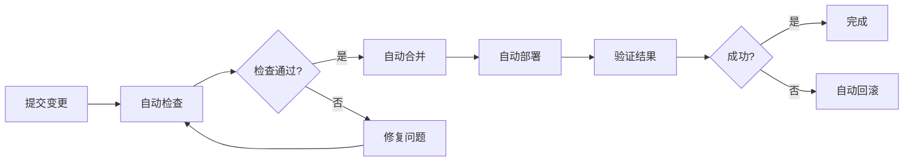
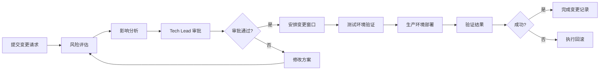
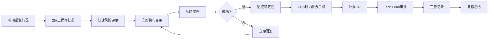
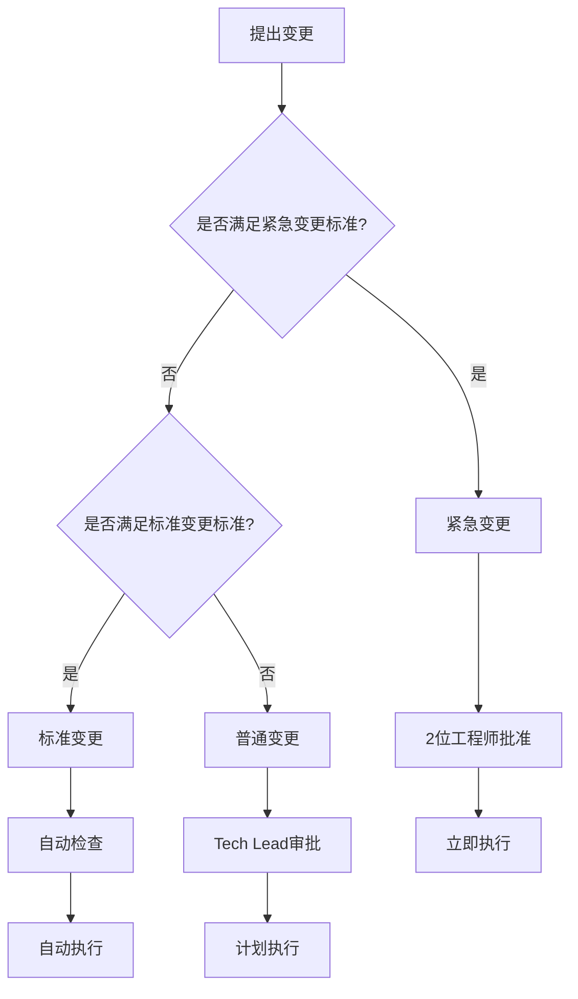
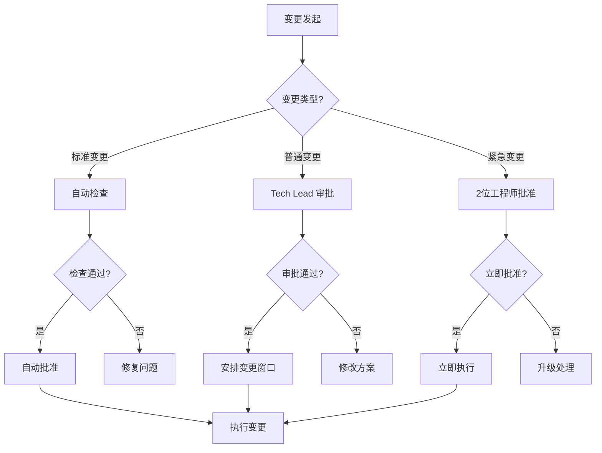
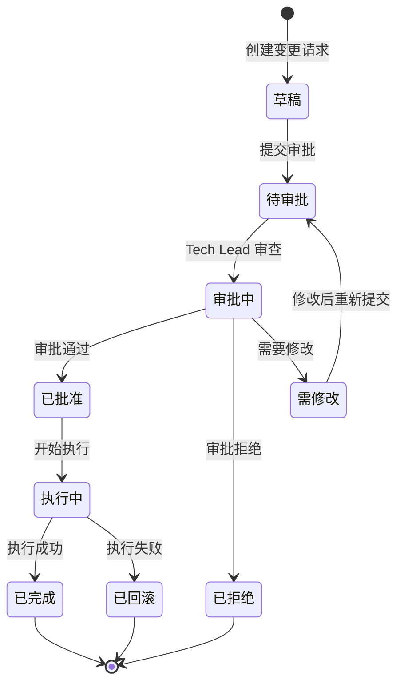
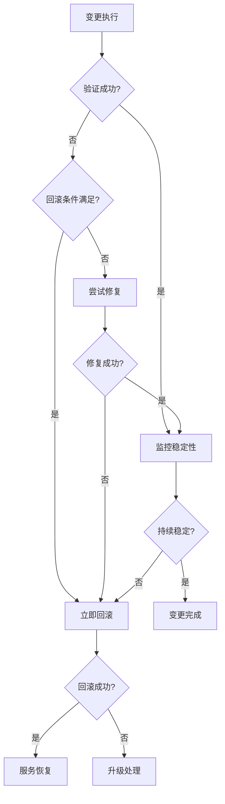

# 变更管理流程文档

**文档版本**: 1.0
**创建日期**: 2026-03-18
**维护者**: DevOps 团队
**状态**: 生效

---

## 目录

1. [变更管理概述](#1-变更管理概述)
2. [变更分类](#2-变更分类)
3. [审批流程](#3-审批流程)
4. [变更窗口](#4-变更窗口)
5. [变更请求流程](#5-变更请求流程)
6. [变更记录和跟踪](#6-变更记录和跟踪)
7. [回滚程序](#7-回滚程序)
8. [变更相关文档](#8-变更相关文档)

---

## 1. 变更管理概述

### 1.1 目的

建立标准化的变更管理流程，防止未经授权或冲突的变更导致生产事故，确保所有变更经过适当评估、审批和记录，最小化变更风险。

### 1.2 适用范围

- **生产环境**: 118.25.0.190 (Platform), 101.34.254.52 (Remote Agent)
- **服务组件**: Backend, Frontend, PostgreSQL, Redis, OpenClaw Agent
- **配置变更**: 环境变量、系统配置、依赖更新
- **代码变更**: 功能部署、Bug 修复、性能优化

### 1.3 核心原则

**风险控制**: 所有变更必须经过风险评估和适当审批
**可追溯性**: 所有变更必须记录在案，可追溯至变更人
**可回滚**: 所有变更必须有明确的回滚方案
**测试优先**: 变更必须先在测试环境验证
**沟通透明**: 变更必须提前通知相关方

### 1.4 变更管理目标

- 降低变更导致的事故率（目标：< 5%）
- 提高变更成功率（目标：> 95%）
- 减少变更回滚率（目标：< 10%）
- 确保变更 100% 可追溯

---

## 2. 变更分类

### 2.1 变更类型概览

| 变更类型 | 特点 | 审批要求 | 适用场景 | 示例 |
|---------|------|---------|---------|------|
| **标准变更** | 预批准 | 自动检查 | 低风险、高频操作 | 配置修改、文档更新 |
| **普通变更** | 需审批 | Tech Lead 审批 | 中风险、常规变更 | 功能部署、架构调整 |
| **紧急变更** | 事后审批 | 2 位工程师批准 | 高风险、紧急修复 | 关键 Bug 修复、安全漏洞 |

### 2.2 标准变更 (Standard Change)

#### 定义

预批准的变更类型，无需人工审批，仅需通过自动化质量检查。这类变更风险低、频率高、流程标准化。

#### 特点

- **预批准**: 无需人工审批流程
- **自动化**: 通过自动化检查即可执行
- **低风险**: 对系统影响最小
- **可逆**: 易于快速回滚
- **标准化**: 有明确的执行步骤

#### 判断标准

满足以下**所有条件**可归类为标准变更：

```yaml
条件:
  - 风险等级: 低
  - 影响范围: 非核心功能
  - 执行频率: 高（每周 > 3 次）
  - 回滚难度: 简单（< 5 分钟）
  - 测试覆盖: 有自动化测试覆盖
```

#### 标准变更示例

**配置修改类**:
- ✅ 修改日志级别（DEBUG → INFO）
- ✅ 调整缓存过期时间
- ✅ 修改监控告警阈值
- ✅ 更新环境变量（非敏感配置）

**热修复类**:
- ✅ 修复明显的 UI Bug
- ✅ 修复文档错误
- ✅ 修正非关键路径的代码错误
- ✅ 更新静态资源（图片、图标）

**文档更新类**:
- ✅ 更新 API 文档
- ✅ 更新 README
- ✅ 更新操作手册
- ✅ 更新 Runbook

**依赖更新类**:
- ✅ 补丁版本更新（1.2.3 → 1.2.4）
- ✅ 安全补丁应用（非破坏性）

#### 标准变更要求

```markdown
标准变更检查清单:
- [ ] 通过质量门禁（Quality Gate）
- [ ] 通过自动化测试（覆盖率 ≥ 80%）
- [ ] 通过代码审查（至少 1 位 Reviewer）
- [ ] 有明确回滚方案（< 5 分钟可完成）
- [ ] 在测试环境验证通过
- [ ] 变更记录已创建
```

#### 标准变更流程



### 2.3 普通变更 (Normal Change)

#### 定义

需要正式审批流程的变更类型，具有一定风险和影响范围，需要 Tech Lead 审批后才能执行。

#### 特点

- **需审批**: Tech Lead 必须审批
- **中风险**: 对系统有中等影响
- **计划性**: 需提前计划和安排
- **评估性**: 需要风险评估和影响分析
- **可追溯**: 完整的变更记录和审批链

#### 判断标准

满足以下**任一条件**应归类为普通变更：

```yaml
条件:
  - 风险等级: 中或高
  - 影响范围: 核心功能或多个服务
  - 执行频率: 低（每周 ≤ 2 次）
  - 回滚难度: 中等（5-30 分钟）
  - 架构变更: 涉及架构调整
```

#### 普通变更示例

**功能部署类**:
- ✅ 新功能发布
- ✅ API 接口变更
- ✅ 数据库 Schema 变更
- ✅ 第三方集成变更

**架构调整类**:
- ✅ 服务拆分或合并
- ✅ 数据库迁移
- ✅ 缓存策略调整
- ✅ 负载均衡配置变更

**性能优化类**:
- ✅ 查询优化
- ✅ 索引调整
- ✅ 缓存实现
- ✅ 代码重构

**配置变更类**:
- ✅ 环境变量重大修改
- ✅ 系统配置调整
- ✅ 网络配置变更
- ✅ 资源限制调整

#### 普通变更要求

```markdown
普通变更检查清单:
- [ ] 变更请求（CR）已提交
- [ ] 风险评估已完成
- [ ] 影响分析已完成
- [ ] 测试计划已定义
- [ ] 回滚计划已准备
- [ ] Tech Lead 已审批
- [ ] 变更窗口已确认
- [ ] 相关方已通知
```

#### 普通变更流程



### 2.4 紧急变更 (Emergency Change)

#### 定义

由于紧急情况需要立即执行的变更，事后补办审批流程。这类变更通常由严重事故、安全漏洞或关键 Bug 触发。

#### 特点

- **事后审批**: 变更执行后补办审批
- **高优先级**: 立即执行，无需等待变更窗口
- **高风险**: 可能对系统产生重大影响
- **时效性**: 时间敏感，延迟会导致更大损失
- **严格审查**: 事后严格审查和复盘

#### 判断标准

满足以下**任一条件**可归类为紧急变更：

```yaml
条件:
  - 严重级别: P0 或 P1 事故
  - 安全漏洞: 高危或严重安全漏洞
  - 数据风险: 数据丢失或损坏风险
  - 业务影响: 严重影响业务运营
  - 合规要求: 法律或合规要求
```

#### 紧急变更示例

**关键 Bug 修复类**:
- ✅ P0/P1 事故修复
- ✅ 数据一致性问题修复
- ✅ 服务完全不可用恢复
- ✅ 性能严重下降恢复

**安全漏洞修复类**:
- ✅ 高危安全漏洞修复
- ✅ 数据泄露风险修复
- ✅ 未授权访问修复
- ✅ 恶意攻击应对

**数据恢复类**:
- ✅ 数据丢失恢复
- ✅ 数据损坏修复
- ✅ 错误数据回滚

**合规要求类**:
- ✅ 法律法规要求变更
- ✅ 合规审计要求变更
- ✅ 安全认证要求变更

#### 紧急变更要求

```markdown
紧急变更检查清单:
变更前:
- [ ] 确认为紧急变更（符合判断标准）
- [ ] 至少 2 位工程师批准
- [ ] 快速风险评估已完成
- [ ] 快速回滚方案已准备
- [ ] 相关方已通知

变更中:
- [ ] 实时监控变更执行
- [ ] 准备随时回滚
- [ ] 记录所有操作步骤
- [ ] 保持沟通畅通

变更后（24 小时内）:
- [ ] 补办变更请求（CR）
- [ ] 补办 Tech Lead 审批
- [ ] 完善变更记录
- [ ] 编写事故报告（如适用）
- [ ] 安排复盘会议
```

#### 紧急变更流程



#### 紧急变更事后要求

**24 小时内完成**:
1. 补办变更请求（CR）
2. 获得 Tech Lead 审批
3. 完善变更记录文档
4. 如触发了事故，编写事故报告
5. 安排复盘会议

**48 小时内完成**:
1. 完成复盘会议
2. 提出改进措施
3. 创建改进行动项

### 2.5 变更类型判断流程



### 2.6 变更类型对比表

| 维度 | 标准变更 | 普通变更 | 紧急变更 |
|------|---------|---------|---------|
| **审批流程** | 自动检查 | Tech Lead 审批 | 2 位工程师 + 事后审批 |
| **执行时机** | 任何时候 | 变更窗口内 | 任何时候 |
| **风险评估** | 自动评估 | 详细评估 | 快速评估 |
| **测试要求** | 自动化测试 | 全面测试 | 最小化测试 |
| **回滚要求** | 简单回滚（< 5min） | 标准回滚（5-30min） | 快速回滚（< 5min） |
| **文档要求** | 变更记录 | CR + 详细计划 | CR + 事故报告 |
| **沟通要求** | 常规通知 | 提前通知 | 实时通知 |
| **频率** | 高（每周 > 3 次） | 低（每周 ≤ 2 次） | 稀少（按需） |
| **典型例子** | 日志级别调整 | 新功能发布 | P0 事故修复 |

---

## 3. 审批流程

### 3.1 审批流程概览



### 3.2 标准变更审批流程

#### 流程步骤

**步骤 1: 自动检查**
```bash
# 运行质量门禁
./scripts/quality-gate.sh

# 检查项:
# ✅ ESLint: 0 错误
# ✅ TypeScript: 0 错误
# ✅ 测试覆盖率: ≥ 80%
# ✅ 安全审计: 无高危漏洞
# ✅ 代码气味: ≤ 5 高严重性
```

**步骤 2: 自动审查**
```bash
# GitHub PR 自动检查
# ✅ 至少 1 位 Reviewer 批准
# ✅ CI 检查全部通过
# ✅ 无合并冲突
```

**步骤 3: 自动合并**
```bash
# 满足以下条件自动合并:
# - 所有检查通过
# - 至少 1 位批准
# - 分支保护规则满足
# - 可自动部署
```

**步骤 4: 自动部署**
```bash
# CI/CD Pipeline 自动部署
# - 测试环境验证
# - 生产环境部署
# - 健康检查验证
```

#### 审批标准

```yaml
自动检查通过标准:
  代码质量:
    - ESLint 错误: 0
    - TypeScript 错误: 0
    - 代码气味高严重性: ≤ 5

  测试覆盖:
    - 行覆盖率: ≥ 80%
    - 分支覆盖率: ≥ 75%
    - 函数覆盖率: ≥ 80%

  安全审计:
    - 高危漏洞: 0
    - 严重漏洞: 0

  代码审查:
    - 至少 1 位 Reviewer 批准
    - 无待解决问题
    - 无合并冲突
```

#### 审批时间

- **预期时间**: 5-10 分钟（自动检查 + 合并 + 部署）
- **最长时间**: 30 分钟（如果需要修复问题）

### 3.3 普通变更审批流程

#### 流程步骤

**步骤 1: 提交变更请求（CR）**
```markdown
# 使用变更请求模板
创建文件: docs/changes/CR-YYYYMMDD-001.md
填写内容:
- 变更描述
- 变更原因
- 影响分析
- 风险评估
- 测试计划
- 回滚计划
```

**步骤 2: Tech Lead 审批**
```yaml
审批检查项:
  技术评估:
    - 技术方案合理性
    - 实现完整性
    - 测试充分性

  风险评估:
    - 风险等级评估
    - 影响范围分析
    - 缓解措施有效性

  业务评估:
    - 业务价值确认
    - 用户影响评估
    - 时机合适性

  回滚准备:
    - 回滚方案可行性
    - 回滚时间评估
    - 数据保护措施
```

**步骤 3: 安排变更窗口**
```yaml
窗口选择:
  时间: 工作日 10:00-16:00 (北京时间)
  避开: 节假日前后 3 天
  避开: 高峰期（如周一上午、周五下午）
  考虑: 相关人员可用性
```

**步骤 4: 执行变更**
```yaml
执行前:
  - 再次确认变更窗口
  - 通知相关人员
  - 准备回滚方案
  - 准备监控面板

执行中:
  - 按计划步骤执行
  - 实时监控指标
  - 记录执行日志
  - 保持沟通畅通

执行后:
  - 验证变更结果
  - 监控稳定性（1 小时）
  - 更新变更记录
  - 通知相关方
```

#### 审批标准

```yaml
Tech Lead 审批标准:
  技术标准:
    - 代码质量: 通过 Quality Gate
    - 测试覆盖: ≥ 80%
    - 文档完整: 有完整的技术文档

  风险标准:
    - 风险等级: 中或以下（高风险需要 CTO 审批）
    - 影响范围: 可控
    - 回滚方案: 可行且已验证

  业务标准:
    - 业务价值: 明确且可衡量
    - 用户影响: 可接受或可缓解
    - 执行时机: 合适

  流程标准:
    - 变更请求: 完整填写
    - 测试计划: 充分且可执行
    - 回滚计划: 详细且已演练
```

#### 审批时间

- **预期时间**: 1-2 个工作日
- **最长时间**: 5 个工作日（需要修改方案）
- **紧急情况**: 可升级为紧急变更

#### 审批权限

| 角色 | 审批权限 | 审批范围 | 升级条件 |
|------|---------|---------|---------|
| **Tech Lead** | ✅ 完全审批 | 所有普通变更 | 高风险变更升级 CTO |
| **CTO** | ✅ 完全审批 | 高风险变更 | 跨团队协调 |
| **DevOps Lead** | ⚠️ 部分审批 | DevOps 相关变更 | 涉及架构升级 |

### 3.4 紧急变更审批流程

#### 流程步骤

**步骤 1: 确认紧急变更**
```yaml
确认标准:
  - 符合紧急变更判断标准
  - 至少 2 位工程师确认
  - 评估延迟后果
  - 确认无其他方案
```

**步骤 2: 快速批准**
```yaml
批准要求:
  - 至少 2 位工程师批准
  - 其中 1 位应为值班工程师
  - 快速风险评估完成
  - 回滚方案已准备

批准方式:
  - 钉钉群确认（#incidents 群）
  - 电话确认（必要时）
  - 记录批准人员和理由
```

**步骤 3: 立即执行**
```yaml
执行要求:
  - 按照事故响应流程执行
  - 实时监控执行过程
  - 准备随时回滚
  - 记录所有操作

执行原则:
  - 恢复服务优先于理解根因
  - 快速修复优先于完美方案
  - 缓解措施优先于完全解决
```

**步骤 4: 事后补办（24 小时内）**
```yaml
补办流程:
  1. 补办变更请求（CR）
  2. 补办 Tech Lead 审批
  3. 完善变更记录
  4. 编写事故报告（如适用）
  5. 安排复盘会议

时间要求:
  - 24 小时内: 补办 CR 和审批
  - 48 小时内: 完成复盘会议
  - 1 周内: 完成改进措施
```

#### 审批标准

```yaml
紧急变更批准标准:
  紧急性标准:
    - P0/P1 事故: 立即
    - 安全漏洞: 高危或严重
    - 数据风险: 迫在眉睫
    - 业务影响: 严重且紧急

  技术标准:
    - 快速风险评估: 可接受
    - 回滚方案: 可行且快速
    - 执行方案: 明确且步骤化
    - 负责人: 明确且在场

  沟通标准:
    - 相关方: 已通知
    - 批准记录: 完整
    - 执行监控: 实时
    - 回滚准备: 就绪
```

#### 审批时间

- **批准时间**: < 15 分钟（2 位工程师批准）
- **执行时间**: 立即开始
- **补办时间**: 24 小时内完成所有手续

#### 审批权限

```yaml
紧急变更批准权限:
  最小批准:
    - 值班工程师: 1 位
    - 在线工程师: 1 位
    - 总计: 至少 2 位

  升级批准:
    - Tech Lead: 涉及架构变更
    - CTO: 跨团队或重大决策
    - 批准时效: 30 分钟内响应
```

### 3.5 审批记录

所有审批必须记录以下信息：

```markdown
## 审批记录

**变更 ID**: CR-20260318-001
**变更类型**: 普通 / 紧急
**提交时间**: 2026-03-18 10:00

### 审批链

| 审批人 | 角色 | 审批时间 | 审批结果 | 审批意见 |
|-------|------|---------|---------|---------|
| @ engineer-1 | 工程师 | 2026-03-18 10:15 | ✅ 批准 | 方案可行，风险可控 |
| @ tech-lead | Tech Lead | 2026-03-18 11:30 | ✅ 批准 | 同意执行，安排在周三 |
| @ cto | CTO | - | - | - |

### 审批意见

**@ engineer-1**:
> 技术方案合理，风险评估充分。建议在测试环境多验证一次缓存失效场景。

**@ tech-lead**:
> 同意变更方案。建议安排在周三 14:00 变更窗口，避开周一高峰。确保回滚方案已演练。

### 审批决策

**最终决策**: ✅ 批准执行
**变更窗口**: 2026-03-20 14:00-15:00
**批准人**: @ tech-lead
```

---

## 4. 变更窗口

### 4.1 变更窗口定义

**目的**: 限制生产环境变更时间，降低变更风险，确保有足够人力应对问题。

**原则**:
- 工作时间执行，便于人员协调
- 避开高峰期，减少用户影响
- 避开节假日，避免人员不足
- 提前通知，确保相关人员在场

### 4.2 生产环境变更窗口

#### 标准变更窗口

```yaml
时间: 工作日 10:00-16:00 (北京时间)
星期: 周一至周五
排除: 节假日前后 3 天

具体窗口:
  - 上午窗口: 10:00-12:00
  - 下午窗口: 14:00-16:00
  - 避开时段: 12:00-14:00 (午休)
  - 避开时段: 16:00-次日 10:00 (非工作时间)
```

#### 最佳变更时间

```yaml
推荐时间:
  - 周二至周四: 14:00-15:00
  - 理由: 避开周一高峰和周五疲劳

不推荐时间:
  - 周一上午: 处理周末积累的问题
  - 周五下午: 人员疲劳，周末出现问题风险高
  - 节假日前: 人员不足，问题响应慢
  - 节假日后: 人员状态不佳
```

#### 窗口预约流程

```markdown
变更窗口预约步骤:

1. 确定变更窗口需求
   - 评估变更执行时间
   - 确定所需人员
   - 识别潜在冲突

2. 检查日历冲突
   - 查看团队日历
   - 检查其他变更计划
   - 确认人员可用性

3. 提交窗口请求
   - 在 #on-call 群通知
   - 创建日历邀请
   - 标注变更类型和影响

4. 确认窗口预约
   - 相关人员确认
   - Tech Lead 确认
   - 更新变更记录

5. 提前通知
   - 至少提前 1 天通知
   - 标注变更影响
   - 提供回滚预计时间
```

### 4.3 变更窗口例外

#### 紧急变更例外

```yaml
紧急变更:
  时间限制: 无（任何时间）
  条件: 符合紧急变更标准
  要求: 至少 2 位工程师批准
  通知: 立即通知相关人员
```

#### 标准变更例外

```yaml
标准变更:
  时间限制: 无（任何时间）
  条件: 通过自动检查
  要求: 有自动化回滚机制
  通知: 变更记录自动更新
```

### 4.4 节假日变更限制

#### 节假日定义

```yaml
节假日包括:
  - 国家法定节假日
  - 公司规定的假期
  - 团队重要活动日

节假日前后限制:
  - 节假日前 3 天: 禁止普通变更
  - 节假日后 2 天: 禁止普通变更
  - 紧急变更: 不受限制
  - 标准变更: 不受限制
```

#### 节假日变更审批

```yaml
节假日变更要求:
  提前规划:
    - 至少提前 2 周规划
    - 额外风险评估
    - 增强回滚准备

  审批要求:
    - Tech Lead 审批: 必须
    - CTO 审批: 高风险变更
    - 团队共识: 必须达成

  执行要求:
    - 主要负责人在场
    - 完整测试验证
    - 增强监控覆盖
    - 快速响应准备
```

### 4.5 变更冲突处理

#### 变更冲突检测

```yaml
冲突检测机制:
  时间冲突:
    - 同一时间多个变更
    - 变更执行时间重叠

  资源冲突:
    - 相同服务或组件
    - 相互依赖的服务
    - 共享资源（数据库、缓存）

  人员冲突:
    - 关键人员同时参与多个变更
    - 值班工程师不可用
```

#### 变更冲突解决策略

```yaml
优先级规则:
  1. 紧急变更 > 普通变更 > 标准变更
  2. 高风险变更优先安排
  3. 依赖关系的变更按依赖顺序
  4. 相同服务的变更合并执行

解决方法:
  - 调整变更时间
  - 合并相关变更
  - 取消低优先级变更
  - 增加执行资源
```

### 4.6 变更日历管理

#### 变更日历维护

```yaml
日历工具:
  - Google Calendar
  - 钉钉日历
  - 团队共享日历

日历信息:
  - 变更 ID
  - 变更描述
  - 变更类型
  - 影响范围
  - 负责人
  - 相关人员
```

#### 变更日历视图

```markdown
## 变更日历示例

### 2026-03-18 (周一)

| 时间 | 变更 ID | 变更描述 | 类型 | 负责人 | 状态 |
|------|---------|---------|------|--------|------|
| 10:00-11:00 | CR-20260318-001 | 数据库索引优化 | 普通 | @ engineer-1 | 🟢 计划中 |
| 14:00-15:00 | CR-20260318-002 | 缓存策略调整 | 普通 | @ engineer-2 | 🟢 计划中 |

### 2026-03-19 (周二)

| 时间 | 变更 ID | 变更描述 | 类型 | 负责人 | 状态 |
|------|---------|---------|------|--------|------|
| 11:00-12:00 | CR-20260319-001 | API v2 发布 | 普通 | @ tech-lead | 🟡 审批中 |
```

---

## 5. 变更请求流程

### 5.1 变更请求（CR）概述

**定义**: 变更请求（Change Request, CR）是正式的变更提案文档，详细描述变更内容、理由、影响和计划。

**目的**:
- 确保变更充分评估和审批
- 提供变更执行的指导文档
- 记录变更决策和理由
- 便于变更跟踪和审计

**适用范围**:
- ✅ 普通变更（必需）
- ✅ 紧急变更（事后补办）
- ❌ 标准变更（不需要）

### 5.2 变更请求模板

使用统一的变更请求模板：`docs/changes/CHANGE_REQUEST_TEMPLATE.md`

**核心内容包括**:
```markdown
# 变更请求 (Change Request)

## 基本信息
- 变更 ID: CR-YYYYMMDD-XXX
- 变更类型: 普通 / 紧急
- 提交人: @ name
- 提交日期: YYYY-MM-DD
- 目标执行日期: YYYY-MM-DD

## 变更描述
{详细描述变更内容}

## 变更原因
{说明为什么需要这个变更}

## 影响分析
{分析变更对系统的影响}

## 风险评估
{评估变更风险等级和缓解措施}

## 测试计划
{说明测试策略和验证方法}

## 回滚计划
{详细说明如何回滚}

## 批准记录
{记录审批链和意见}
```

### 5.3 变更请求提交流程

#### 步骤 1: 创建变更请求

```bash
# 使用模板创建变更请求
cp docs/changes/CHANGE_REQUEST_TEMPLATE.md docs/changes/CR-$(date +%Y%m%d)-001.md

# 或使用脚本生成
./scripts/create-change-request.sh --type normal
```

#### 步骤 2: 填写变更请求

```markdown
# 必填内容清单
- [ ] 变更描述（清晰、完整）
- [ ] 变更原因（业务价值）
- [ ] 影响分析（范围和程度）
- [ ] 风险评估（等级和缓解）
- [ ] 测试计划（充分且可执行）
- [ ] 回滚计划（详细且已验证）
- [ ] 执行时间（符合窗口要求）
- [ ] 负责人（明确且可用）
```

#### 步骤 3: 提交审批

```bash
# 1. 提交 PR 到 GitHub
git checkout -b change/CR-20260318-001
git add docs/changes/CR-20260318-001.md
git commit -m "docs: Submit CR-20260318-001"
git push origin change/CR-20260318-001
gh pr create --title "CR-20260318-001: Database index optimization" --body "Change request for database index optimization"

# 2. 通知 Tech Lead 审批
# 在 #on-call 群通知:
# "📋 新变更请求: CR-20260318-001 - 数据库索引优化"
# "请 @ tech-lead 审批"

# 3. 等待审批结果
# 正常: 1-2 个工作日
# 加急: 可联系 Tech Lead 加急处理
```

#### 步骤 4: 审批反馈处理

```yaml
审批结果处理:
  批准:
    - 安排变更窗口
    - 通知相关人员
    - 准备执行变更

  拒绝:
    - 查看拒绝理由
    - 修改变更方案
    - 重新提交审批

  修改后重新提交:
    - 根据反馈修改
    - 标注修改内容
    - 请求重新审批
```

### 5.4 变更请求编号规则

#### 编号格式

```yaml
格式: CR-YYYYMMDD-XXX
示例: CR-20260318-001

组成部分:
  - CR: Change Request 缩写
  - YYYYMMDD: 提交日期
  - XXX: 当日序号（001-999）

编号示例:
  - CR-20260318-001: 2026年3月18日第1个变更请求
  - CR-20260318-002: 2026年3月18日第2个变更请求
```

#### 编号分配

```yaml
分配规则:
  - 按提交日期顺序分配
  - 每日从 001 开始
  - 自动递增
  - 不可跳号

管理工具:
  - 脚本自动生成: ./scripts/create-change-request.sh
  - 手动创建时查阅现有编号
  - 在团队群公布每日编号范围
```

### 5.5 变更请求生命周期



**状态说明**:
- **草稿**: 变更请求正在编写中
- **待审批**: 变更请求已提交，等待审批
- **审批中**: Tech Lead 正在审查
- **已批准**: 变更请求已批准，等待执行
- **已拒绝**: 变更请求被拒绝，不能执行
- **需修改**: 需要根据反馈修改后重新提交
- **执行中**: 变更正在执行中
- **已完成**: 变更执行成功
- **已回滚**: 变更执行失败，已回滚

### 5.6 变更请求示例

#### 示例 1: 普通变更请求

```markdown
# 变更请求: 数据库索引优化

## 基本信息
- **变更 ID**: CR-20260318-001
- **变更类型**: 普通
- **提交人**: @ engineer-1
- **提交日期**: 2026-03-18
- **目标执行日期**: 2026-03-20 14:00-15:00

## 变更描述

为 `users` 表的 `email` 字段添加索引，优化查询性能。

**变更内容**:
- 添加索引: `CREATE INDEX idx_users_email ON users(email);`
- 验证索引: `EXPLAIN ANALYZE SELECT * FROM users WHERE email = 'test@example.com';`
- 监控查询性能

**涉及文件**:
- `platform/backend/migrations/20260320_add_email_index.sql`

## 变更原因

**当前问题**:
- 用户登录查询慢（P95: 800ms）
- 数据库 CPU 使用率高（80%）
- 用户投诉登录速度

**预期收益**:
- 查询性能提升 10 倍（P95: 80ms）
- 数据库 CPU 使用率降低至 40%
- 用户体验改善

## 影响分析

**影响范围**:
- ✅ 数据库: PostgreSQL（需要重建索引）
- ✅ 应用: Backend（无需修改）
- ❌ 前端: Frontend（无影响）

**影响用户**:
- 0% 用户影响（索引构建期间无锁）

**影响时长**:
- 索引构建: 约 5 分钟（100 万行数据）
- 验证测试: 约 10 分钟
- 总计: 约 15 分钟

**依赖关系**:
- 无其他变更依赖此变更
- 此变更不依赖其他变更

## 风险评估

**风险等级**: 🟡 中等

**风险分析**:
| 风险 | 可能性 | 影响 | 缓解措施 |
|------|-------|------|---------|
| 索引构建时间长 | 低 | 中 | 使用 CONCURRENTLY 选项，不锁表 |
| 磁盘空间不足 | 低 | 高 | 提前检查磁盘空间（需要 2GB） |
| 查询性能无改善 | 中 | 低 | 在测试环境验证，有数据支持 |
| 索引维护开销 | 低 | 低 | 监控索引使用情况 |

**缓解措施**:
1. 使用 `CREATE INDEX CONCURRENTLY` 避免锁表
2. 在测试环境验证性能提升
3. 提前检查磁盘空间（> 5GB 可用）
4. 准备回滚方案（删除索引）
5. 执行期间监控数据库性能

## 测试计划

**测试环境验证**（2026-03-19 完成）:
- [ ] 在测试环境执行迁移
- [ ] 验证索引创建成功
- [ ] 对比查询性能（前后对比）
- [ ] 验证登录功能正常
- [ ] 压力测试（1000 并发）

**生产环境验证**（执行时验证）:
- [ ] 索引创建成功（\di users）
- [ ] 查询性能提升（EXPLAIN ANALYZE）
- [ ] 登录功能正常（测试账号）
- [ ] 错误日志无异常
- [ ] 数据库 CPU 使用率下降

**监控指标**:
- 查询延迟: P95 < 100ms
- 数据库 CPU: < 50%
- 登录成功率: > 99.9%

## 回滚计划

**回滚触发条件**:
- 查询性能无改善或下降
- 数据库错误率 > 1%
- 数据库 CPU 使用率 > 90%
- 用户投诉增加

**回滚步骤**:
```sql
-- 1. 删除索引
DROP INDEX CONCURRENTLY IF EXISTS idx_users_email;

-- 2. 验证索引已删除
\d users

-- 3. 验证查询恢复正常
EXPLAIN ANALYZE SELECT * FROM users WHERE email = 'test@example.com';
```

**回滚时间**: 约 2 分钟

**回滚影响**:
- 查询性能恢复到变更前水平
- 无数据损失
- 无功能影响

**回滚验证**:
- [ ] 索引已删除
- [ ] 查询性能恢复
- [ ] 登录功能正常
- [ ] 错误日志正常

## 批准记录

| 审批人 | 角色 | 审批时间 | 审批结果 | 审批意见 |
|-------|------|---------|---------|---------|
| @ engineer-1 | 工程师 | 2026-03-18 10:00 | ✅ 提交 | 变更请求已提交 |
| @ tech-lead | Tech Lead | - | ⏳ 待审批 | 等待审批 |

## 执行记录

**执行时间**: 待定
**执行人**: 待定
**执行结果**: 待定
**备注**: 待定
```

#### 示例 2: 紧急变更请求（事后补办）

```markdown
# 变更请求: P0 事故紧急修复

## 基本信息
- **变更 ID**: CR-20260318-002
- **变更类型**: 紧急
- **提交人**: @ on-call-engineer
- **提交日期**: 2026-03-18
- **实际执行时间**: 2026-03-18 15:30-16:00
- **补办时间**: 2026-03-18 18:00

## 变更描述

紧急修复 OAuth 登录 100% 失败问题。

**变更内容**:
- 回滚环境变量配置
- 恢复正确的 FEISHU_APP_SECRET

**涉及文件**:
- `/opt/opclaw/platform/.env.production`

## 变更原因

**P0 事故: OAuth 登录 100% 失败**

**事故详情**:
- 事故 ID: INC-20260318-001
- 事故级别: P0
- 开始时间: 2026-03-18 15:00
- 影响用户: 100%

**根本原因**:
配置变更时使用了错误的 .env 文件，FEISHU_APP_SECRET 被替换为占位符值。

**紧急性**:
- 所有用户无法登录
- 业务完全中断
- 需要立即恢复

## 影响分析

**影响范围**:
- ✅ 平台: 所有用户无法登录
- ✅ 业务: 完全中断
- ✅ 影响: 100% 用户

**影响时长**:
- 事故持续: 30 分钟
- 修复时间: 5 分钟
- 总影响: 35 分钟

## 风险评估

**风险等级**: 🔴 高（紧急变更）

**风险分析**:
| 风险 | 可能性 | 影响 | 缓解措施 |
|------|-------|------|---------|
| 修复失败 | 低 | 高 | 快速回滚到之前配置 |
| 配置错误 | 中 | 中 | 2 位工程师验证 |
| 服务中断 | 高 | 高 | 快速执行，< 5 分钟 |

**缓解措施**:
1. 2 位工程师验证配置
2. 备份当前配置
3. 快速执行（< 5 分钟）
4. 实时监控结果
5. 准备回滚方案

## 测试计划

**测试环境**: 跳过（紧急情况）

**生产环境验证**:
- [ ] 配置已更新
- [ ] OAuth 登录成功（测试账号）
- [ ] 错误率降至 0%
- [ ] 用户反馈正常

**监控指标**:
- 登录成功率: > 99%
- 错误率: < 0.1%
- 响应时间: P95 < 500ms

## 回滚计划

**回滚触发条件**:
- 修复后错误率仍 > 50%
- 新的问题出现

**回滚步骤**:
```bash
# 恢复到修复前配置
docker restart opclaw-backend
```

**回滚时间**: < 2 分钟

## 批准记录

| 审批人 | 角色 | 批准时间 | 批准方式 | 审批意见 |
|-------|------|---------|---------|---------|
| @ on-call-engineer | 值班工程师 | 2026-03-18 15:30 | 钉钉群 | 确认紧急，立即执行 |
| @ engineer-2 | 工程师 | 2026-03-18 15:31 | 钉钉群 | 同意立即执行 |
| @ tech-lead | Tech Lead | 2026-03-18 18:00 | 事后审批 | ✅ 批准（事后） |

**批准记录**:
```
15:30 @ on-call-engineer: 🔴 P0 事故：OAuth 登录 100% 失败，需要紧急回滚配置
15:31 @ engineer-2: 确认，同意立即执行
15:31 @ on-call-engineer: 开始执行修复...
15:36 @ on-call-engineer: ✅ 修复完成，登录已恢复
18:00 @ tech-lead: ✅ 事后审批通过，感谢快速响应
```

## 执行记录

**执行时间**: 2026-03-18 15:30-15:36
**执行人**: @ on-call-engineer
**执行结果**: ✅ 成功

**执行步骤**:
1. 15:30 - 检测事故，确认原因
2. 15:31 - 获得 2 位工程师批准
3. 15:32 - 备份当前配置
4. 15:33 - 更新环境变量
5. 15:34 - 重启服务
6. 15:35 - 验证登录成功
7. 15:36 - 确认服务恢复

**验证结果**:
- ✅ 登录成功率恢复至 100%
- ✅ 错误率降至 0%
- ✅ 用户反馈正常

**备注**: 紧急变更，事后补办审批。感谢 @ engineer-2 快速批准。

## 复盘计划

**复盘会议**: 2026-03-19 10:00
**复盘报告**: 待编写
**改进措施**: 待确定
```

---

## 6. 变更记录和跟踪

### 6.1 变更记录概述

**目的**: 记录所有变更的完整生命周期，便于追溯、审计和学习。

**记录内容**:
- 变更基本信息（ID、类型、时间）
- 变更描述和原因
- 影响分析和风险评估
- 审批记录和决策
- 执行记录和结果
- 回滚记录（如适用）
- 复盘和学习（如适用）

### 6.2 变更记录模板

使用统一的变更记录模板：`docs/changes/CHANGE_RECORD_TEMPLATE.md`

**变更记录位置**:
- 文件: `docs/changes/CR-YYYYMMDD-XXX.md`
- 格式: Markdown
- 命名: 与变更请求 ID 相同

### 6.3 变更跟踪系统

#### GitHub Issues 跟踪

```yaml
使用 GitHub Issues 跟踪变更:

Issue 标签:
  - change: 所有变更
  - change-standard: 标准变更
  - change-normal: 普通变更
  - change-emergency: 紧急变更
  - change-completed: 已完成
  - change-rolled-back: 已回滚

Issue 模板:
  - 使用变更请求模板
  - 关联相关 PR
  - 关联相关事故（如适用）

Issue 状态:
  - Open: 待审批
  - In Progress: 执行中
  - Closed: 已完成或已回滚
```

#### 变更日志

```yaml
变更日志维护:
位置: CHANGELOG.md
内容:
  - 已发布的变更
  - 按时间倒序
  - 包含变更 ID 和简要描述

格式示例:
## [Unreleased]

### Added
- CR-20260318-001: Database index optimization for users table

### Changed
- CR-20260318-002: Updated OAuth configuration

### Fixed
- CR-20260318-003: Fixed login performance issue

## [1.2.0] - 2026-03-15
...
```

#### 变更统计

```yaml
变更统计指标:
  每月变更数量:
    - 标准变更: XX 次
    - 普通变更: XX 次
    - 紧急变更: XX 次

  变更成功率:
    - 成功率: XX%
    - 回滚率: XX%
    - 失败率: XX%

  变更类型分布:
    - 配置变更: XX%
    - 功能部署: XX%
    - Bug 修复: XX%
    - 性能优化: XX%

  审批时间:
    - 平均审批时间: XX 小时
    - 最长审批时间: XX 小时
    - 最短审批时间: XX 小时
```

### 6.4 变更记录查询

#### 查询变更记录

```bash
# 查看所有变更记录
ls -la docs/changes/

# 查看特定变更记录
cat docs/changes/CR-20260318-001.md

# 搜索变更记录
grep -r "数据库索引" docs/changes/

# 按日期查找变更
find docs/changes/ -name "CR-202603*"
```

#### 变更记录报告

```bash
# 生成月度变更报告
./scripts/generate-change-report.sh --month 2026-03

# 报告内容包括:
# - 变更数量统计
# - 变更类型分布
# - 变更成功率
# - 回滚情况分析
# - 改进建议
```

### 6.5 变更记录保留策略

```yaml
记录保留:
  活跃变更: 永久保留
  已完成变更: 永久保留
  已回滚变更: 永久保留（用于学习）

  归档策略:
    - 6 个月前的变更: 移至 archive/ 目录
    - 1 年前的变更: 压缩存储
    - 3 年前的变更: 移至冷存储

  删除策略:
    - 原则上不删除任何变更记录
    - 仅删除明显错误的测试记录
    - 删除需要团队批准
```

---

## 7. 回滚程序

详细的回滚程序请参考: `docs/operations/CHANGE_MANAGEMENT_ROLLBACK.md`

**核心原则**:
1. **快速回滚**: 优先恢复服务，不超过 5 分钟
2. **明确触发**: 清晰定义何时回滚
3. **充分准备**: 所有变更必须有回滚方案
4. **验证回滚**: 回滚后必须验证服务恢复
5. **记录学习**: 回滚后必须复盘和学习

**回滚决策树**:


---

## 8. 变更相关文档

### 8.1 模板文档

- **变更请求模板**: `docs/changes/CHANGE_REQUEST_TEMPLATE.md`
- **变更记录模板**: `docs/changes/CHANGE_RECORD_TEMPLATE.md`
- **回滚计划模板**: `docs/changes/ROLLBACK_PLAN_TEMPLATE.md`

### 8.2 流程文档

- **变更回滚程序**: `docs/operations/CHANGE_MANAGEMENT_ROLLBACK.md`
- **质量门禁文档**: `docs/operations/QUALITY_GATE.md`
- **事故响应流程**: `docs/operations/INCIDENT_RESPONSE.md`
- **On-Call 值班手册**: `docs/operations/ONCALL.md`

### 8.3 配置文档

- **变更管理配置**: `docs/operations/CONFIG.md`
- **SLA/SLO 文档**: `docs/operations/SLIS_SLOS.md`
- **部署指南**: `docs/deployment/DEPLOYMENT_GUIDE.md`

### 8.4 相关文档

- **Git Workflow**: `docs/development/GIT_WORKFLOW.md`
- **CI/CD Pipeline**: `docs/development/CICD_PIPELINE.md`
- **测试策略**: `docs/development/TEST_STRATEGY.md`

---

## 附录

### 附录 A: 变更类型快速判断

```yaml
快速判断流程:
  1. 是否紧急?
     是 → 紧急变更
     否 → 继续

  2. 是否低风险且高频?
     是 → 标准变更
     否 → 继续

  3. 是否需要正式审批?
     是 → 普通变更
     否 → 标准变更

判断示例:
  - 修改日志级别 → 标准变更
  - 新功能发布 → 普通变更
  - P0 事故修复 → 紧急变更
  - 安全漏洞修复 → 紧急变更
  - 性能优化 → 普通变更
```

### 附录 B: 变更检查清单

#### 标准变更检查清单

```markdown
## 标准变更检查清单

变更 ID: CR-YYYYMMDD-XXX
变更描述: {description}

### 变更前
- [ ] 通过质量门禁（Quality Gate）
- [ ] 通过自动化测试（覆盖率 ≥ 80%）
- [ ] 通过代码审查（至少 1 位 Reviewer）
- [ ] 有明确回滚方案（< 5 分钟）
- [ ] 在测试环境验证通过
- [ ] 变更记录已创建

### 变更中
- [ ] 按照变更步骤执行
- [ ] 实时监控执行过程
- [ ] 记录执行日志

### 变更后
- [ ] 验证变更成功
- [ ] 监控服务稳定性（1 小时）
- [ ] 更新变更记录
- [ ] 通知相关方
```

#### 普通变更检查清单

```markdown
## 普通变更检查清单

变更 ID: CR-YYYYMMDD-XXX
变更描述: {description}

### 变更前
- [ ] 变更请求（CR）已提交
- [ ] 风险评估已完成
- [ ] 影响分析已完成
- [ ] 测试计划已定义
- [ ] 回滚计划已准备
- [ ] Tech Lead 已审批
- [ ] 变更窗口已确认
- [ ] 相关方已通知
- [ ] 测试环境验证通过
- [ ] 回滚方案已演练

### 变更中
- [ ] 再次确认变更窗口
- [ ] 通知相关人员（变更开始）
- [ ] 按照变更计划执行
- [ ] 实时监控关键指标
- [ ] 记录详细执行日志
- [ ] 保持沟通渠道畅通

### 变更后
- [ ] 验证变更成功
- [ ] 监控服务稳定性（1 小时）
- [ ] 更新变更记录（执行结果）
- [ ] 通知相关方（变更完成）
- [ ] 标记变更为已完成
```

#### 紧急变更检查清单

```markdown
## 紧急变更检查清单

变更 ID: CR-YYYYMMDD-XXX
变更描述: {description}
事故 ID: INC-YYYYMMDD-XXX (如适用)

### 变更前
- [ ] 确认为紧急变更（符合判断标准）
- [ ] 至少 2 位工程师批准
- [ ] 快速风险评估已完成
- [ ] 快速回滚方案已准备
- [ ] 相关方已通知
- [ ] 记录批准理由

### 变更中
- [ ] 实时监控变更执行
- [ ] 准备随时回滚
- [ ] 记录所有操作步骤
- [ ] 保持沟通渠道畅通
- [ ] 每 5 分钟更新状态

### 变更后
- [ ] 验证服务恢复
- [ ] 监控稳定性（1 小时）
- [ ] 24 小时内补办变更请求
- [ ] 24 小时内补办 Tech Lead 审批
- [ ] 完善变更记录
- [ ] 编写事故报告（如适用）
- [ ] 48 小时内完成复盘
```

### 附录 C: 常见问题

**Q1: 如何判断变更类型？**

A: 使用以下判断流程：
1. 是否符合紧急变更标准？→ 紧急变更
2. 是否符合标准变更标准？→ 标准变更
3. 其他情况 → 普通变更

**Q2: 标准变更是否需要审批？**

A: 标准变更不需要人工审批，但必须通过自动化质量检查：
- Quality Gate 检查
- 代码审查（至少 1 位 Reviewer）
- CI 检查全部通过

**Q3: 紧急变更可以跳过测试吗？**

A: 紧急变更可以跳过测试环境的完整测试，但必须：
- 在生产环境执行最小化验证
- 准备快速回滚方案
- 2 位工程师批准

**Q4: 变更窗口之外可以执行变更吗？**

A: 只有以下情况可以在变更窗口之外执行：
- 标准变更（通过自动检查）
- 紧急变更（符合紧急变更标准）

**Q5: 变更失败后如何处理？**

A: 按照以下流程处理：
1. 立即评估是否需要回滚
2. 如需回滚，立即执行回滚方案
3. 回滚后验证服务恢复
4. 编写事故报告（如适用）
5. 安排复盘会议

**Q6: 如何避免变更冲突？**

A: 使用以下方法避免冲突：
1. 查看变更日历，了解其他变更计划
2. 在 #on-call 群提前通知变更计划
3. 合并相关变更，减少变更次数
4. 遵循变更优先级规则

**Q7: 变更记录需要保留多久？**

A: 变更记录永久保留，用于：
- 审计和合规
- 问题追溯
- 经验学习
- 趋势分析

**Q8: 如何处理变更导致的性能问题？**

A: 按照以下流程处理：
1. 立即监控性能指标
2. 评估是否需要回滚
3. 如性能下降 > 50%，立即回滚
4. 如性能下降 < 50%，监控并评估
5. 分析根本原因，优化后重新部署

### 附录 D: 变更管理最佳实践

**1. 变更前充分准备**
- 详细评估变更风险
- 准备完整的回滚方案
- 在测试环境充分验证
- 获得必要的审批

**2. 变更中谨慎执行**
- 严格按照变更计划执行
- 实时监控关键指标
- 保持沟通渠道畅通
- 准备随时回滚

**3. 变更后持续监控**
- 验证变更成功
- 监控服务稳定性
- 更新变更记录
- 通知相关方

**4. 持续改进**
- 定期回顾变更流程
- 分析失败案例
- 优化审批流程
- 分享最佳实践

---

**文档维护**: 每月评审一次，或根据变更反馈更新
**问题反馈**: 在 GitHub 创建 Issue
**最后更新**: 2026-03-18
**下次评审**: 2026-04-18
