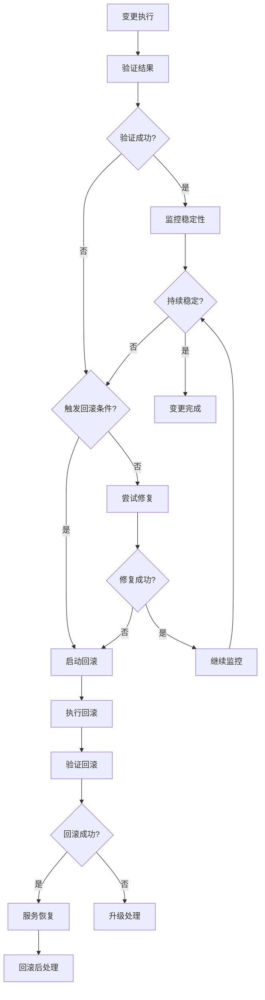

# 变更回滚程序

**文档版本**: 1.0
**创建日期**: 2026-03-18
**维护者**: DevOps 团队
**状态**: 生效

---

## 目录

1. [回滚概述](#1-回滚概述)
2. [回滚触发条件](#2-回滚触发条件)
3. [回滚决策流程](#3-回滚决策流程)
4. [回滚执行步骤](#4-回滚执行步骤)
5. [回滚验证](#5-回滚验证)
6. [回滚后处理](#6-回滚后处理)
7. [常见回滚场景](#7-常见回滚场景)
8. [回滚最佳实践](#8-回滚最佳实践)

---

## 1. 回滚概述

### 1.1 回滚目的

当变更执行失败或导致严重问题时，快速将系统恢复到变更前的稳定状态，最小化服务中断时间和用户影响。

### 1.2 回滚原则

**快速优先**: 服务恢复优先于问题诊断
**明确触发**: 清晰定义何时回滚
**充分准备**: 所有变更必须有回滚方案
**验证回滚**: 回滚后必须验证服务恢复
**记录学习**: 回滚后必须复盘和学习

### 1.3 回滚目标

| 指标 | 目标值 | 说明 |
|------|-------|------|
| **回滚决策时间** | < 2 分钟 | 从发现问题到决定回滚 |
| **回滚执行时间** | < 5 分钟 | 从开始回滚到服务恢复 |
| **回滚成功率** | > 95% | 回滚后服务成功恢复 |
| **数据一致性** | 100% | 回滚后数据必须一致 |

### 1.4 回滚类型

| 类型 | 适用场景 | 回滚时间 | 复杂度 |
|------|---------|---------|-------|
| **代码回滚** | 代码部署失败 | 2-3 分钟 | 低 |
| **配置回滚** | 配置变更错误 | 1-2 分钟 | 低 |
| **数据库回滚** | 数据库迁移失败 | 5-10 分钟 | 中 |
| **数据回滚** | 数据迁移错误 | 10-30 分钟 | 高 |

---

## 2. 回滚触发条件

### 2.1 自动回滚条件

满足以下**任一条件**应立即触发自动回滚：

**服务完全不可用**:
```yaml
条件:
  - 所有用户无法访问
  - API 错误率 > 50%
  - 服务响应时间 > 10 秒（P95）
  - 数据库完全不可用

触发: 立即自动回滚
```

**关键功能失败**:
```yaml
条件:
  - OAuth 登录成功率 < 90%
  - 核心业务流程完全中断
  - 支付功能失败率 > 10%

触发: 立即自动回滚
```

**数据一致性问题**:
```yaml
条件:
  - 数据丢失或损坏
  - 数据不一致率 > 1%
  - 数据库查询返回错误结果

触发: 立即自动回滚
```

**性能严重下降**:
```yaml
条件:
  - 响应时间增加 > 10 倍
  - 错误率增加 > 20%
  - 资源使用率 > 95%

触发: 评估后决定回滚
```

### 2.2 手动回滚条件

满足以下**任一条件**应考虑手动回滚：

**业务影响严重**:
```yaml
条件:
  - 用户大量投诉
  - 业务收入损失
  - 合规风险
  - 品牌声誉受损

决策: 值班工程师评估后决定
```

**监控指标异常**:
```yaml
条件:
  - 监控指标超出阈值
  - 告警持续增加
  - 系统不稳定

决策: Tech Lead 评估后决定
```

**测试验证失败**:
```yaml
条件:
  - 功能测试失败
  - 性能测试不达标
  - 安全测试未通过

决策: 执行负责人决定
```

### 2.3 回滚决策矩阵

| 影响程度 | 响应时间 | 回滚决策 |
|---------|---------|---------|
| **服务完全不可用** | 立即 | ✅ 自动回滚 |
| **关键功能失败** | < 5 分钟 | ✅ 自动回滚 |
| **性能下降 > 10 倍** | < 10 分钟 | ✅ 评估后回滚 |
| **性能下降 5-10 倍** | < 30 分钟 | ⚠️ 观察后决定 |
| **性能下降 2-5 倍** | < 1 小时 | ⚠️ 监控后决定 |
| **非关键功能问题** | < 1 天 | ❌ 不回滚，修复 |

### 2.4 回滚决策流程



---

## 3. 回滚决策流程

### 3.1 回滚决策步骤

**步骤 1: 评估问题** (2 分钟内)
```yaml
评估内容:
  - 问题严重程度
  - 影响用户数量
  - 是否有快速修复方案
  - 回滚是否可行

评估方法:
  - 查看监控面板
  - 查看错误日志
  - 执行健康检查
  - 咨询团队成员
```

**步骤 2: 决策是否回滚** (1 分钟内)
```yaml
决策标准:
  - 满足自动回滚条件 → 立即回滚
  - 满足手动回滚条件 → 评估后决定
  - 不满足回滚条件 → 尝试修复

决策权限:
  - 自动回滚: 执行人可直接决定
  - 手动回滚: 需要 2 位工程师同意
  - 重大决策: 需要 Tech Lead 批准
```

**步骤 3: 通知相关人员** (立即)
```yaml
通知内容:
  - 回滚原因
  - 回滚时间
  - 预计影响

通知渠道:
  - #incidents 群: 立即通知
  - 相关人员: 钉钉消息
  - 管理层: 重大回滚时通知
```

### 3.2 回滚决策模板

```markdown
## 回滚决策记录

**变更 ID**: CR-YYYYMMDD-XXX
**决策时间**: YYYY-MM-DD HH:MM
**决策人**: @ name

### 问题评估
- **问题描述**: {问题描述}
- **严重程度**: P0 / P1 / P2
- **影响用户**: {数量/百分比}
- **影响功能**: {功能列表}

### 触发条件
满足以下回滚触发条件:
- [ ] 服务完全不可用
- [ ] 关键功能失败
- [ ] 数据一致性问题
- [ ] 性能严重下降
- [ ] 业务影响严重
- [ ] 监控指标异常
- [ ] 测试验证失败

### 回滚决策
**决策**: ✅ 立即回滚 / ⚠️ 评估后回滚 / ❌ 不回滚

**决策理由**:
{说明为什么做此决策}

**决策依据**:
- 监控数据: {链接}
- 错误日志: {链接}
- 用户反馈: {描述}

### 审批记录
| 审批人 | 角色 | 审批时间 | 审批结果 | 审批意见 |
|-------|------|---------|---------|---------|
| @ name | 工程师 | HH:MM | ✅ 同意 | 同意回滚 |
| @ name | 工程师 | HH:MM | ✅ 同意 | 同意回滚 |
| @ tech-lead | Tech Lead | HH:MM | ✅ 批准 | 批准回滚 |
```

---

## 4. 回滚执行步骤

### 4.1 回滚前准备

**确认回滚方案** (30 秒内):
```markdown
回滚前检查清单:
- [ ] 回滚方案已准备
- [ ] 回滚步骤已明确
- [ ] 回滚时间已评估（< 5 分钟）
- [ ] 回滚影响已评估
- [ ] 相关人员已通知
```

**准备回滚环境** (30 秒内):
```bash
# 准备回滚脚本
cd /path/to/rollback/scripts

# 备份当前状态（如果需要）
./backup-current-state.sh

# 打开监控面板
# Grafana: http://118.25.0.190:3001
```

### 4.2 回滚执行

**步骤 1: 停止变更** (30 秒内)
```bash
# 停止正在执行的变更
# 如果变更正在执行中，立即停止

# 示例：停止正在运行的迁移
docker exec opclaw-backend pkill -f migration

# 示例：取消正在部署的容器
docker stop opclaw-backend-deploying
```

**步骤 2: 执行回滚** (2-3 分钟)
```bash
# 根据变更类型执行相应的回滚

# 代码回滚
git revert <commit-hash>
git push origin main

# 配置回滚
cp /etc/opclaw/.env.backup /etc/opclaw/.env.production
docker restart opclaw-backend

# 数据库回滚
psql -U opclaw -d opclaw -f /path/to/rollback.sql

# 容器回滚
docker rollback opclaw-backend <previous-image-id>
```

**步骤 3: 验证回滚** (1 分钟)
```bash
# 验证服务已恢复
curl http://localhost:3000/health

# 验证关键功能
# OAuth 登录、API 调用等

# 检查错误日志
docker logs --tail 100 opclaw-backend
```

### 4.3 回滚时间线

```yaml
标准回滚时间线:
  T+00:00 - 发现问题，开始评估
  T+00:02 - 完成评估，决定回滚
  T+00:03 - 通知相关人员，准备回滚
  T+00:05 - 开始执行回滚
  T+00:08 - 回滚完成
  T+00:09 - 验证服务恢复
  T+00:10 - 回滚成功

总计: 10 分钟内完成
```

### 4.4 回滚执行模板

```markdown
## 回滚执行记录

**变更 ID**: CR-YYYYMMDD-XXX
**回滚开始时间**: YYYY-MM-DD HH:MM
**回滚结束时间**: YYYY-MM-DD HH:MM
**回滚执行人**: @ name

### 回滚原因
{说明为什么需要回滚}

### 回滚前状态
- **服务状态**: {描述}
- **错误率**: {百分比}
- **响应时间**: {P95 值}

### 回滚步骤
- [x] T+00: 停止变更执行
- [x] T+01: 执行回滚脚本
- [x] T+02: 验证回滚结果
- [x] T+03: 检查服务状态

### 回滚命令
```bash
# 记录实际执行的回滚命令
{命令 1}
{命令 2}
{命令 3}
```

### 回滚后状态
- **服务状态**: {描述}
- **错误率**: {百分比}
- **响应时间**: {P95 值}
- **数据一致性**: ✅ / ❌

### 回滚结果
**回滚状态**: ✅ 成功 / ❌ 失败

**验证结果**:
- [ ] 服务恢复正常
- [ ] 错误率恢复正常
- [ ] 响应时间恢复正常
- [ ] 数据一致性检查通过

### 备注
{其他需要记录的信息}
```

---

## 5. 回滚验证

### 5.1 验证内容

**服务可用性验证**:
```yaml
健康检查:
  - [ ] API 健康检查通过
  - [ ] 容器状态正常
  - [ ] 数据库连接正常
  - [ ] Redis 连接正常

功能验证:
  - [ ] OAuth 登录成功
  - [ ] 关键 API 正常
  - [ ] 数据读写正常
  - [ ] 用户界面正常
```

**性能验证**:
```yaml
性能指标:
  - [ ] 响应时间恢复正常（P95 < 基线值）
  - [ ] 错误率恢复正常（< 1%）
  - [ ] 资源使用率正常（CPU < 80%）
  - [ ] 吞吐量恢复正常
```

**数据验证**:
```yaml
数据一致性:
  - [ ] 数据完整性检查通过
  - [ ] 数据一致性检查通过
  - [ ] 无数据丢失
  - [ ] 无数据损坏
```

### 5.2 验证方法

**自动化验证**:
```bash
# 运行健康检查脚本
./scripts/health-check.sh

# 运行功能测试
npm run test:integration

# 运行数据一致性检查
./scripts/data-consistency-check.sh
```

**手动验证**:
```bash
# 手动测试关键功能
curl http://localhost:3000/api/health

# 检查监控面板
# Grafana: http://118.25.0.190:3001

# 查看错误日志
docker logs --tail 100 opclaw-backend
```

### 5.3 验证时间线

```yaml
验证时间线:
  T+00: 回滚完成
  T+01: 基础健康检查
  T+03: 功能验证
  T+05: 性能验证
  T+10: 数据验证
  T+15: 稳定性监控

总验证时长: 15 分钟
```

### 5.4 验证失败处理

如果验证失败：

**步骤 1**: 确认失败原因
```yaml
可能原因:
  - 回滚不完整
  - 回滚脚本错误
  - 数据不一致
  - 配置未恢复
```

**步骤 2**: 尝试修复
```yaml
修复方案:
  - 重新执行回滚
  - 手动修复问题
  - 恢复备份数据
```

**步骤 3**: 升级处理
```yaml
升级条件:
  - 修复失败
  - 回滚后问题更严重
  - 无法恢复服务

升级到:
  - Tech Lead (立即)
  - CTO (30 分钟内)
```

---

## 6. 回滚后处理

### 6.1 立即处理 (0-30 分钟)

**服务稳定性监控** (0-15 分钟):
```yaml
监控内容:
  - 错误率: 每 2 分钟检查
  - 响应时间: 每 2 分钟检查
  - 资源使用: 每 5 分钟检查
  - 用户反馈: 实时关注

监控时长: 15 分钟
```

**通知相关方** (0-5 分钟):
```yaml
通知内容:
  - 回滚已完成
  - 服务已恢复
  - 影响时长
  - 后续计划

通知对象:
  - #incidents 群
  - 管理层
  - 受影响用户（如需要）
```

**更新状态** (5-15 分钟):
```yaml
更新内容:
  - 变更记录更新
  - GitHub Issue 更新
  - 状态页面更新（如需要）
```

### 6.2 短期处理 (30 分钟 - 24 小时)

**问题分析** (30 分钟 - 2 小时):
```yaml
分析内容:
  - 回滚原因分析
  - 变更失败根因
  - 影响范围评估
  - 数据影响分析

分析输出:
  - 根因分析报告
  - 改进措施建议
```

**改进计划** (2-4 小时):
```yaml
改进内容:
  - 修复变更方案
  - 优化回滚流程
  - 加强测试验证
  - 完善监控告警
```

**文档更新** (4-8 小时):
```yaml
更新内容:
  - 回滚记录更新
  - Runbook 更新
  - 经验教训文档
```

### 6.3 长期处理 (24 小时 - 1 周)

**复盘会议** (48 小时内):
```yaml
参会人员:
  - 执行负责人
  - Tech Lead
  - 相关工程师
  - （可选）CTO

会议议程:
  1. 回顾变更和回滚过程（10 分钟）
  2. 分析根本原因（20 分钟）
  3. 讨论改进措施（20 分钟）
  4. 分配行动项（10 分钟）
```

**改进措施实施** (1 周内):
```yaml
改进措施:
  - [ ] 修复变更方案
  - [ ] 优化回滚流程
  - [ ] 加强测试验证
  - [ ] 完善监控告警
  - [ ] 更新文档
```

**经验分享** (1 周内):
```yaml
分享内容:
  - 回滚案例
  - 经验教训
  - 改进建议

分享对象:
  - 团队内部
  - 相关团队
  - （可选）社区
```

### 6.4 回滚后处理模板

```markdown
## 回滚后处理记录

**变更 ID**: CR-YYYYMMDD-XXX
**回滚时间**: YYYY-MM-DD HH:MM

### 回滚原因分析
**直接原因**:
{直接导致回滚的原因}

**根本原因**:
{根本原因分析（5 Whys）}

### 影响评估
**服务影响**:
- 影响时长: XX 分钟
- 影响用户: XX%
- 业务损失: {描述}

**数据影响**:
- 数据丢失: 是 / 否
- 数据不一致: 是 / 否
- 数据恢复: {方法}

### 改进措施
**短期措施** (24 小时内):
- [ ] {措施 1}
- [ ] {措施 2}
- [ ] {措施 3}

**长期措施** (1 周内):
- [ ] {措施 1}
- [ ] {措施 2}
- [ ] {措施 3}

### 复盘计划
**复盘会议**: YYYY-MM-DD HH:MM
**参会人员**: @ name1, @ name2, @ name3
**复盘报告**: {链接}

### 经验教训
**成功经验**:
1. {经验 1}
2. {经验 2}
3. {经验 3}

**改进建议**:
1. {建议 1}
2. {建议 2}
3. {建议 3}
```

---

## 7. 常见回滚场景

### 7.1 代码部署回滚

**场景**: 代码部署后发现严重 Bug

**回滚步骤**:
```bash
# 1. 回滚 Git 代码
git revert <commit-hash>
git push origin main

# 2. 重新部署
# CI/CD Pipeline 自动重新部署

# 3. 验证部署
curl http://localhost:3000/health
```

**回滚时间**: 2-3 分钟

**验证内容**:
- [ ] 健康检查通过
- [ ] 功能测试通过
- [ ] 错误率恢复正常

### 7.2 配置变更回滚

**场景**: 配置变更后服务异常

**回滚步骤**:
```bash
# 1. 恢复配置文件
cp /etc/opclaw/.env.backup /etc/opclaw/.env.production

# 2. 重启服务
docker restart opclaw-backend

# 3. 验证配置
docker exec opclaw-backend printenv | grep FEISHU
```

**回滚时间**: 1-2 分钟

**验证内容**:
- [ ] 配置已恢复
- [ ] 服务正常启动
- [ ] 功能正常

### 7.3 数据库迁移回滚

**场景**: 数据库迁移导致问题

**回滚步骤**:
```bash
# 1. 回滚迁移
psql -U opclaw -d opclaw -f /path/to/rollback.sql

# 2. 验证回滚
psql -U opclaw -d opclaw -c "\d table_name"

# 3. 验证数据
psql -U opclaw -d opclaw -c "SELECT count(*) FROM table_name;"
```

**回滚时间**: 5-10 分钟

**验证内容**:
- [ ] Schema 已恢复
- [ ] 数据完整性正常
- [ ] 应用功能正常

### 7.4 数据迁移回滚

**场景**: 数据迁移导致数据问题

**回滚步骤**:
```bash
# 1. 从备份恢复数据
pg_restore -U opclaw -d opclaw -v backup.dump

# 2. 验证数据
psql -U opclaw -d opclaw -c "SELECT count(*) FROM table_name;"

# 3. 验证应用
curl http://localhost:3000/api/health
```

**回滚时间**: 10-30 分钟

**验证内容**:
- [ ] 数据已恢复
- [ ] 数据一致性正常
- [ ] 应用功能正常

### 7.5 容器回滚

**场景**: 容器升级后服务异常

**回滚步骤**:
```bash
# 1. 停止当前容器
docker stop opclaw-backend

# 2. 启动旧版本容器
docker start opclaw-backend-old

# 3. 切换流量
# 更新 Nginx 配置或负载均衡器

# 4. 验证服务
curl http://localhost:3000/health
```

**回滚时间**: 3-5 分钟

**验证内容**:
- [ ] 容器正常运行
- [ ] 健康检查通过
- [ ] 功能正常

---

## 8. 回滚最佳实践

### 8.1 回滚准备

**所有变更必须有回滚方案**:
```yaml
回滚方案要求:
  - 在变更请求中明确回滚方案
  - 回滚方案必须经过测试
  - 回滚时间必须 < 5 分钟
  - 回滚方案必须有验证步骤
```

**回滚方案测试**:
```yaml
测试要求:
  - 在测试环境验证回滚方案
  - 确认回滚方案可行
  - 评估回滚时间
  - 识别回滚风险
```

**回滚脚本准备**:
```yaml
脚本要求:
  - 自动化回滚脚本
  - 脚本经过测试
  - 脚本有错误处理
  - 脚本有日志记录
```

### 8.2 回滚执行

**快速决策**:
```yaml
决策原则:
  - 满足自动回滚条件立即回滚
  - 不要犹豫，时间就是服务质量
  - 优先恢复服务，后分析原因
  - 回滚比修复更可靠
```

**标准化执行**:
```yaml
执行标准:
  - 使用标准回滚流程
  - 使用预准备的回滚脚本
  - 记录回滚执行过程
  - 验证回滚结果
```

**沟通透明**:
```yaml
沟通要求:
  - 及时通知相关人员
  - 更新回滚状态
  - 说明回滚原因
  - 提供恢复时间
```

### 8.3 回滚验证

**全面验证**:
```yaml
验证范围:
  - 服务可用性
  - 功能正确性
  - 性能指标
  - 数据一致性
```

**持续监控**:
```yaml
监控时长: 至少 15 分钟
监控频率: 每 2-5 分钟
监控指标:
  - 错误率
  - 响应时间
  - 资源使用
  - 用户反馈
```

### 8.4 回滚后处理

**问题分析**:
```yaml
分析要求:
  - 48 小时内完成分析
  - 使用 5 Whys 方法
  - 找出根本原因
  - 提出改进措施
```

**流程改进**:
```yaml
改进要求:
  - 更新回滚流程
  - 优化回滚脚本
  - 加强测试验证
  - 完善监控告警
```

**经验分享**:
```yaml
分享要求:
  - 团队内部分享
  - 更新文档
  - 训练团队
  - 持续改进
```

---

## 附录

### 附录 A: 回滚检查清单

```markdown
## 回滚检查清单

变更 ID: CR-YYYYMMDD-XXX
回滚时间: YYYY-MM-DD HH:MM

### 回滚前
- [ ] 确认触发回滚条件
- [ ] 评估回滚影响
- [ ] 准备回滚方案
- [ ] 通知相关人员
- [ ] 准备回滚脚本

### 回滚中
- [ ] 停止变更执行
- [ ] 执行回滚脚本
- [ ] 验证回滚结果
- [ ] 记录回滚过程

### 回滚后
- [ ] 服务恢复验证
- [ ] 性能指标验证
- [ ] 数据一致性验证
- [ ] 持续监控 15 分钟
- [ ] 更新回滚记录
- [ ] 通知相关方
- [ ] 开始问题分析
```

### 附录 B: 回滚时间线模板

```markdown
## 回滚时间线

**变更 ID**: CR-YYYYMMDD-XXX
**回滚日期**: YYYY-MM-DD

| 时间 | 事件 | 负责人 | 状态 |
|------|------|--------|------|
| HH:MM | 发现问题 | @ name | 🟡 |
| HH:MM | 开始评估 | @ name | 🟡 |
| HH:MM | 决定回滚 | @ name | 🔴 |
| HH:MM | 通知团队 | @ name | 🔴 |
| HH:MM | 开始回滚 | @ name | 🔄 |
| HH:MM | 回滚完成 | @ name | ✅ |
| HH:MM | 验证通过 | @ name | ✅ |
| HH:MM | 服务恢复 | @ name | ✅ |

**总回滚时长**: XX 分钟
**服务中断时长**: XX 分钟
```

### 附录 C: 相关文档

- **变更管理流程**: `docs/operations/CHANGE_MANAGEMENT.md`
- **事故响应流程**: `docs/operations/INCIDENT_RESPONSE.md`
- **变更请求模板**: `docs/changes/CHANGE_REQUEST_TEMPLATE.md`
- **变更记录模板**: `docs/changes/CHANGE_RECORD_TEMPLATE.md`

---

**文档维护**: 每月评审一次，或根据回滚反馈更新
**问题反馈**: 在 GitHub 创建 Issue
**最后更新**: 2026-03-18
**下次评审**: 2026-04-18
