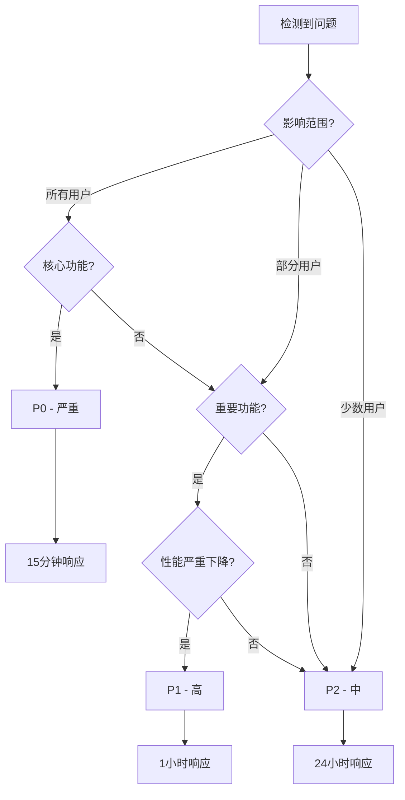
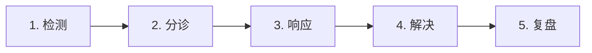
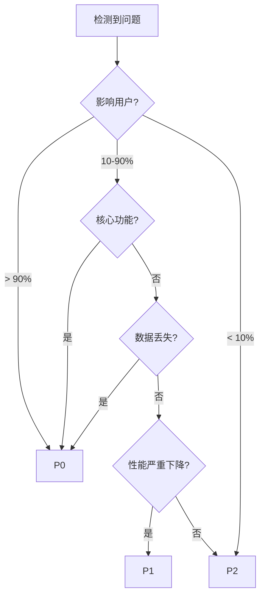

# 事故响应流程

**文档版本**: 1.0
**创建日期**: 2026-03-18
**维护者**: DevOps 团队
**状态**: 生效

---

## 目录

1. [事故响应概述](#1-事故响应概述)
2. [事故等级定义](#2-事故等级定义)
3. [5步响应流程](#3-5步响应流程)
4. [沟通机制](#4-沟通机制)
5. [事故处理指南](#5-事故处理指南)
6. [事故检查清单](#6-事故检查清单)
7. [团队培训](#7-团队培训)
8. [相关文档](#8-相关文档)

---

## 1. 事故响应概述

### 1.1 目的

建立标准化的事故响应流程，确保事故处理高效有序，最小化服务中断时间，并通过系统性学习预防同类事故再次发生。

### 1.2 适用范围

- **生产环境**: 118.25.0.190 (Platform), 101.34.254.52 (Remote Agent)
- **服务组件**: Backend, Frontend, PostgreSQL, Redis, OpenClaw Agent
- **所有事故**: P0/P1/P2 级别事故

### 1.3 核心原则

**快速响应**: 严格按照等级要求的时间响应
**系统化处理**: 遵循 5 步响应流程，不遗漏关键步骤
**充分沟通**: 保持团队和用户信息同步
**持续改进**: 每次事故后复盘，优化流程和系统

### 1.4 无责文化

- **关注系统，不关注个人**
- **"不要将可以用错误解释的事情归因于恶意"**
- **事故是改进的机会，不是惩罚的理由**
- **公开分享学习，帮助团队成长**

---

## 2. 事故等级定义

### 2.1 等级概览

| 等级 | 响应时间 | 处理时间目标 | 更新频率 | 复盘要求 |
|------|---------|-------------|---------|---------|
| **P0 - 严重** | 15 分钟 | MTTR < 1 小时 | 每 15 分钟 | 必须复盘 |
| **P1 - 高** | 1 小时 | MTTR < 4 小时 | 每 30 分钟 | MTTR > 2h 必须复盘 |
| **P2 - 中** | 24 小时 | MTTR < 2 天 | 每日更新 | 可选复盘 |

### 2.2 P0 - 严重 (Critical)

#### 定义
完全服务中断或核心功能完全不可用，影响所有用户。

#### 示例

**服务完全不可用**:
- 所有用户无法访问 Platform 或 Agent
- 100% 用户登录失败
- 所有 API 请求返回 500 错误

**数据相关**:
- 数据库完全不可用
- 数据丢失或损坏
- 数据一致性问题

**基础设施**:
- 服务器宕机
- 网络完全中断
- 关键容器全部停止

**安全相关**:
- 数据泄露
- 未授权访问
- 恶意攻击

#### 响应要求

- ⚠️ **15 分钟内响应**并开始处理
- 📞 **立即电话通知** Primary On-Call
- 🔄 **升级路径**: Primary (15min) → Tech Lead (30min) → CTO (1h)
- 📊 **每 15 分钟更新**一次状态
- 📢 **外部沟通**: 持续 > 15 分钟需要状态页面更新

#### 判断标准

```yaml
条件: 满足任一条件即为 P0
  - 所有用户受影响 (> 90%)
  - 核心功能完全不可用
  - 数据丢失或损坏
  - 安全漏洞或攻击
  - MTTR 预期 > 1 小时
```

### 2.3 P1 - 高 (High)

#### 定义
主要功能故障，部分用户受影响，但系统仍有部分可用性。

#### 示例

**功能不可用**:
- 单个重要功能完全不可用（如 OAuth 登录失败 > 50%）
- Agent 无法连接平台
- 关键 API 端点返回错误

**性能严重下降**:
- P95 延迟 > 3 秒
- 错误率 > 10%
- 吞吐量下降 > 50%

**部分影响**:
- 特定区域用户无法访问
- 特定用户组受影响
- 容器 unhealthy 状态

#### 响应要求

- ⏰ **1 小时内响应**并开始处理
- 💬 **钉钉消息通知** Primary
- 🔄 **升级路径**: Primary (1h) → Tech Lead (2h)
- 📊 **每 30 分钟更新**一次状态
- 📢 **外部沟通**: 持续 > 1 小时考虑状态页面更新

#### 判断标准

```yaml
条件: 满足任一条件即为 P1
  - 部分用户受影响 (10-90%)
  - 重要功能部分不可用
  - 性能严重下降但不完全不可用
  - 错误率升高但不完全失败
  - MTTR 预期 1-4 小时
```

### 2.4 P2 - 中 (Medium)

#### 定义
次要功能故障，少数用户受影响，对核心业务影响有限。

#### 示例

**次要功能**:
- 非核心功能不可用（如统计报表）
- UI 显示问题
- 文档错误

**轻微影响**:
- 性能轻微下降（P95 < 1 秒但高于基线）
- 少数用户（< 10%）受影响
- 非关键路径错误

#### 响应要求

- 📅 **24 小时内处理**
- 📝 **创建 GitHub Issue** 跟踪
- 🔄 **无需升级**
- 📊 **每日更新**进度

#### 判断标准

```yaml
条件: 满足任一条件即为 P2
  - 少数用户受影响 (< 10%)
  - 次要功能不可用
  - 轻微性能下降
  - UI/文档问题
  - MTTR 预期 < 2 天
```

### 2.5 等级判断流程图



---

## 3. 5步响应流程

### 3.1 流程概览



### 3.2 步骤 1: 检测 (Detection)

#### 目标
尽早发现事故，缩短 MTTD (Mean Time To Detect)。

#### 检测来源

**自动监控**:
- Prometheus + Alertmanager 告警
- 容器健康检查失败
- 日志异常检测
- 性能指标异常

**用户报告**:
- 用户反馈（客服、邮件、钉钉）
- 社交媒体抱怨
- 应用内错误报告

**内部观察**:
- 手动检查 Dashboard
- 值班工程师主动发现
- 代码审查发现问题
- 变更后验证失败

#### 检测最佳实践

- ✅ **多维度监控**: 使用多个指标验证
- ✅ **告警降噪**: 减少误报，避免告警疲劳
- ✅ **快速验证**: 确认不是监控故障
- ✅ **上下文收集**: 记录检测到的时间、来源

#### 检测检查清单

```markdown
检测确认清单:
- [ ] 告警是否真实？（不是监控故障）
- [ ] 问题是否影响生产环境？
- [ ] 问题是否已经自行恢复？
- [ ] 记录检测时间和来源
```

### 3.3 步骤 2: 分诊 (Triage)

#### 目标
快速评估事故严重程度和影响范围，确定响应策略。

#### 分诊步骤

**1. 验证事故** (5 分钟内):
```bash
# 确认服务状态
ssh -i ~/.ssh/rap001_opclaw root@118.25.0.190 "docker ps | grep opclaw"
ssh -i ~/.ssh/aiopclaw_remote_agent root@101.34.254.52 "systemctl status openclaw-agent"

# 检查错误率
# 登录 Grafana: http://118.25.0.190:3001
```

**2. 确定严重级别**:
- 使用 [事故等级定义](#2-事故等级定义)
- 评估影响用户数量和范围
- 评估业务影响程度

**3. 评估影响范围**:
- 受影响的用户/区域/功能
- 是否有降级方案
- 是否需要外部沟通

**4. 创建事故记录**:
```bash
# GitHub Issue
标题: [P0] Incident - {简要描述}
标签: incident, P0
模板: 使用事故模板

# 钉钉群
在 #incidents 群发送初始通知
```

**5. 通知值班工程师**:
- P0: 钉钉 @ + 电话通知
- P1: 钉钉 @ 通知
- P2: 创建 Issue 跟踪

#### 分诊决策树



#### 分诊检查清单

```markdown
分诊确认清单:
- [ ] 确认事故真实性
- [ ] 确定严重级别 (P0/P1/P2)
- [ ] 评估影响范围
- [ ] 创建事故记录 (GitHub Issue)
- [ ] 通知值班工程师
- [ ] 发送初始事故通知
```

### 3.4 步骤 3: 响应 (Response)

#### 目标
快速诊断并实施临时修复，恢复服务可用性。

#### 响应阶段

**阶段 1: 初步诊断** (15-30 分钟):

收集上下文:
```bash
# 查看容器日志
docker logs --tail 500 opclaw-backend | grep -i error

# 查看系统资源
htop
df -h
free -h

# 查看数据库连接
docker exec -it opclaw-postgres psql -U opclaw -c "SELECT count(*) FROM pg_stat_activity;"
```

确定可能原因:
- 近期变更？（部署、配置变更）
- 负载增加？（流量、资源）
- 依赖服务？（Feishu、DeepSeek API）
- 已知问题？（查看 Runbook）

**阶段 2: 临时修复** (尽快):

优先级策略:
1. **恢复服务** > 理解根因
2. **快速修复** > 完美方案
3. **缓解措施** > 完全解决

临时修复选项:
- 重启服务
- 回滚最近变更
- 切换到备用服务
- 扩容资源
- 降级非核心功能

**阶段 3: 持续更新** (每 15-30 分钟):

使用标准更新模板（见 [4. 沟通机制](#4-沟通机制)）

**阶段 4: 必要时升级**:

升级条件:
- P0 持续 1 小时未解决
- Primary 无法响应 (30 分钟)
- 需要额外资源或权限

#### 响应策略

**时间优先级**:
```
第 1 个 15 分钟: 检测 + 分诊 + 初步诊断
第 2 个 15 分钟: 尝试临时修复
第 3 个 15 分钟: 升级或执行缓解措施
第 4 个 15 分钟: 准备外部沟通
```

**决策优先级**:
```
1. 恢复服务（如果可能）
2. 缓解影响（如果无法完全恢复）
3. 诊断根因（在服务稳定后）
4. 永久修复（在复盘后）
```

#### 响应检查清单

```markdown
响应确认清单:
- [ ] 收集足够上下文（日志、指标、追踪）
- [ ] 确定可能原因
- [ ] 实施临时修复或缓解措施
- [ ] 验证修复效果
- [ ] 每 15-30 分钟更新状态
- [ ] 必要时升级给 Tech Lead
```

### 3.5 步骤 4: 解决 (Resolution)

#### 目标
实施永久解决方案，确保问题不再复发。

#### 解决阶段

**阶段 1: 永久修复** (事故后 1-4 小时):

根因分析:
- 使用 5 Whys 方法
- 分析系统缺陷
- 识别流程问题

实施永久修复:
- 代码修复
- 配置调整
- 架构改进
- 流程优化

**阶段 2: 验证** (修复后 1 小时):

验证清单:
```markdown
- [ ] 功能测试通过
- [ ] 性能指标正常
- [ ] 错误率恢复正常
- [ ] 监控 1 小时无复发
- [ ] 用户验证（如果可能）
```

**阶段 3: 关闭事故**:

关闭条件:
- 服务完全恢复
- 监控 1 小时正常
- 永久修复已部署
- 用户影响消除

关闭步骤:
1. 在 GitHub Issue 更新最终状态
2. 在 #incidents 群发送解决通知
3. 标记 Issue 为已关闭
4. 创建复盘 Issue（如果需要）

#### 解决检查清单

```markdown
解决确认清单:
- [ ] 永久修复已实施
- [ ] 修复效果已验证
- [ ] 监控 1 小时无复发
- [ ] 用户影响已消除
- [ ] 事故记录已更新
- [ ] 团队已通知解决
```

### 3.6 步骤 5: 复盘 (Post-Incident)

#### 目标
通过系统性学习预防同类事故，改进系统和流程。

#### 复盘要求

**必须复盘**:
- 所有 P0 事故
- MTTR > 2 小时的 P1 事故
- 导致数据丢失的事故

**可选复盘**:
- MTTR < 2 小时的 P1 事故
- 重要的 P2 事故
- 有学习价值的事故

#### 复盘时间线

```
Day 1: 事故解决
Day 2-3: 根因分析和起草复盘报告
Day 4: 团队评审和批准
Day 5: 发布和分享学习
```

#### 复盘会议议程

**会前准备** (30 分钟):
- 事故指挥官收集时间线
- 技术负责人准备根因分析
- 参会人员阅读事故报告

**会议进行** (60 分钟):
1. 时间线回顾 (10 分钟)
2. 根因分析 (20 分钟)
3. 讨论改进措施 (20 分钟)
4. 分配行动项 (10 分钟)

**会后跟进**:
- 发布复盘报告
- 创建改进 Issue
- 跟踪行动项完成

#### 复盘报告模板

详细模板请参考: [`docs/operations/POSTMORTEM_TEMPLATE.md`](POSTMORTEM_TEMPLATE.md)

核心内容:
- 事故概要（1-2 句话）
- 影响分析
- 详细时间线
- 根因分析（5 Whys）
- 解决方案
- 改进行动项
- 学习和反思

#### 复盘检查清单

```markdown
复盘确认清单:
- [ ] 根因分析已完成（5 Whys）
- [ ] 复盘报告已编写
- [ ] 复盘会议已举行
- [ ] 改进行动项已定义
- [ ] 行动项负责人已分配
- [ ] 学习已分享给团队
```

---

## 4. 沟通机制

### 4.1 沟通渠道

#### 内部沟通

**#incidents 钉钉群**:
- **用途**: 事故响应协调和状态更新
- **成员**: 所有工程师 + Tech Lead + CTO
- **机器人**: 告警通知机器人
- **消息保留**: 永久

**#on-call 钉钉群**:
- **用途**: 值班轮换和交接
- **成员**: 所有工程师
- **消息保留**: 90 天

#### 外部沟通

**状态页面** (未来):
- URL: status.aiopc.com
- 用途: 向用户公示服务状态
- 更新条件: P0 持续 > 15 分钟

**应用内通知**:
- 横幅通知: 服务中断警告
- 功能提示: 临时功能关闭说明

**社交媒体** (重大事故):
- 条件: P0 持续 > 1 小时
- 渠道: 官方网站公告

### 4.2 沟通模板

#### 初始事故通知

**P0 事故初始通知**:
```markdown
🔴 P0 事故开始

标题: {简要描述，如 Platform 服务完全不可用}
影响: {受影响用户/功能，如 所有用户无法登录}
开始时间: {YYYY-MM-DD HH:mm}
当前状态: 正在调查
事故指挥官: {值班工程师姓名}

初步信息:
- 检测来源: {监控告警/用户报告}
- 影响范围: {用户数量/区域}
- 当前操作: {正在收集日志/尝试重启}

更新时间: {YYYY-MM-DD HH:mm}
下次更新: {YYYY-MM-DD HH:mm (+15min)}

相关链接:
- GitHub Issue: #{issue_number}
- Grafana Dashboard: {link}
```

**P1 事故初始通知**:
```markdown
🟡 P1 事故开始

标题: {简要描述}
影响: {受影响用户/功能}
开始时间: {YYYY-MM-DD HH:mm}
当前状态: 正在调查
事故指挥官: {值班工程师姓名}

初步信息:
- 检测来源: {监控告警/用户报告}
- 影响范围: {部分用户/特定功能}
- 当前操作: {正在诊断}

更新时间: {YYYY-MM-DD HH:mm}
下次更新: {YYYY-MM-DD HH:mm (+30min)}
```

#### 进展更新

**标准进展更新模板**:
```markdown
📊 事故进展更新

标题: {简要描述}
当前状态: {诊断中/修复中/验证中/升级中}

进展详情:
- {具体进展 1}
- {具体进展 2}
- {具体进展 3}

当前操作:
- {正在执行的操作}
- {需要的支持}

预计恢复: {未知/预计 HH:mm}
置信度: {高/中/低}

更新时间: {YYYY-MM-DD HH:mm}
下次更新: {YYYY-MM-DD HH:mm}
```

#### 解决通知

**标准解决通知模板**:
```markdown
✅ 事故已解决

标题: {简要描述}
解决时间: {YYYY-MM-DD HH:mm}
完全恢复: {YYYY-MM-DD HH:mm}
持续时长: {X 小时 Y 分钟}
事故指挥官: {值班工程师姓名}

根本原因:
{简要描述根本原因}

解决方案:
{简要描述修复措施}

影响总结:
- 受影响用户: {数量/百分比}
- 受影响时长: {时间段}
- 数据影响: {是否有数据丢失}

复盘计划:
- 复盘会议: {YYYY-MM-DD HH:mm}
- 复盘报告链接: {将在会后添加}

感谢团队的努力:
{特别贡献者}

更新时间: {YYYY-MM-DD HH:mm}
```

### 4.3 更新频率

| 事故等级 | 更新频率 | 强制更新条件 |
|---------|---------|-------------|
| **P0** | 每 15 分钟 | 状态变化时立即更新 |
| **P1** | 每 30 分钟 | 状态变化时立即更新 |
| **P2** | 每日 | 有进展时更新 |

### 4.4 外部沟通策略

**何时进行外部沟通**:
- P0 事故持续 > 15 分钟
- 预计修复时间 > 1 小时
- 影响范围扩大
- 用户大量投诉

**外部沟通原则**:
- 透明: 诚实告知当前状态
- 及时: 定期更新进展
- 简洁: 使用非技术语言
- 同步: 内外信息保持一致

---

## 5. 事故处理指南

### 5.1 常见事故场景处理

#### 场景 1: 服务完全不可用

**症状**:
- 所有 API 请求返回 500
- 用户无法登录
- Dashboard 显示服务 down

**立即操作** (5 分钟内):
```bash
# 1. 检查容器状态
docker ps | grep opclaw

# 2. 如果容器停止，尝试重启
docker restart opclaw-backend

# 3. 检查日志
docker logs --tail 100 opclaw-backend

# 4. 如果重启失败，回滚最近部署
# (需要有自动化脚本)
```

**诊断步骤**:
1. 检查容器资源 (CPU/Memory)
2. 检查数据库连接
3. 检查依赖服务 (Feishu, DeepSeek API)
4. 检查最近变更

**临时修复**:
- 重启服务
- 回滚部署
- 扩容资源

#### 场景 2: 数据库连接失败

**症状**:
- 应用日志显示数据库连接错误
- API 返回 503
- 数据库查询超时

**立即操作** (5 分钟内):
```bash
# 1. 检查数据库容器
docker ps | grep postgres

# 2. 检查数据库连接数
docker exec -it opclaw-postgres psql -U opclaw -c "SELECT count(*) FROM pg_stat_activity;"

# 3. 检查数据库日志
docker logs --tail 100 opclaw-postgres

# 4. 如果连接数满，重启应用容器释放连接
docker restart opclaw-backend
```

**诊断步骤**:
1. 检查连接池配置
2. 检查慢查询日志
3. 检查数据库资源 (CPU/Memory/Disk)
4. 检查是否有连接泄漏

**临时修复**:
- 重启应用释放连接
- 增加数据库最大连接数
- 重启数据库（最后手段）

#### 场景 3: 性能严重下降

**症状**:
- P95 延迟 > 3 秒
- API 响应缓慢
- 用户投诉卡顿

**立即操作** (5 分钟内):
```bash
# 1. 检查系统资源
htop
df -h

# 2. 检查容器资源
docker stats

# 3. 检查数据库慢查询
docker exec -it opclaw-postgres psql -U opclaw -c "SELECT query, mean_exec_time FROM pg_stat_statements ORDER BY mean_exec_time DESC LIMIT 10;"

# 4. 如果资源满，扩容或重启
```

**诊断步骤**:
1. 检查资源使用率
2. 检查慢查询
3. 检查缓存命中率
4. 检查是否有死锁

**临时修复**:
- 扩容资源
- 重启服务
- 清理缓存
- 限流降级

#### 场景 4: OAuth 登录失败

**症状**:
- 用户无法登录
- OAuth 回调错误
- Token 验证失败

**立即操作** (5 分钟内):
```bash
# 1. 检查 Feishu API 状态
curl -X GET "https://open.feishu.cn/open-apis/auth/v3/tenant_access_token/internal" \
  -H "Content-Type: application/json" \
  -d '{"app_id": "$FEISHU_APP_ID", "app_secret": "$FEISHU_APP_SECRET"}'

# 2. 检查应用配置
docker exec opclaw-backend printenv | grep FEISHU

# 3. 检查 OAuth 日志
docker logs opclaw-backend | grep -i oauth

# 4. 如果配置错误，回滚到之前版本
```

**诊断步骤**:
1. 检查 Feishu API 状态
2. 检查应用配置（FEISHU_APP_ID, FEISHU_APP_SECRET）
3. 检查回调 URL 配置
4. 检查 JWT_SECRET 配置

**临时修复**:
- 回滚配置变更
- 重启服务
- 联系 Feishu 支持

### 5.2 事故指挥官职责

**角色定义**:
- 事故指挥官是事故处理的唯一决策者
- 通常由值班工程师担任
- 可以升级给 Tech Lead

**核心职责**:
1. 协调响应团队
2. 做出关键决策
3. 管理沟通渠道
4. 记录时间线
5. 决定何时升级

**决策权**:
- 可以执行任何必要操作恢复服务
- 可以回滚任何变更
- 可以调用任何资源
- 可以决定升级时机

### 5.3 升级决策

**何时升级**:
- Primary 30 分钟内未响应
- P0 持续 1 小时未解决
- P1 持续 2 小时未解决
- 需要额外资源或权限
- 事故影响范围扩大

**如何升级**:
1. 在 #incidents 群 @ Tech Lead
2. 钉钉消息 5 分钟无回应，直接电话
3. 记录升级时间和原因

**升级后**:
- 原值班工程师继续协助
- 升级人员主导事故处理
- 保持团队信息同步

---

## 6. 事故检查清单

### 6.1 分诊阶段检查清单

```markdown
## 事故分诊检查清单

事故 ID: #{issue_number}
检测时间: {YYYY-MM-DD HH:mm}
分诊完成时间: {YYYY-MM-DD HH:mm}

### 事故确认
- [ ] 事故真实性已验证
- [ ] 确认影响生产环境
- [ ] 确认不是误报

### 严重级别评估
- [ ] 影响用户数量已评估: {数量/百分比}
- [ ] 影响功能已确定: {功能列表}
- [ ] 业务影响已评估: {影响描述}
- [ ] 严重级别已确定: P0 / P1 / P2

### 影响范围
- [ ] 受影响用户: {所有/部分/少数}
- [ ] 受影响区域: {区域列表}
- [ ] 受影响功能: {功能列表}
- [ ] 是否有降级方案: 是/否

### 事故记录
- [ ] GitHub Issue 已创建
- [ ] 标签已添加: incident, P{level}
- [ ] 初始描述已填写
- [ ] 时间线已开始记录

### 通知
- [ ] 值班工程师已通知: {姓名}
- [ ] 初始事故通知已发送
- [ ] #incidents 群已通知
- [ ] P0 电话通知已完成: 是/否

### 下一步
- [ ] 响应计划已制定
- [ ] 所需资源已确定
- [ ] 升级路径已明确
```

### 6.2 响应阶段检查清单

```markdown
## 事故响应检查清单

事故 ID: #{issue_number}
响应开始时间: {YYYY-MM-DD HH:mm}

### 初步诊断 (15-30 分钟)
- [ ] 日志已收集: {log_paths}
- [ ] 指标已查看: {metric_links}
- [ ] 追踪已分析: {trace_ids}
- [ ] 可能原因已确定: {cause}
- [ ] 影响范围已确认: {impact}

### 临时修复
- [ ] 修复方案已确定: {solution}
- [ ] 修复已实施: 是/否/进行中
- [ ] 修复效果已验证: 是/否/待验证
- [ ] 服务已恢复: 是/否/部分恢复

### 持续沟通
- [ ] 初始通知已发送
- [ ] 第一次更新已发送 (15/30min)
- [ ] 后续更新已发送 (每 15/30min)
- [ ] 状态变更已立即更新

### 升级管理
- [ ] 是否需要升级: 是/否
- [ ] 升级时间: {YYYY-MM-DD HH:mm}
- [ ] 升级原因: {reason}
- [ ] 升级给: {Tech Lead / CTO}

### 时间线记录
- [ ] {timestamp}: {event}
- [ ] {timestamp}: {event}
- [ ] {timestamp}: {event}
```

### 6.3 解决阶段检查清单

```markdown
## 事故解决检查清单

事故 ID: #{issue_number}
解决开始时间: {YYYY-MM-DD HH:mm}

### 根因分析
- [ ] 5 Whys 分析已完成
- [ ] 根本原因已确定: {root_cause}
- [ ] 系统缺陷已识别: {defects}
- [ ] 流程问题已识别: {process_issues}

### 永久修复
- [ ] 修复方案已设计: {solution}
- [ ] 修复已实施: 是/否/进行中
- [ ] 代码已 Review: 是/否
- [ ] 修复已部署: 是/否/待部署

### 验证
- [ ] 功能测试通过: 是/否
- [ ] 性能指标正常: 是/否
- [ ] 错误率恢复正常: 是/否
- [ ] 监控 1 小时无复发: 是/否/进行中
- [ ] 用户已验证: 是/否/N/A

### 文档更新
- [ ] GitHub Issue 已更新最终状态
- [ ] 时间线已完善
- [ ] 根因和解决已记录
- [ ] Runbook 需要更新: 是/否

### 沟通
- [ ] #incidents 群已通知解决
- [ ] 解决通知已发送
- [ ] 外部沟通已完成: 是/否/N/A
- [ ] 事故已关闭: 是/否

### 复盘准备
- [ ] 是否需要复盘: 是/否
- [ ] 复盘会议已安排: {YYYY-MM-DD HH:mm}
- [ ] 复盘 Issue 已创建: #{issue_number}
```

### 6.4 复盘阶段检查清单

```markdown
## 事故复盘检查清单

事故 ID: #{issue_number}
复盘日期: {YYYY-MM-DD}

### 复盘准备
- [ ] 时间线已完整记录
- [ ] 根因分析已完成 (5 Whys)
- [ ] 参会人员已邀请
- [ ] 会前材料已准备

### 复盘会议 (60 分钟)
- [ ] 时间线回顾已完成 (10min)
- [ ] 根因分析已讨论 (20min)
- [ ] 改进措施已确定 (20min)
- [ ] 行动项已分配 (10min)

### 复盘报告
- [ ] 报告已编写
- [ ] 报告已团队评审
- [ ] 报告已发布
- [ ] 学习已分享

### 行动项跟踪
- [ ] 所有行动项已创建 GitHub Issue
- [ ] 负责人已分配
- [ ] 截止日期已设定
- [ ] 跟踪机制已建立
```

---

## 7. 团队培训

### 7.1 培训目标

**新工程师**:
- 理解事故响应流程
- 掌握基本事故处理技能
- 熟悉沟通工具和模板
- 通过事故响应认证

**资深工程师**:
- 深化事故处理技能
- 掌握复杂事故诊断
- 能够担任事故指挥官
- 能够指导新工程师

### 7.2 培训内容

#### 基础培训 (4 小时)

**模块 1: 事故响应概述** (30 分钟)
- 事故定义和等级
- 5 步响应流程
- 无责文化

**模块 2: 事故等级判断** (30 分钟)
- P0/P1/P2 判断标准
- 判断练习和案例
- 等级判断流程图

**模块 3: 沟通机制** (30 分钟)
- 沟通渠道介绍
- 更新模板使用
- 沟通最佳实践

**模块 4: 工具和命令** (1 小时)
- 服务器访问和命令
- Docker 操作
- 监控 Dashboard 使用
- GitHub Issue 管理

**模块 5: 模拟演练** (2 小时)
- 场景 1: P0 服务完全不可用
- 场景 2: P1 性能严重下降
- 场景 3: P2 次要功能问题

#### 进阶培训 (2 小时)

**模块 1: 复杂事故诊断** (1 小时)
- 根因分析方法 (5 Whys)
- 系统性故障排查
- 性能问题诊断

**模块 2: 事故指挥官技能** (1 小时)
- 决策权行使
- 团队协调
- 升级决策

### 7.3 培训材料

**阅读材料**:
- 本文档 (`INCIDENT_RESPONSE.md`)
- On-Call 值班手册 (`ONCALL.md`)
- Postmortem 模板 (`POSTMORTEM_TEMPLATE.md`)
- Runbook 索引 (`docs/operations/runbooks/`)

**视频教程** (未来):
- 事故响应流程介绍
- 常见事故处理演示
- 工具使用指南

**模拟演练场景**:
- 附录 C: 模拟演练场景

### 7.4 培训认证

#### 认证流程

**步骤 1: 完成基础培训** (4 小时)
- 参加基础培训课程
- 阅读所有培训材料
- 通过理论考试

**步骤 2: 完成 Shadowing** (1 周)
- 跟随资深工程师值班 1 周
- 观察 3 次真实事故处理
- 参与事故讨论和决策

**步骤 3: 完成模拟演练** (3 场景)
- 独立处理 3 个模拟事故
- 通过演练评估
- 获得反馈和改进

**步骤 4: 认证考试** (1 小时)
- 理论考试 (30 分钟)
- 实操考试 (30 分钟)
- 通过认证

#### 认证标准

**理论考试**:
- 事故等级判断: 100% 正确
- 流程知识: 90% 正确
- 沟通模板使用: 100% 正确

**实操考试**:
- 在 30 分钟内处理 P1 模拟事故
- 正确使用所有检查清单
- 正确使用沟通模板
- 通过考官评估

### 7.5 培训检查清单

```markdown
## 事故响应培训检查清单

工程师姓名: {name}
培训日期: {YYYY-MM-DD}

### 基础培训 (4 小时)
- [ ] 事故响应概述已完成
- [ ] 事故等级判断已完成
- [ ] 沟通机制已完成
- [ ] 工具和命令已完成
- [ ] 模拟演练已完成

### 理论考试
- [ ] 理论考试已完成
- [ ] 考试成绩: {score}/100
- [ ] 考试通过: 是/否

### Shadowing (1 周)
- [ ] Shadowing 周次: {week}
- [ ] Mentor: {name}
- [ ] 观察事故数量: {count}
- [ ] Shadowing 评估通过: 是/否

### 模拟演练
- [ ] 场景 1: P0 服务完全不可用 - 通过/待改进
- [ ] 场景 2: P1 性能严重下降 - 通过/待改进
- [ ] 场景 3: P2 次要功能问题 - 通过/待改进

### 认证考试
- [ ] 理论考试: {score}/100 - 通过/不通过
- [ ] 实操考试: 通过/不通过
- [ ] 考官: {name}
- [ ] 认证状态: 通过/不通过

### 认证后
- [ ] 认证日期: {YYYY-MM-DD}
- [ ] 认证有效期: {YYYY-MM-DD}
- [ ] 下次认证: {YYYY-MM-DD}
```

### 7.6 持续改进

**定期复训**:
- 每季度事故响应回顾
- 每半年流程更新培训
- 每年认证重新评估

**演练计划**:
- 每月 1 次模拟演练
- 每季度 1 次全员演练
- 每年 1 次灾难演练

**学习分享**:
- 每次事故后分享学习
- 每季度最佳实践分享
- 每年事故响应总结

---

## 8. 相关文档

### 8.1 内部文档

- [`ONCALL.md`](ONCALL.md) - On-Call 值班手册
- [`POSTMORTEM_TEMPLATE.md`](POSTMORTEM_TEMPLATE.md) - 复盘报告模板
- [`SLIS_SLOS.md`](SLIS_SLOS.md) - 服务级别指标和目标
- [`CONFIG.md`](CONFIG.md) - 配置管理指南

### 8.2 Runbooks

详细的故障排查指南:

- `docs/operations/runbooks/01-alert-management.md` - 告警处理
- `docs/operations/runbooks/02-service-restart.md` - 服务重启
- `docs/operations/runbooks/03-database-issues.md` - 数据库问题
- `docs/operations/runbooks/04-cache-issues.md` - 缓存问题
- `docs/operations/runbooks/05-oauth-failures.md` - OAuth 故障
- `docs/operations/runbooks/06-performance-degradation.md` - 性能下降
- `docs/operations/runbooks/07-data-recovery.md` - 数据恢复
- `docs/operations/runbooks/08-incident-response.md` - 事故响应详细流程
- `docs/operations/runbooks/09-post-incident-review.md` - 事后复盘详细指南

### 8.3 外部参考

- Google SRE Book - Incident Management
- PagerDuty Incident Response Documentation
- Atlassian Incident Management Playbook

---

## 附录 A: 快速参考

### A.1 关键时间线

```markdown
P0 事故时间线:
00:00 - 事故检测
00:15 - 响应完成，初步诊断完成
00:30 - 临时修复尝试
01:00 - 如未解决，升级 Tech Lead
02:00 - 如未解决，升级 CTO

P1 事故时间线:
00:00 - 事故检测
01:00 - 响应完成，初步诊断完成
02:00 - 临时修复尝试
04:00 - 如未解决，升级 Tech Lead

复盘时间线:
Day 1 - 事故解决
Day 2-3 - 根因分析和起草报告
Day 4 - 团队评审和批准
Day 5 - 发布和分享学习
```

### A.2 命令快速参考

```bash
# 服务器访问
ssh -i ~/.ssh/rap001_opclaw root@118.25.0.190
ssh -i ~/.ssh/aiopclaw_remote_agent root@101.34.254.52

# 容器操作
docker ps | grep opclaw
docker logs -f opclaw-backend
docker restart opclaw-backend
docker stats

# 数据库操作
docker exec -it opclaw-postgres psql -U opclaw -d opclaw
docker exec -it opclaw-postgres pg_dump -U opclaw opclaw | gzip > backup.sql.gz

# 监控访问
# Grafana: http://118.25.0.190:3001
# Prometheus: http://118.25.0.190:9090

# 系统资源
htop
df -h
free -h
```

### A.3 紧急联系人

| 角色 | 姓名 | 钉钉 | 电话 |
|------|------|------|------|
| Tech Lead | - | - | - |
| CTO | - | - | - |
| DevOps Lead | - | - | - |

### A.4 钉钉群快速链接

- #incidents: [钉钉群链接]
- #on-call: [钉钉群链接]
- #platform-alerts: [钉钉群链接]

---

## 附录 B: 事故报告模板

### GitHub Issue 模板

```markdown
---
title: [P{level}] Incident - {brief_description}
labels: incident, P{level}
---

## 事故概要

**事故 ID**: #{issue_number}
**严重级别**: P{0/1/2}
**检测时间**: {YYYY-MM-DD HH:mm}
**事故指挥官**: {name}
**状态**: 🟡 活跃 / ✅ 已解决 / 🔴 已关闭

## 影响分析

- **受影响用户**: {count/%}
- **受影响功能**: {features}
- **受影响区域**: {regions}
- **业务影响**: {description}

## 时间线

- `{YYYY-MM-DD HH:mm}`: 事故检测 - {detection_source}
- `{YYYY-MM-DD HH:mm}`: 分诊完成 - 确定级别 P{level}
- `{YYYY-MM-DD HH:mm}`: 响应开始 - {actions}
- `{YYYY-MM-DD HH:mm}`: {event}
- ...

## 当前状态

{current_status}

## 根本原因

{root_cause_analysis}

## 解决方案

{resolution}

## 改进措施

- [ ] {action_item_1} (Who: @name, When: {date})
- [ ] {action_item_2} (Who: @name, When: {date})
- ...

## 复盘

- **复盘会议**: {YYYY-MM-DD HH:mm}
- **复盘报告**: [链接]
- **学习分享**: [链接]

## 附录

- **日志**: {links}
- **指标**: {links}
- **截图**: {links}
```

---

## 附录 C: 模拟演练场景

### 场景 1: P0 服务完全不可用

**背景**:
- 周五下午 3 点
- 用户报告无法登录
- 监控显示 100% 错误率

**演练目标**:
- 15 分钟内完成分诊
- 30 分钟内实施临时修复
- 正确使用所有沟通模板

**评估标准**:
- 等级判断正确
- 响应时间符合要求
- 沟通模板使用正确
- 检查清单完整

### 场景 2: P1 性能严重下降

**背景**:
- 周三上午 10 点
- P95 延迟从 200ms 升至 5s
- 用户投诉卡顿

**演练目标**:
- 1 小时内完成分诊
- 2 小时内实施缓解措施
- 正确诊断性能问题

**评估标准**:
- 性能问题诊断正确
- 缓解措施有效
- 监控指标正确使用
- 根因分析合理

### 场景 3: P2 次要功能问题

**背景**:
- 周二下午 2 点
- 统计报表功能不可用
- 少数用户受影响

**演练目标**:
- 正确判断为 P2
- 24 小时内完成修复
- 不影响核心功能

**评估标准**:
- 等级判断正确
- 不影响核心功能
- Issue 跟踪正确
- 用户沟通适当

---

**文档维护**: 每月评审一次，或根据事故反馈更新
**问题反馈**: 在 GitHub 创建 Issue
**最后更新**: 2026-03-18
**下次评审**: 2026-04-18
